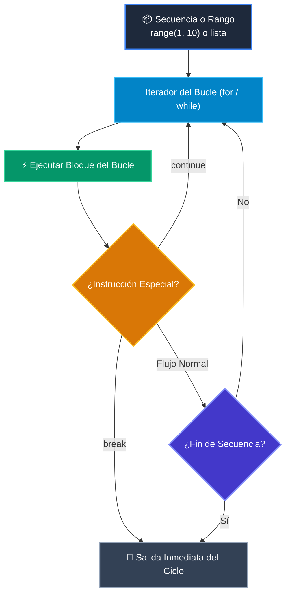

# 📘 Clase 04: Control de Flujo: Bucles (for / while)

<div class="grid cards" markdown>

-   :material-bookmark: **Curso:** Curso 1: Fundamentos Básicos de Python (CLASE 04)
-   :material-signal-cellular-outline: **Nivel:** `Nivel 1 - Principiante`
-   :material-lightbulb-on: **Metáfora Central:** *«Bucles como una Cinta Transportadora de Fábrica»*
-   :material-file-pdf-box: **Manual PDF Oficial:** [Descargar clase-04-control-flujo-bucles.pdf](https://github.com/wisrovi/wisrovi-python/raw/main/01-fundamentos-python/clase-04-control-flujo-bucles/clase-04-control-flujo-bucles.pdf)

</div>

<div align="center" style="margin: 1rem 0;" markdown>

[](https://colab.research.google.com/github/wisrovi/wisrovi-python/blob/main/01-fundamentos-python/clase-04-control-flujo-bucles/notebook/clase-04-control-flujo-bucles.ipynb)
[](https://github.com/wisrovi/wisrovi-python/tree/main/01-fundamentos-python/clase-04-control-flujo-bucles)

</div>

---

## 1. 💡 Fundamentación Teórica y Modelo Mental


!!! note "🌟 Modelo Mental de la Sesión: «Bucles como una Cinta Transportadora de Fábrica»"
    El bucle 'for' es como una cinta transportadora donde inspeccionas cada paquete uno a uno hasta terminar.

### Principios Fundamentales de la Sesión


!!! info "⚡ Regla de Oro en Python"
    En bucles while, asegúrate siempre de modificar la variable de control para evitar bucles infinitos.

---

## 2. 🗺️ Arquitectura de Ejecución y Diagrama de Flujo



---

## 3. 💻 Código de Implementación Práctica

```python
ventas = [120.0, 45.5, 300.0, 89.9]
total = 0.0

for venta in ventas:
    if venta  $50: ${total:.2f}")
```

---

## 4. 🛡️ Buenas Prácticas, Gotchas y Prevención de Errores

!!! warning "⚠️ Trampa Frecuente (Gotcha)"
    Hacer .remove() en una lista dentro de un bucle for provoca saltos de elementos.

=== "❌ Antipatrón / Código Inadecuado"
    ```python
    for n in numeros:
    if n % 2 == 0: numeros.remove(n)  # ❌ Muta la colección
    ```

=== "✅ Patrón Recomendado / Pythonic"
    ```python
    impares = [n for n in numeros if n % 2 != 0]  # ✅ List comprehension
    ```

!!! tip "🔧 Consejo de Ingeniería"
    

---

## 5. 🏋️ Desafío Práctico de la Clase

!!! example "🎯 Enunciado del Reto"
    **Escribe un programa que imprima la tabla de multiplicar de un número del 1 al 10.**

Para resolver este ejercicio en tu entorno:
1. Abre el archivo `ejercicios/reto.py` de esta clase en Visual Studio Code.
2. Implementa tu solución cumpliendo los requisitos y contratos de tipo.
3. Valida tus resultados ejecutando las pruebas unitarias:
   ```bash
   pytest tests/curso_01/test_clase_04_control_flujo_bucles.py
   ```

---

## 6. 📚 Fuentes y Bibliografía Recomendada

*   [📖 Documentación Oficial de Python 3](https://docs.python.org/3/)
*   [📑 Guía de Estilo Oficial PEP 8](https://peps.python.org/pep-0008/)
*   [📦 Ecosistema Open Source wisrovi en PyPI](https://pypi.org/user/wisrovi/)
