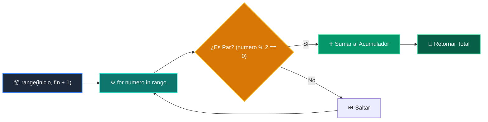

# 📘 Clase 04: Control de Flujo: Bucles (for / while)

<div class="grid cards" markdown>

-   :material-bookmark: **Curso:** Curso 1: Fundamentos Básicos de Python (CLASE 04)
-   :material-signal-cellular-outline: **Nivel:** `Nivel 1 - Principiante`
-   :material-lightbulb-on: **Metáfora Central:** *«La Cinta Transportadora y el Contador Infinito»*
-   :material-laptop: **Wisrovi Studio (Local):** [🚀 Abrir Reto](http://127.0.0.1:8501/?course=1&class=4) &bull; [👨‍🏫 Modo Tutor](http://127.0.0.1:8501/tutor?course=1&class=4)
-   :material-file-pdf-box: **Manual PDF Oficial:** [Descargar clase-04-control-flujo-bucles.pdf](https://github.com/wisrovi/wisrovi-python/raw/main/01-fundamentos-python/clase-04-control-flujo-bucles/clase-04-control-flujo-bucles.pdf)

</div>

<div align="center" style="margin: 1rem 0;" markdown>

[](https://colab.research.google.com/github/wisrovi/wisrovi-python/blob/main/01-fundamentos-python/clase-04-control-flujo-bucles/notebook/clase-04-control-flujo-bucles.ipynb)
[-0284c7?logo=python&logoColor=white)](http://127.0.0.1:8501/?course=1&class=4)
[](https://github.com/wisrovi/wisrovi-python/tree/main/01-fundamentos-python/clase-04-control-flujo-bucles)

</div>

---

## 1. 💡 Fundamentación Teórica y Modelo Mental

Los bucles automatizan tareas repetitivas de forma determinista:
1. **Bucle `for`**: Itera sobre secuencias finitas (`range`, listas, cadenas).
2. **Bucle `while`**: Repite mientras una condición booleana sea verdadera.
3. **Sentencias de Control**: `break` para abortar y `continue` para saltar a la siguiente iteración.

!!! note "🌟 Modelo Mental de la Sesión: «La Cinta Transportadora y el Contador Infinito»"
    En esta sesión anclamos el aprendizaje en la metáfora del mundo real para visualizar cómo fluyen las estructuras de datos y el flujo de ejecución en la memoria.

---

## 2. 🗺️ Arquitectura de Ejecución y Diagrama de Flujo



---

## 3. 💻 Código de Implementación Práctica

=== "🚀 Demostración en Vivo"
    ```python
    # Sumar números impares del 1 al 10
total_impares = 0
for i in range(1, 11):
    if i % 2 != 0:
        total_impares += i
print("Suma de impares (1..10):", total_impares)
    ```

=== "🔬 Arenero de Exploración de Memoria (RAM)"
    ```python
    contador = 5
while contador > 0:
    print(f"🚀 Despegue en {contador}...")
    contador -= 1
print("🌟 ¡Lanzamiento exitoso!")
    ```

---

## 4. 🛡️ Buenas Prácticas PEP 8: Antipatrones vs Código Pythonic

!!! warning "⚠️ Cuidado con los Antipatrones"
    

=== "❌ Antipatrón / Código Inadecuado"
    ```python
    for n in numeros:
    if n % 2 == 0: numeros.remove(n)  # ❌ Muta la colección
    ```

=== "✅ Patrón Recomendado / Pythonic"
    ```python
    impares = [n for n in numeros if n % 2 != 0]  # ✅ List comprehension
    ```

---

## 5. 🏋️ Desafío Práctico de la Clase

!!! example "🎯 Enunciado del Reto"
    **Crea una función `sumar_rango_pares(inicio: int, fin: int) -> int` que retorne la suma de todos los números pares entre `inicio` y `fin` (ambos inclusive).**

!!! tip "⚡ Resolución Híbrida en 1 Clic (Local + Web)"
    Si tienes ejecutando `wisrovi ui` en tu terminal local, puedes [🚀 Abrir este Reto directamente en tu Studio Local (127.0.0.1:8501)](http://127.0.0.1:8501/?course=1&class=4) para escribir tu código con auto-formateo AST, inspeccionar variables en el Heap/Stack y evaluarlo con pruebas en tiempo real.

=== "💻 Plantilla de Inicio (Starter Code)"
    ```python
    def sumar_rango_pares(inicio: int, fin: int) -> int:
    # ✍️ Acumula los pares
    total = 0
    for num in range(inicio, fin + 1):
        if num % 2 == 0:
            total += num
    return total

    ```

??? info "💡 Pista Socrática 1"
    💡 Pista 1: Recuerda usar `range(inicio, fin + 1)` para incluir el valor final.

??? info "💡 Pista Socrática 2"
    💡 Pista 2: Comprueba si un número es par con `num % 2 == 0`.

??? info "💡 Pista Socrática 3"
    💡 Pista 3: Acumula el resultado en una variable `total = 0` y retórnala.


Para resolver este ejercicio en tu entorno:
1. Abre el archivo `ejercicios/reto.py` de esta clase en Visual Studio Code o utiliza `wisrovi ui` / `wisrovi tutor`.
2. Implementa tu solución cumpliendo los requisitos y contratos de tipado.
3. Valida tus resultados ejecutando las pruebas unitarias:
   ```bash
   pytest tests/curso_01/test_clase_04_control_flujo_bucles.py
   ```

---


## 6. 📚 Fuentes y Bibliografía Recomendada

*   [📖 Documentación Oficial de Python 3](https://docs.python.org/3/)
*   [📑 Guía de Estilo Oficial PEP 8](https://peps.python.org/pep-0008/)
*   [📦 Ecosistema Open Source wisrovi en PyPI](https://pypi.org/user/wisrovi/)
