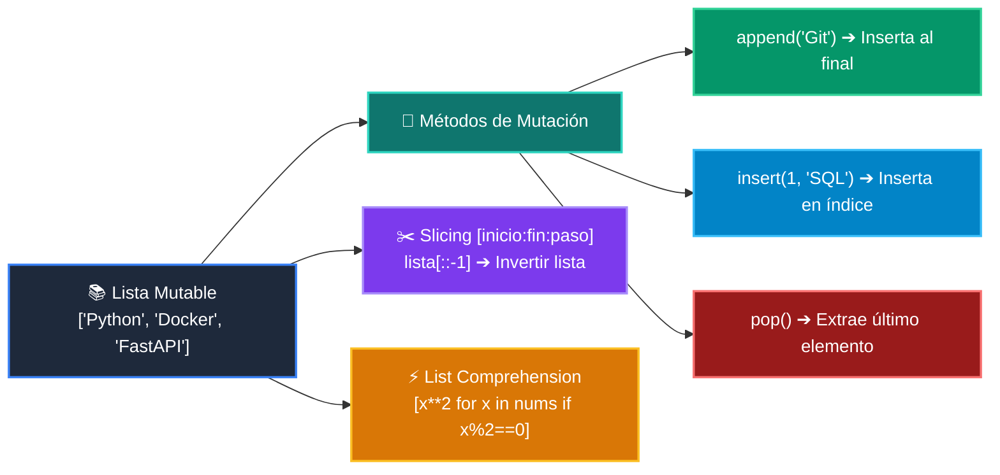

# 📘 Clase 05: Listas, Tuplas y Colecciones Básicas

<div class="grid cards" markdown>

-   :material-bookmark: **Curso:** Curso 1: Fundamentos Básicos de Python (CLASE 05)
-   :material-signal-cellular-outline: **Nivel:** `Nivel 1 - Principiante`
-   :material-lightbulb-on: **Metáfora Central:** *«Listas como Archivadores Modulares y Tuplas como Documentos Notariados»*
-   :material-file-pdf-box: **Manual PDF Oficial:** [Descargar clase-05-listas-y-colecciones.pdf](https://github.com/wisrovi/wisrovi-python/raw/main/01-fundamentos-python/clase-05-listas-y-colecciones/clase-05-listas-y-colecciones.pdf)

</div>

<div align="center" style="margin: 1rem 0;" markdown>

[](https://colab.research.google.com/github/wisrovi/wisrovi-python/blob/main/01-fundamentos-python/clase-05-listas-y-colecciones/notebook/clase-05-listas-y-colecciones.ipynb)
[](https://github.com/wisrovi/wisrovi-python/tree/main/01-fundamentos-python/clase-05-listas-y-colecciones)

</div>

---

## 1. 💡 Fundamentación Teórica y Modelo Mental


!!! note "🌟 Modelo Mental de la Sesión: «Listas como Archivadores Modulares y Tuplas como Documentos Notariados»"
    Una lista es un archivador modular donde agregas carpetas; una tupla es un documento sellado inmutable.

### Principios Fundamentales de la Sesión


!!! info "⚡ Regla de Oro en Python"
    Si los datos representan una entidad fija que no debe cambiar, usa una tupla.

---

## 2. 🗺️ Arquitectura de Ejecución y Diagrama de Flujo



---

## 3. 💻 Código de Implementación Práctica

```python
inventario = ["Laptop", "Teclado", "Mouse"]
inventario.append("Monitor")
inventario.sort()

primeros_dos = inventario[:2]
print("Inventario ordenado:", inventario)
print("Top 2 productos:", primeros_dos)
```

---

## 4. 🛡️ Buenas Prácticas, Gotchas y Prevención de Errores

!!! warning "⚠️ Trampa Frecuente (Gotcha)"
    Hacer lista_b = lista_a no crea una copia, crea otro puntero a la misma lista.

=== "❌ Antipatrón / Código Inadecuado"
    ```python
    a = [1, 2, 3]
b = a
b.append(4)  # ❌ Modifica también 'a'
    ```

=== "✅ Patrón Recomendado / Pythonic"
    ```python
    a = [1, 2, 3]
b = a.copy()  # ✅ 'a' permanece intacta
    ```

!!! tip "🔧 Consejo de Ingeniería"
    

---

## 5. 🏋️ Desafío Práctico de la Clase

!!! example "🎯 Enunciado del Reto"
    **Crea una función que elimine duplicados de una lista manteniendo el orden original.**

Para resolver este ejercicio en tu entorno:
1. Abre el archivo `ejercicios/reto.py` de esta clase en Visual Studio Code.
2. Implementa tu solución cumpliendo los requisitos y contratos de tipo.
3. Valida tus resultados ejecutando las pruebas unitarias:
   ```bash
   pytest tests/curso_01/test_clase_05_listas_y_colecciones.py
   ```

---

## 6. 📚 Fuentes y Bibliografía Recomendada

*   [📖 Documentación Oficial de Python 3](https://docs.python.org/3/)
*   [📑 Guía de Estilo Oficial PEP 8](https://peps.python.org/pep-0008/)
*   [📦 Ecosistema Open Source wisrovi en PyPI](https://pypi.org/user/wisrovi/)
