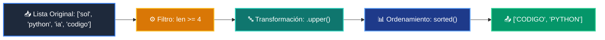

# 📘 Clase 05: Listas, Tuplas y Colecciones Básicas

<div class="grid cards" markdown>

-   :material-bookmark: **Curso:** Curso 1: Fundamentos Básicos de Python (CLASE 05)
-   :material-signal-cellular-outline: **Nivel:** `Nivel 1 - Principiante`
-   :material-lightbulb-on: **Metáfora Central:** *«El Archivador Dinámico (Listas) y las Cajas Selladas (Tuplas)»*
-   :material-laptop: **Wisrovi Studio (Local):** [🚀 Abrir Reto](http://127.0.0.1:8501/?course=1&class=5) &bull; [👨‍🏫 Modo Tutor](http://127.0.0.1:8501/tutor?course=1&class=5)
-   :material-file-pdf-box: **Manual PDF Oficial:** [Descargar clase-05-listas-y-colecciones.pdf](https://github.com/wisrovi/wisrovi-python/raw/main/01-fundamentos-python/clase-05-listas-y-colecciones/clase-05-listas-y-colecciones.pdf)

</div>

<div align="center" style="margin: 1rem 0;" markdown>

[](https://colab.research.google.com/github/wisrovi/wisrovi-python/blob/main/01-fundamentos-python/clase-05-listas-y-colecciones/notebook/clase-05-listas-y-colecciones.ipynb)
[-0284c7?logo=python&logoColor=white)](http://127.0.0.1:8501/?course=1&class=5)
[](https://github.com/wisrovi/wisrovi-python/tree/main/01-fundamentos-python/clase-05-listas-y-colecciones)

</div>

---

## 1. 💡 Fundamentación Teórica y Modelo Mental

Estructuras lineales de datos para organizar colecciones:
1. **Listas (`list`)**: Mutables, ordenadas, permiten `append`, `pop`, `sort`.
2. **Tuplas (`tuple`)**: Inmutables, ideales para registros de solo lectura o claves hash.
3. **List Comprehensions**: Sintaxis compacta y rápida para filtrar y transformar colecciones.

!!! note "🌟 Modelo Mental de la Sesión: «El Archivador Dinámico (Listas) y las Cajas Selladas (Tuplas)»"
    En esta sesión anclamos el aprendizaje en la metáfora del mundo real para visualizar cómo fluyen las estructuras de datos y el flujo de ejecución en la memoria.

---

## 2. 🗺️ Arquitectura de Ejecución y Diagrama de Flujo



---

## 3. 💻 Código de Implementación Práctica

=== "🚀 Demostración en Vivo"
    ```python
    frutas = ["manzana", "banana", "kiwi", "cereza"]
frutas_largas = [f.upper() for f in frutas if len(f) > 5]
print("Frutas de más de 5 letras:", sorted(frutas_largas))
    ```

=== "🔬 Arenero de Exploración de Memoria (RAM)"
    ```python
    lenguajes = ["Python", "Rust", "Go", "TypeScript"]
lenguajes.append("C++")
print("Total lenguajes:", len(lenguajes))
print("Primer y último:", lenguajes[0], lenguajes[-1])
    ```

---

## 4. 🛡️ Buenas Prácticas PEP 8: Antipatrones vs Código Pythonic

!!! warning "⚠️ Cuidado con los Antipatrones"
    

=== "❌ Antipatrón / Código Inadecuado"
    ```python
    a = [1, 2, 3]
b = a
b.append(4)  # ❌ Modifica también 'a'
    ```

=== "✅ Patrón Recomendado / Pythonic"
    ```python
    a = [1, 2, 3]
b = a.copy()  # ✅ 'a' permanece intacta
    ```

---

## 5. 🏋️ Desafío Práctico de la Clase

!!! example "🎯 Enunciado del Reto"
    **Crea una función `filtrar_y_ordenar_palabras(palabras: list[str]) -> list[str]` que filtre palabras con longitud >= 4, las transforme a mayúsculas y las devuelva ordenadas alfabéticamente.**

!!! tip "⚡ Resolución Híbrida en 1 Clic (Local + Web)"
    Si tienes ejecutando `wisrovi ui` en tu terminal local, puedes [🚀 Abrir este Reto directamente en tu Studio Local (127.0.0.1:8501)](http://127.0.0.1:8501/?course=1&class=5) para escribir tu código con auto-formateo AST, inspeccionar variables en el Heap/Stack y evaluarlo con pruebas en tiempo real.

=== "💻 Plantilla de Inicio (Starter Code)"
    ```python
    def filtrar_y_ordenar_palabras(palabras: list[str]) -> list[str]:
    # ✍️ Filtra longitud >= 4, convierte a .upper() y retorna sorted()
    resultado = [p.upper() for p in palabras if len(p) >= 4]
    return sorted(resultado)

    ```

??? info "💡 Pista Socrática 1"
    💡 Pista 1: Puedes usar una list comprehension: `[p.upper() for p in palabras if len(p) >= 4]`

??? info "💡 Pista Socrática 2"
    💡 Pista 2: Usa la función nativa `sorted(...)` para ordenar la lista resultante.

??? info "💡 Pista Socrática 3"
    💡 Pista 3: Verifica que palabras de menos de 4 letras sean descartadas.


Para resolver este ejercicio en tu entorno:
1. Abre el archivo `ejercicios/reto.py` de esta clase en Visual Studio Code o utiliza `wisrovi ui` / `wisrovi tutor`.
2. Implementa tu solución cumpliendo los requisitos y contratos de tipado.
3. Valida tus resultados ejecutando las pruebas unitarias:
   ```bash
   pytest tests/curso_01/test_clase_05_listas_y_colecciones.py
   ```

---


## 6. 📚 Fuentes y Bibliografía Recomendada

*   [📖 Documentación Oficial de Python 3](https://docs.python.org/3/)
*   [📑 Guía de Estilo Oficial PEP 8](https://peps.python.org/pep-0008/)
*   [📦 Ecosistema Open Source wisrovi en PyPI](https://pypi.org/user/wisrovi/)
