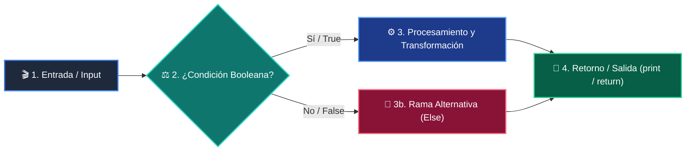

# Clase 05: Listas y Colecciones de Datos

<div class="grid cards" markdown>

-   :material-school: __Nivel:__ Principiante Absoluto
-   :material-book-open-page-variant: __Curso:__ Curso 1: Fundamentos Básicos de Python
-   :material-lightbulb-on: __Metáfora:__ *«La Mochila del Programador y los Casilleros»*
-   :material-file-pdf-box: __Descargar PDF:__ [clase-05-listas-y-colecciones.pdf](https://github.com/wisrovi/wisrovi-python/blob/main/01-fundamentos-python/clase-05-listas-y-colecciones/clase-05-listas-y-colecciones.pdf)

</div>

---

## 🎯 Objetivos de Aprendizaje

!!! abstract "Competencias Clave de la Sesión"
    *   **Competencia Conceptual:** Comprender la indexación basada en cero (0-indexed), la mutabilidad de listas y la inmutabilidad de tuplas.
    *   **Competencia Práctica:** Manipular colecciones mediante append(), insert(), pop(), slicing avanzado y comprensión de listas básica.

---

## 1. 💡 Fundamentos Teóricos y Modelo Mental

En el mundo real rara vez trabajamos con datos aislados; casi siempre gestionamos conjuntos de elementos como listas de clientes, precios o mediciones.

!!! note "🌟 Metáfora Central: La Mochila del Programador y los Casilleros"
    Imagina una fila de casilleros escolares numerados desde el 0. En cada casillero puedes guardar lo que quieras. Las listas son casilleros que puedes abrir, cambiar y reordenar (mutables). Las tuplas son cajas de cristal selladas: puedes ver lo que hay dentro, pero nadie puede alterarlo (inmutables).

### Principios Fundamentales

Indexación: El primer elemento está en el índice 0, y el último en el índice -1.

Slicing: La sintaxis lista[inicio:fin:paso] permite extraer subconjuntos sin modificar la lista original.

!!! tip "⚡ Regla de Oro en Python"
    Las listas son mutables (se modifican en el mismo lugar de memoria); las tuplas son inmutables y ofrecen mayor seguridad e integridad.

---

## 2. 🗺️ Diagrama de Arquitectura y Flujo de Control

Mapeo de memoria para índices directos, inversos y sub-rangos de datos.



### Desglose Paso a Paso del Flujo

| Fase del Flujo | Acción del Intérprete | Estado en Memoria |
| :--- | :--- | :--- |
| **1. Inicialización** | Python asigna un puntero de memoria ordenado a cada elemento. | `['A', 'B', 'C', 'D']` |
| **2. Evaluación** | Índices positivos: [0]=A, [1]=B, [2]=C, [3]=D. | `Lectura hacia adelante` |
| **3. Transformación** | Índices negativos: [-1]=D, [-2]=C, [-3]=B, [-4]=A. | `Lectura desde el final` |
| **4. Retorno / Salida** | Slicing [1:3] extrae los índices 1 y 2 (el límite superior es excluyente). | `Nueva lista: ['B', 'C']` |

!!! info "🔍 Visualización Mental"
    Recuerda siempre la regla del límite superior: lista[0:3] extrae 3 elementos (índices 0, 1 y 2), el 3 queda fuera.

---

## 3. 💻 Implementación Práctica en Python

Script que aplica operaciones CRUD sobre listas de Python con métodos nativos:

```python title="main.py - Python 3.10+ (PEP 8)" linenums="1"
carrito: list[str] = ["Laptop", "Mouse", "Teclado"]

# 1. Agregar elementos
carrito.append("Monitor 4K")
carrito.insert(1, "Auriculares")

# 2. Slicing (primeros 3 productos)
prioritarios = carrito[0:3]
print(f"Productos prioritarios: {prioritarios}")

# 3. Eliminar y extraer
eliminado = carrito.pop()
print(f"Producto extraído: {eliminado}")

# 4. Iteración elegante con enumeración
for idx, prod in enumerate(carrito, start=1):
    print(f"{idx}. {prod}")
```

### Análisis Detallado del Código

Uso de métodos nativos append, insert, pop, slicing y la función enumerate() para iteración limpia con índices.

---

## 4. 🛡️ Buenas Prácticas, Gotchas y Depuración

Errores comunes al manipular listas y colecciones mutables:

!!! warning "⚠️ Gotcha Frecuente (Trampa de Principiante)"
    Copiar una lista por asignación simple (lista2 = lista1) solo copia la referencia, no los datos.

### Comparativa: Patrón Recomendado vs Antipatrón

=== "✅ Patrón Pythonic Recomendado"
    ```python
a = [1, 2, 3]
b = a.copy() # Copia superficial independiente
b.append(4)
    ```

=== "❌ Antipatrón / Mal Código"
    ```python
a = [1, 2, 3]
b = a
b.append(4) # ¡Modifica también la lista 'a'!
    ```

!!! success "🛡️ Consejo de Resiliencia en Producción"
    Usa lista[:] o lista.copy() cuando quieras duplicar una lista sin afectar la original.

---

## 5. 🏋️ Ejercicios y Desafío de Autoestudio

!!! example "Desafío Práctico Recomendado"
    Crea una función que reciba una lista de números y devuelva una tupla con (mínimo, máximo, promedio).

???+ tip "🧪 Cómo validar tu solución con Pytest"
    Abre tu terminal en VS Code y ejecuta:
    ```bash
    pytest 01-fundamentos-python/clase-05-listas-y-colecciones/ejercicios/
    ```

---

## 6. 📚 Fuentes y Referencias Oficiales

| Fuente / Recurso | Descripción Temática | Enlace Oficial |
| :--- | :--- | :--- |
| **Documentación Oficial de Python** | Referencia canónica del lenguaje y librería estándar | [docs.python.org/3/](https://docs.python.org/3/) |
| **PEP 8 — Style Guide for Python** | Guía oficial de estilo, formato e indentación | [peps.python.org/pep-0008/](https://peps.python.org/pep-0008/) |
| **Real Python Tutorials** | Artículos técnicos y patrones de desarrollo moderno | [realpython.com](https://realpython.com/) |
| **Suite Open Source wisrovi** | Paquetes Python para orquestación y rendimiento | [github.com/wisrovi](https://github.com/wisrovi) |
