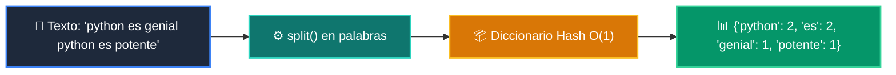

# 📘 Clase 06: Diccionarios y Conjuntos (Sets)

<div class="grid cards" markdown>

-   :material-bookmark: **Curso:** Curso 1: Fundamentos Básicos de Python (CLASE 06)
-   :material-signal-cellular-outline: **Nivel:** `Nivel 1 - Principiante`
-   :material-lightbulb-on: **Metáfora Central:** *«La Agenda Telefónica O(1) y el Filtro de Elementos Únicos»*
-   :material-laptop: **Wisrovi Studio (Local):** [🚀 Abrir Reto](http://127.0.0.1:8501/?course=1&class=6) &bull; [👨‍🏫 Modo Tutor](http://127.0.0.1:8501/tutor?course=1&class=6)
-   :material-file-pdf-box: **Manual PDF Oficial:** [Descargar clase-06-diccionarios.pdf](https://github.com/wisrovi/wisrovi-python/raw/main/01-fundamentos-python/clase-06-diccionarios/clase-06-diccionarios.pdf)

</div>

<div align="center" style="margin: 1rem 0;" markdown>

[](https://colab.research.google.com/github/wisrovi/wisrovi-python/blob/main/01-fundamentos-python/clase-06-diccionarios/notebook/clase-06-diccionarios.ipynb)
[-0284c7?logo=python&logoColor=white)](http://127.0.0.1:8501/?course=1&class=6)
[](https://github.com/wisrovi/wisrovi-python/tree/main/01-fundamentos-python/clase-06-diccionarios)

</div>

---

## 1. 💡 Fundamentación Teórica y Modelo Mental

Estructuras basadas en tablas hash para acceso ultra-rápido $O(1)$:
1. **Diccionarios (`dict`)**: Pares clave-valor (`{key: value}`). Métodos `.get()`, `.keys()`, `.values()`, `.items()`.
2. **Conjuntos (`set`)**: Colecciones no duplicadas (`{1, 2, 3}`). Operaciones de unión `|`, intersección `&` y diferencia `-`.

!!! note "🌟 Modelo Mental de la Sesión: «La Agenda Telefónica O(1) y el Filtro de Elementos Únicos»"
    En esta sesión anclamos el aprendizaje en la metáfora del mundo real para visualizar cómo fluyen las estructuras de datos y el flujo de ejecución en la memoria.

---

## 2. 🗺️ Arquitectura de Ejecución y Diagrama de Flujo



---

## 3. 💻 Código de Implementación Práctica

=== "🚀 Demostración en Vivo"
    ```python
    texto = "hola mundo hola python"
frecuencia = {}
for p in texto.split():
    frecuencia[p] = frecuencia.get(p, 0) + 1
print("Frecuencia de palabras:", frecuencia)
    ```

=== "🔬 Arenero de Exploración de Memoria (RAM)"
    ```python
    tags_a = {"python", "ai", "backend"}
tags_b = {"ai", "frontend", "docker"}
print("Intersección:", tags_a & tags_b)
print("Unión completa:", tags_a | tags_b)
    ```

---

## 4. 🛡️ Buenas Prácticas PEP 8: Antipatrones vs Código Pythonic

!!! warning "⚠️ Cuidado con los Antipatrones"
    

=== "❌ Antipatrón / Código Inadecuado"
    ```python
    data = {'a': 1}
val = data['b']  # ❌ KeyError
    ```

=== "✅ Patrón Recomendado / Pythonic"
    ```python
    data = {'a': 1}
val = data.get('b', 0)  # ✅ Seguro
    ```

---

## 5. 🏋️ Desafío Práctico de la Clase

!!! example "🎯 Enunciado del Reto"
    **Crea una función `contar_frecuencia_palabras(texto: str) -> dict[str, int]` que reciba un texto, lo divida en palabras (en minúsculas) y retorne un diccionario con el conteo de apariciones de cada palabra.**

!!! tip "⚡ Resolución Híbrida en 1 Clic (Local + Web)"
    Si tienes ejecutando `wisrovi ui` en tu terminal local, puedes [🚀 Abrir este Reto directamente en tu Studio Local (127.0.0.1:8501)](http://127.0.0.1:8501/?course=1&class=6) para escribir tu código con auto-formateo AST, inspeccionar variables en el Heap/Stack y evaluarlo con pruebas en tiempo real.

=== "💻 Plantilla de Inicio (Starter Code)"
    ```python
    def contar_frecuencia_palabras(texto: str) -> dict[str, int]:
    # ✍️ Divide con .lower().split() y cuenta con dict
    frecuencias = {}
    for palabra in texto.lower().split():
        frecuencias[palabra] = frecuencias.get(palabra, 0) + 1
    return frecuencias

    ```

??? info "💡 Pista Socrática 1"
    💡 Pista 1: Convierte el texto a minúsculas con `texto.lower()` y sepáralo con `.split()`.

??? info "💡 Pista Socrática 2"
    💡 Pista 2: Usa `frecuencias.get(palabra, 0) + 1` para incrementar la cuenta de forma segura.

??? info "💡 Pista Socrática 3"
    💡 Pista 3: Retorna el diccionario final.


Para resolver este ejercicio en tu entorno:
1. Abre el archivo `ejercicios/reto.py` de esta clase en Visual Studio Code o utiliza `wisrovi ui` / `wisrovi tutor`.
2. Implementa tu solución cumpliendo los requisitos y contratos de tipado.
3. Valida tus resultados ejecutando las pruebas unitarias:
   ```bash
   pytest tests/curso_01/test_clase_06_diccionarios.py
   ```

---


## 6. 📚 Fuentes y Bibliografía Recomendada

*   [📖 Documentación Oficial de Python 3](https://docs.python.org/3/)
*   [📑 Guía de Estilo Oficial PEP 8](https://peps.python.org/pep-0008/)
*   [📦 Ecosistema Open Source wisrovi en PyPI](https://pypi.org/user/wisrovi/)
