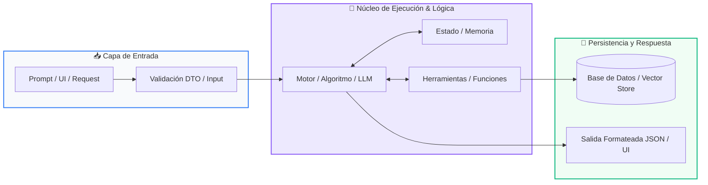

# Clase 06: Diccionarios y Mapeos Clave-Valor

<div class="grid cards" markdown>

-   :material-school: __Nivel:__ Principiante Absoluto
-   :material-book-open-page-variant: __Curso:__ Curso 1: Fundamentos Básicos de Python
-   :material-lightbulb-on: __Metáfora:__ *«La Agenda Telefónica y el Expediente Médico»*
-   :material-file-pdf-box: __Descargar PDF:__ [clase-06-diccionarios.pdf](https://github.com/wisrovi/wisrovi-python/blob/main/01-fundamentos-python/clase-06-diccionarios/clase-06-diccionarios.pdf)

</div>

---

## 🎯 Objetivos de Aprendizaje

!!! abstract "Competencias Clave de la Sesión"
    *   **Competencia Conceptual:** Comprender la indexación por clave semántica en lugar de posición numérica y la eficiencia O(1) de las tablas hash.
    *   **Competencia Práctica:** Construir modelos de datos complejos con diccionarios anidados y procesar registros estructurados.

---

## 1. 💡 Fundamentos Teóricos y Modelo Mental

Buscar un dato por su posición (índice 4) es poco intuitivo; en el mundo real buscamos por nombre, correo o ID.

!!! note "🌟 Metáfora Central: La Agenda Telefónica y el Expediente Médico"
    Un diccionario es como tu agenda del teléfono: no buscas a tu mamá por el número de orden en que la agregaste, buscas la etiqueta 'Mamá' (la clave) y obtienes su número de teléfono (el valor).

### Principios Fundamentales

Las claves en un diccionario deben ser únicas e inmutables (comúnmente strings o ints). Los valores pueden ser de cualquier tipo, incluidas listas u otros diccionarios.

La búsqueda en un diccionario es instantánea (tiempo constante O(1)) gracias al algoritmo interno de tabla hash.

!!! tip "⚡ Regla de Oro en Python"
    Nunca accedas a una clave con dict['clave'] si no estás 100% seguro de que existe; usa dict.get('clave', valor_por_defecto) para evitar KeyError.

---

## 2. 🗺️ Diagrama de Arquitectura y Flujo de Control

Cómo Python mapea claves alfanuméricas a ubicaciones de memoria específicas.



### Desglose Paso a Paso del Flujo

| Fase del Flujo | Acción del Intérprete | Estado en Memoria |
| :--- | :--- | :--- |
| **1. Inicialización** | Python aplica una función hash a la clave (ej: hash('email')). | `Clave -> Hash ID numérico` |
| **2. Evaluación** | Localiza el casillero exacto en la tabla hash de memoria. | `Búsqueda O(1)` |
| **3. Transformación** | Recupera o modifica el valor asociado sin recorrer toda la estructura. | `Lectura/Escritura inmediata` |
| **4. Retorno / Salida** | Permite serialización directa hacia y desde formato JSON para APIs web. | `Compatibilidad universal` |

!!! info "🔍 Visualización Mental"
    Los diccionarios son el equivalente en Python a los objetos de JavaScript o los registros de bases de datos NoSQL.

---

## 3. 💻 Implementación Práctica en Python

Manipulación de registros de productos con métodos .get(), .items() y anidamiento:

```python title="main.py - Python 3.10+ (PEP 8)" linenums="1"
inventario = {
    "PROD-001": {"nombre": "Teclado Mecánico", "precio": 85.0, "stock": 12},
    "PROD-002": {"nombre": "Mouse Ergonómico", "precio": 45.0, "stock": 0}
}

# Acceso seguro con .get()
sku_buscado = "PROD-001"
producto = inventario.get(sku_buscado, None)

if producto:
    print(f"Producto: {producto['nombre']} | Stock: {producto['stock']} uds")

# Iteración completa de claves y valores
for sku, datos in inventario.items():
    disponible = "En Stock" if datos["stock"] > 0 else "Agotado"
    print(f"[{sku}] {datos['nombre']} -> {disponible}")
```

### Análisis Detallado del Código

Se utiliza una estructura anidada dict-of-dicts, acceso resiliente con get() y desempaquetado de tuplas con el método .items().

---

## 4. 🛡️ Buenas Prácticas, Gotchas y Depuración

Errores habituales al consultar y mutar diccionarios:

!!! warning "⚠️ Gotcha Frecuente (Trampa de Principiante)"
    Consultar una clave inexistente con corchetes (dict['inexistente']) provoca un KeyError que detiene el programa.

### Comparativa: Patrón Recomendado vs Antipatrón

=== "✅ Patrón Pythonic Recomendado"
    ```python
user = {'nombre': 'Leo'}
print(user.get('edad', 0)) # Retorna 0 de forma segura
    ```

=== "❌ Antipatrón / Mal Código"
    ```python
user = {'nombre': 'Leo'}
print(user['edad']) # KeyError: 'edad'
    ```

!!! success "🛡️ Consejo de Resiliencia en Producción"
    Utiliza dictionary comprehensions ({k: v for k, v in ...}) para filtrar y transformar diccionarios en una sola línea.

---

## 5. 🏋️ Ejercicios y Desafío de Autoestudio

!!! example "Desafío Práctico Recomendado"
    Crea una función que reciba una lista de palabras y devuelva un diccionario con la frecuencia de aparición de cada palabra.

???+ tip "🧪 Cómo validar tu solución con Pytest"
    Abre tu terminal en VS Code y ejecuta:
    ```bash
    pytest 01-fundamentos-python/clase-06-diccionarios/ejercicios/
    ```

---

## 6. 📚 Fuentes y Referencias Oficiales

| Fuente / Recurso | Descripción Temática | Enlace Oficial |
| :--- | :--- | :--- |
| **Documentación Oficial de Python** | Referencia canónica del lenguaje y librería estándar | [docs.python.org/3/](https://docs.python.org/3/) |
| **PEP 8 — Style Guide for Python** | Guía oficial de estilo, formato e indentación | [peps.python.org/pep-0008/](https://peps.python.org/pep-0008/) |
| **Real Python Tutorials** | Artículos técnicos y patrones de desarrollo moderno | [realpython.com](https://realpython.com/) |
| **Suite Open Source wisrovi** | Paquetes Python para orquestación y rendimiento | [github.com/wisrovi](https://github.com/wisrovi) |
