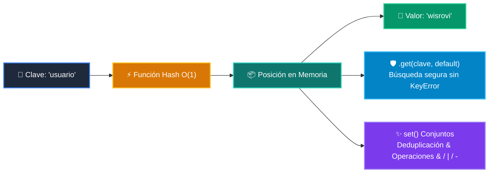

# 📘 Clase 06: Diccionarios y Conjuntos (Sets)

<div class="grid cards" markdown>

-   :material-bookmark: **Curso:** Curso 1: Fundamentos Básicos de Python (CLASE 06)
-   :material-signal-cellular-outline: **Nivel:** `Nivel 1 - Principiante`
-   :material-lightbulb-on: **Metáfora Central:** *«Diccionarios como un Casillero con Llaves Únicas»*
-   :material-file-pdf-box: **Manual PDF Oficial:** [Descargar clase-06-diccionarios.pdf](https://github.com/wisrovi/wisrovi-python/raw/main/01-fundamentos-python/clase-06-diccionarios/clase-06-diccionarios.pdf)

</div>

<div align="center" style="margin: 1rem 0;" markdown>

[](https://colab.research.google.com/github/wisrovi/wisrovi-python/blob/main/01-fundamentos-python/clase-06-diccionarios/notebook/clase-06-diccionarios.ipynb)
[](https://github.com/wisrovi/wisrovi-python/tree/main/01-fundamentos-python/clase-06-diccionarios)

</div>

---

## 1. 💡 Fundamentación Teórica y Modelo Mental


!!! note "🌟 Modelo Mental de la Sesión: «Diccionarios como un Casillero con Llaves Únicas»"
    Un diccionario es como un casillero: con tu llave (clave) abres instantáneamente el compartimento (valor).

### Principios Fundamentales de la Sesión


!!! info "⚡ Regla de Oro en Python"
    Usa siempre diccionario.get('clave', default) para evitar excepciones KeyError.

---

## 2. 🗺️ Arquitectura de Ejecución y Diagrama de Flujo



---

## 3. 💻 Código de Implementación Práctica

```python
usuario = {
    "id": 101,
    "nombre": "Carlos Ruiz",
    "roles": {"admin", "editor"},
    "activo": True
}

email = usuario.get("email", "sin_correo@empresa.com")
print(f"Usuario: {usuario['nombre']} | Email: {email}")
```

---

## 4. 🛡️ Buenas Prácticas, Gotchas y Prevención de Errores

!!! warning "⚠️ Trampa Frecuente (Gotcha)"
    Hacer data['no_existe'] lanza KeyError en lugar de devolver None.

=== "❌ Antipatrón / Código Inadecuado"
    ```python
    data = {'a': 1}
val = data['b']  # ❌ KeyError
    ```

=== "✅ Patrón Recomendado / Pythonic"
    ```python
    data = {'a': 1}
val = data.get('b', 0)  # ✅ Seguro
    ```

!!! tip "🔧 Consejo de Ingeniería"
    

---

## 5. 🏋️ Desafío Práctico de la Clase

!!! example "🎯 Enunciado del Reto"
    **Crea una función que reciba un texto y cuente la frecuencia de cada palabra con un diccionario.**

Para resolver este ejercicio en tu entorno:
1. Abre el archivo `ejercicios/reto.py` de esta clase en Visual Studio Code.
2. Implementa tu solución cumpliendo los requisitos y contratos de tipo.
3. Valida tus resultados ejecutando las pruebas unitarias:
   ```bash
   pytest tests/curso_01/test_clase_06_diccionarios.py
   ```

---

## 6. 📚 Fuentes y Bibliografía Recomendada

*   [📖 Documentación Oficial de Python 3](https://docs.python.org/3/)
*   [📑 Guía de Estilo Oficial PEP 8](https://peps.python.org/pep-0008/)
*   [📦 Ecosistema Open Source wisrovi en PyPI](https://pypi.org/user/wisrovi/)
