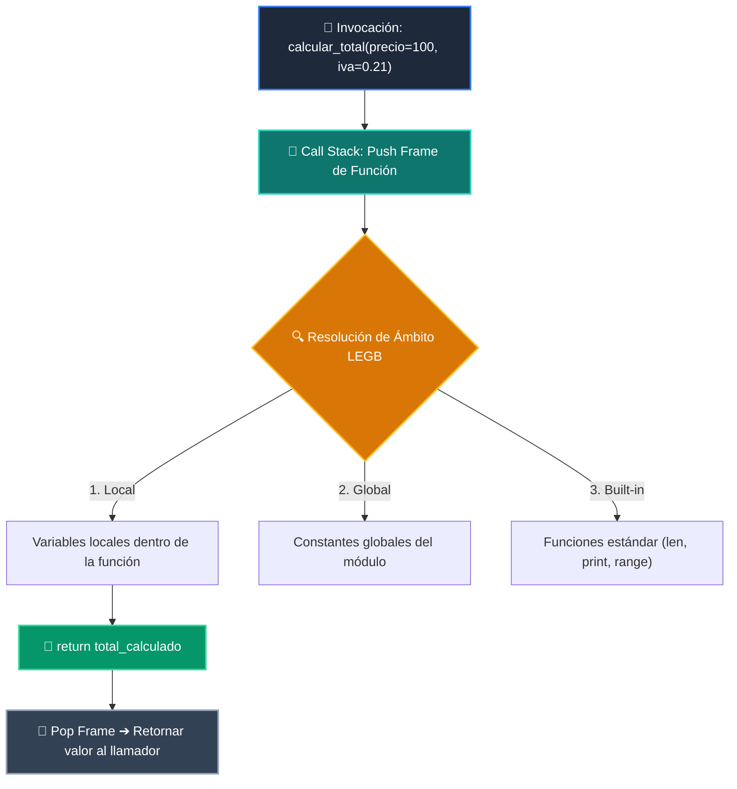

# 📘 Clase 07: Funciones, Parámetros y Scope

<div class="grid cards" markdown>

-   :material-bookmark: **Curso:** Curso 1: Fundamentos Básicos de Python (CLASE 07)
-   :material-signal-cellular-outline: **Nivel:** `Nivel 1 - Principiante`
-   :material-lightbulb-on: **Metáfora Central:** *«Funciones como Máquinas Reutilizables de una Fábrica»*
-   :material-file-pdf-box: **Manual PDF Oficial:** [Descargar clase-07-funciones.pdf](https://github.com/wisrovi/wisrovi-python/raw/main/01-fundamentos-python/clase-07-funciones/clase-07-funciones.pdf)

</div>

<div align="center" style="margin: 1rem 0;" markdown>

[](https://colab.research.google.com/github/wisrovi/wisrovi-python/blob/main/01-fundamentos-python/clase-07-funciones/notebook/clase-07-funciones.ipynb)
[](https://github.com/wisrovi/wisrovi-python/tree/main/01-fundamentos-python/clase-07-funciones)

</div>

---

## 1. 💡 Fundamentación Teórica y Modelo Mental


!!! note "🌟 Modelo Mental de la Sesión: «Funciones como Máquinas Reutilizables de una Fábrica»"
    Una función es como un electrodoméstico: introduces ingredientes (argumentos) y recibes el resultado (return).

### Principios Fundamentales de la Sesión


!!! info "⚡ Regla de Oro en Python"
    Toda función debe tener una sola responsabilidad clara.

---

## 2. 🗺️ Arquitectura de Ejecución y Diagrama de Flujo



---

## 3. 💻 Código de Implementación Práctica

```python
def calcular_precio_final(base: float, descuento_pct: float = 0.0, iva_pct: float = 21.0) -> float:
    """Calcula el importe total tras aplicar descuento e impuestos."""
    subtotal = base * (1 - descuento_pct / 100)
    total = subtotal * (1 + iva_pct / 100)
    return round(total, 2)

print("Total:", calcular_precio_final(100.0, descuento_pct=10.0))
```

---

## 4. 🛡️ Buenas Prácticas, Gotchas y Prevención de Errores

!!! warning "⚠️ Trampa Frecuente (Gotcha)"
    Usar listas o diccionarios vacíos como valores por defecto en la firma.

=== "❌ Antipatrón / Código Inadecuado"
    ```python
    def agregar(item, lista=[]):  # ❌ Se comparte entre llamadas
    lista.append(item)
    return lista
    ```

=== "✅ Patrón Recomendado / Pythonic"
    ```python
    def agregar(item, lista=None):  # ✅ Inmutable None
    if lista is None: lista = []
    lista.append(item)
    return lista
    ```

!!! tip "🔧 Consejo de Ingeniería"
    

---

## 5. 🏋️ Desafío Práctico de la Clase

!!! example "🎯 Enunciado del Reto"
    **Escribe una función que reciba una lista de números y retorne el mínimo, el máximo y el promedio.**

Para resolver este ejercicio en tu entorno:
1. Abre el archivo `ejercicios/reto.py` de esta clase en Visual Studio Code.
2. Implementa tu solución cumpliendo los requisitos y contratos de tipo.
3. Valida tus resultados ejecutando las pruebas unitarias:
   ```bash
   pytest tests/curso_01/test_clase_07_funciones.py
   ```

---

## 6. 📚 Fuentes y Bibliografía Recomendada

*   [📖 Documentación Oficial de Python 3](https://docs.python.org/3/)
*   [📑 Guía de Estilo Oficial PEP 8](https://peps.python.org/pep-0008/)
*   [📦 Ecosistema Open Source wisrovi en PyPI](https://pypi.org/user/wisrovi/)
