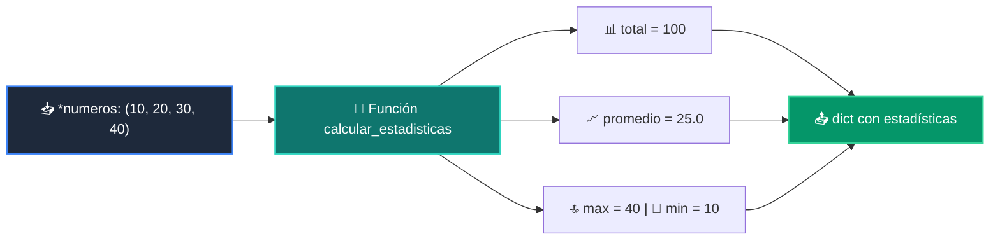

# 📘 Clase 07: Funciones, Parámetros y Scope

<div class="grid cards" markdown>

-   :material-bookmark: **Curso:** Curso 1: Fundamentos Básicos de Python (CLASE 07)
-   :material-signal-cellular-outline: **Nivel:** `Nivel 1 - Principiante`
-   :material-lightbulb-on: **Metáfora Central:** *«La Licuadora Modular (Entradas Flexibles ➔ Resultado)»*
-   :material-laptop: **Wisrovi Studio (Local):** [🚀 Abrir Reto](http://127.0.0.1:8501/?course=1&class=7) &bull; [👨‍🏫 Modo Tutor](http://127.0.0.1:8501/tutor?course=1&class=7)
-   :material-file-pdf-box: **Manual PDF Oficial:** [Descargar clase-07-funciones.pdf](https://github.com/wisrovi/wisrovi-python/raw/main/01-fundamentos-python/clase-07-funciones/clase-07-funciones.pdf)

</div>

<div align="center" style="margin: 1rem 0;" markdown>

[](https://colab.research.google.com/github/wisrovi/wisrovi-python/blob/main/01-fundamentos-python/clase-07-funciones/notebook/clase-07-funciones.ipynb)
[-0284c7?logo=python&logoColor=white)](http://127.0.0.1:8501/?course=1&class=7)
[](https://github.com/wisrovi/wisrovi-python/tree/main/01-fundamentos-python/clase-07-funciones)

</div>

---

## 1. 💡 Fundamentación Teórica y Modelo Mental

Modularización avanzada del código y reutilización:
1. **Parámetros Posicionales y con Nombre (`*args`, `**kwargs`)**: Permiten funciones de aridad variable.
2. **Scope (LEGB)**: Local, Enclosing, Global, Built-in. Las variables locales viven solo durante la ejecución de la función.
3. **Docstrings & Retornos Múltiples**: Documentar el contrato y retornar diccionarios estructurados.

!!! note "🌟 Modelo Mental de la Sesión: «La Licuadora Modular (Entradas Flexibles ➔ Resultado)»"
    En esta sesión anclamos el aprendizaje en la metáfora del mundo real para visualizar cómo fluyen las estructuras de datos y el flujo de ejecución en la memoria.

---

## 2. 🗺️ Arquitectura de Ejecución y Diagrama de Flujo



---

## 3. 💻 Código de Implementación Práctica

=== "🚀 Demostración en Vivo"
    ```python
    def resumen_ventas(*montos: float) -> dict:
    if not montos: return {"total": 0.0, "promedio": 0.0}
    return {
        "total": sum(montos),
        "promedio": sum(montos) / len(montos),
        "max": max(montos)
    }

print(resumen_ventas(120.5, 450.0, 89.9))
    ```

=== "🔬 Arenero de Exploración de Memoria (RAM)"
    ```python
    def saludar_usuario(nombre: str, **opciones):
    prefijo = opciones.get("titulo", "Ingeniero")
    print(f"👋 Saludos, {prefijo} {nombre}")

saludar_usuario("Wisrovi", titulo="Architect")
    ```

---

## 4. 🛡️ Buenas Prácticas PEP 8: Antipatrones vs Código Pythonic

!!! warning "⚠️ Cuidado con los Antipatrones"
    

=== "❌ Antipatrón / Código Inadecuado"
    ```python
    def agregar(item, lista=[]):  # ❌ Se comparte entre llamadas
    lista.append(item)
    return lista
    ```

=== "✅ Patrón Recomendado / Pythonic"
    ```python
    def agregar(item, lista=None):  # ✅ Inmutable None
    if lista is None: lista = []
    lista.append(item)
    return lista
    ```

---

## 5. 🏋️ Desafío Práctico de la Clase

!!! example "🎯 Enunciado del Reto"
    **Crea una función `calcular_estadisticas(*numeros: float) -> dict[str, float]` que acepte cualquier cantidad de números y retorne un dict con las claves: 'total', 'promedio', 'max' y 'min'.**

!!! tip "⚡ Resolución Híbrida en 1 Clic (Local + Web)"
    Si tienes ejecutando `wisrovi ui` en tu terminal local, puedes [🚀 Abrir este Reto directamente en tu Studio Local (127.0.0.1:8501)](http://127.0.0.1:8501/?course=1&class=7) para escribir tu código con auto-formateo AST, inspeccionar variables en el Heap/Stack y evaluarlo con pruebas en tiempo real.

=== "💻 Plantilla de Inicio (Starter Code)"
    ```python
    def calcular_estadisticas(*numeros: float) -> dict[str, float]:
    # ✍️ Calcula total, promedio, max y min
    if not numeros:
        return {"total": 0.0, "promedio": 0.0, "max": 0.0, "min": 0.0}
    return {
        "total": float(sum(numeros)),
        "promedio": float(sum(numeros) / len(numeros)),
        "max": float(max(numeros)),
        "min": float(min(numeros))
    }

    ```

??? info "💡 Pista Socrática 1"
    💡 Pista 1: Usa `*numeros` para recibir una tupla de valores numéricos variables.

??? info "💡 Pista Socrática 2"
    💡 Pista 2: Calcula `sum(numeros)`, `max(numeros)` y `min(numeros)` con las funciones nativas.

??? info "💡 Pista Socrática 3"
    💡 Pista 3: Retorna el diccionario con las 4 claves exactas.


Para resolver este ejercicio en tu entorno:
1. Abre el archivo `ejercicios/reto.py` de esta clase en Visual Studio Code o utiliza `wisrovi ui` / `wisrovi tutor`.
2. Implementa tu solución cumpliendo los requisitos y contratos de tipado.
3. Valida tus resultados ejecutando las pruebas unitarias:
   ```bash
   pytest tests/curso_01/test_clase_07_funciones.py
   ```

---


## 6. 📚 Fuentes y Bibliografía Recomendada

*   [📖 Documentación Oficial de Python 3](https://docs.python.org/3/)
*   [📑 Guía de Estilo Oficial PEP 8](https://peps.python.org/pep-0008/)
*   [📦 Ecosistema Open Source wisrovi en PyPI](https://pypi.org/user/wisrovi/)
