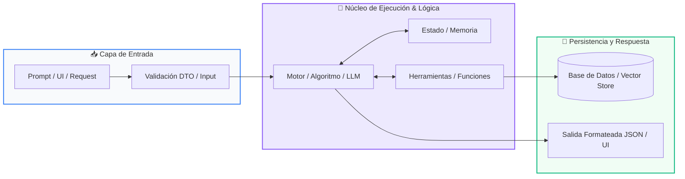

# Clase 07: Funciones Reutilizables y Modulares

<div class="grid cards" markdown>

-   :material-school: __Nivel:__ Principiante Absoluto
-   :material-book-open-page-variant: __Curso:__ Curso 1: Fundamentos Básicos de Python
-   :material-lightbulb-on: __Metáfora:__ *«El Electrodoméstico y la Entrega del Cajero»*
-   :material-file-pdf-box: __Descargar PDF:__ [clase-07-funciones.pdf](https://github.com/wisrovi/wisrovi-python/blob/main/01-fundamentos-python/clase-07-funciones/clase-07-funciones.pdf)

</div>

---

## 🎯 Objetivos de Aprendizaje

!!! abstract "Competencias Clave de la Sesión"
    *   **Competencia Conceptual:** Comprender el principio DRY (Don't Repeat Yourself), la diferencia entre print y return, y el scope local de variables.
    *   **Competencia Práctica:** Escribir funciones modulares, documentadas con docstrings y fuertemente tipadas listas para producción.

---

## 1. 💡 Fundamentos Teóricos y Modelo Mental

El código profesional no se escribe dos veces; cuando una lógica se necesita en múltiples lugares, se encapsula en una función.

!!! note "🌟 Metáfora Central: El Electrodoméstico y la Entrega del Cajero"
    Una función es como un electrodoméstico: tiene una ranura de entrada (parámetros), un motor interno que realiza una tarea específica, y una bandeja de salida donde entrega el resultado terminado (return).

### Principios Fundamentales

Parámetros vs Argumentos: Los parámetros son los nombres en la firma (def), los argumentos son los valores reales que pasas al invocarla.

Diferencia crucial: print() solo muestra texto en la pantalla pero devuelve None; return devuelve el valor a la variable que llamó a la función para seguir trabajando con él.

!!! tip "⚡ Regla de Oro en Python"
    Una función debe hacer una sola cosa y hacerla excepcionalmente bien (Principio de Responsabilidad Única).

---

## 2. 🗺️ Diagrama de Arquitectura y Flujo de Control

Flujo de invocación, paso de argumentos, aislamiento de variables locales y retorno de valor.



### Desglose Paso a Paso del Flujo

| Fase del Flujo | Acción del Intérprete | Estado en Memoria |
| :--- | :--- | :--- |
| **1. Inicialización** | La función es llamada y se asignan los argumentos a los parámetros. | `Creación del Call Stack Frame` |
| **2. Evaluación** | Se ejecutan las instrucciones en un ámbito local aislado. | `Variables locales temporales` |
| **3. Transformación** | La instrucción 'return' finaliza la ejecución de la función y emite el resultado. | `Envío del valor de retorno` |
| **4. Retorno / Salida** | El stack frame se destruye y la memoria local se libera. | `Retorno al flujo principal` |

!!! info "🔍 Visualización Mental"
    Las variables creadas dentro de una función mueren cuando la función termina: nunca intentes acceder a una variable local desde fuera.

---

## 3. 💻 Implementación Práctica en Python

Diseño de funciones modulares con valores por defecto, docstrings y anotaciones de tipo:

```python title="main.py - Python 3.10+ (PEP 8)" linenums="1"
def calcular_total_factura(
    subtotal: float,
    tasa_impuesto: float = 0.21,
    descuento: float = 0.0
) -> dict[str, float]:
    """Calcula el desglose final de una factura comercial."""
    monto_descuento = subtotal * descuento
    base_imponible = subtotal - monto_descuento
    impuestos = base_imponible * tasa_impuesto
    total_pagar = base_imponible + impuestos
    
    return {
        "subtotal": subtotal,
        "descuento_aplicado": monto_descuento,
        "impuestos": impuestos,
        "total": round(total_pagar, 2)
    }

# Uso con argumentos por nombre (keyword arguments)
factura = calcular_total_factura(subtotal=150.0, descuento=0.10)
print(f"Total a pagar: ${factura['total']}")
```

### Análisis Detallado del Código

Función pura con parámetros opcionales con valores predeterminados, tipado formal y retorno estructurado en diccionario.

---

## 4. 🛡️ Buenas Prácticas, Gotchas y Depuración

Errores comunes de diseño y sintaxis en funciones de Python:

!!! warning "⚠️ Gotcha Frecuente (Trampa de Principiante)"
    Usar argumentos mutables por defecto (como def func(lista=[])); la lista se comparte entre llamadas sucesivas.

### Comparativa: Patrón Recomendado vs Antipatrón

=== "✅ Patrón Pythonic Recomendado"
    ```python
def agregar(item, lista=None):
    if lista is None: lista = []
    lista.append(item)
    return lista
    ```

=== "❌ Antipatrón / Mal Código"
    ```python
def agregar(item, lista=[]): # ¡Peligro mutable!
    lista.append(item)
    return lista
    ```

!!! success "🛡️ Consejo de Resiliencia en Producción"
    Usa siempre None como valor predeterminado para parámetros que contengan estructuras mutables.

---

## 5. 🏋️ Ejercicios y Desafío de Autoestudio

!!! example "Desafío Práctico Recomendado"
    Escribe una función recursiva que calcule el factorial de un número entero positivo con su caso base bien definido.

???+ tip "🧪 Cómo validar tu solución con Pytest"
    Abre tu terminal en VS Code y ejecuta:
    ```bash
    pytest 01-fundamentos-python/clase-07-funciones/ejercicios/
    ```

---

## 6. 📚 Fuentes y Referencias Oficiales

| Fuente / Recurso | Descripción Temática | Enlace Oficial |
| :--- | :--- | :--- |
| **Documentación Oficial de Python** | Referencia canónica del lenguaje y librería estándar | [docs.python.org/3/](https://docs.python.org/3/) |
| **PEP 8 — Style Guide for Python** | Guía oficial de estilo, formato e indentación | [peps.python.org/pep-0008/](https://peps.python.org/pep-0008/) |
| **Real Python Tutorials** | Artículos técnicos y patrones de desarrollo moderno | [realpython.com](https://realpython.com/) |
| **Suite Open Source wisrovi** | Paquetes Python para orquestación y rendimiento | [github.com/wisrovi](https://github.com/wisrovi) |
