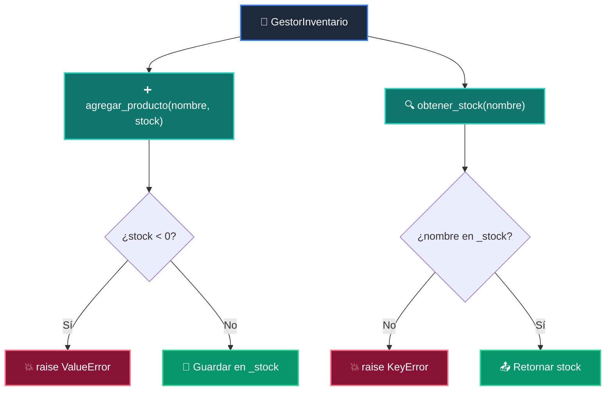

# 📘 Clase 08: Proyecto Integrador: Sistema CLI Completo

<div class="grid cards" markdown>

-   :material-bookmark: **Curso:** Curso 1: Fundamentos Básicos de Python (CLASE 08)
-   :material-signal-cellular-outline: **Nivel:** `Nivel 1 - Principiante`
-   :material-lightbulb-on: **Metáfora Central:** *«El Tablero de Control y el Casco de Seguridad (try/except)»*
-   :material-laptop: **Wisrovi Studio (Local):** [🚀 Abrir Reto](http://127.0.0.1:8501/?course=1&class=8) &bull; [👨‍🏫 Modo Tutor](http://127.0.0.1:8501/tutor?course=1&class=8)
-   :material-file-pdf-box: **Manual PDF Oficial:** [Descargar clase-08-proyecto-integrador-basico.pdf](https://github.com/wisrovi/wisrovi-python/raw/main/01-fundamentos-python/clase-08-proyecto-integrador-basico/clase-08-proyecto-integrador-basico.pdf)

</div>

<div align="center" style="margin: 1rem 0;" markdown>

[](https://colab.research.google.com/github/wisrovi/wisrovi-python/blob/main/01-fundamentos-python/clase-08-proyecto-integrador-basico/notebook/clase-08-proyecto-integrador-basico.ipynb)
[-0284c7?logo=python&logoColor=white)](http://127.0.0.1:8501/?course=1&class=8)
[](https://github.com/wisrovi/wisrovi-python/tree/main/01-fundamentos-python/clase-08-proyecto-integrador-basico)

</div>

---

## 1. 💡 Fundamentación Teórica y Modelo Mental

Integración total de los fundamentos de Python en una clase orientada a objetos con control robusto de errores:
1. **Clases y Métodos (`class`, `__init__`)**: Encapsulación de estado y lógica de negocio.
2. **Excepciones (`try`, `except`, `raise`)**: `ValueError`, `KeyError` para contratos defensivos.
3. **Persistencia en Memoria**: Gestión de catálogos mediante diccionarios internos protegidos.

!!! note "🌟 Modelo Mental de la Sesión: «El Tablero de Control y el Casco de Seguridad (try/except)»"
    En esta sesión anclamos el aprendizaje en la metáfora del mundo real para visualizar cómo fluyen las estructuras de datos y el flujo de ejecución en la memoria.

---

## 2. 🗺️ Arquitectura de Ejecución y Diagrama de Flujo



---

## 3. 💻 Código de Implementación Práctica

=== "🚀 Demostración en Vivo"
    ```python
    class GestorInventarioDemo:
    def __init__(self):
        self._stock = {}

    def agregar(self, item: str, cant: int):
        if cant < 0: raise ValueError("Stock negativo")
        self._stock[item] = self._stock.get(item, 0) + cant

g = GestorInventarioDemo()
g.agregar("Laptop", 5)
print("Inventario:", g._stock)
    ```

=== "🔬 Arenero de Exploración de Memoria (RAM)"
    ```python
    try:
    edad = int("veinte")
except ValueError as e:
    print(f"⚠️ Error capturado con éxito: {e}")
    ```

---

## 4. 🛡️ Buenas Prácticas PEP 8: Antipatrones vs Código Pythonic

!!! warning "⚠️ Cuidado con los Antipatrones"
    

=== "❌ Antipatrón / Código Inadecuado"
    ```python
    # 500 líneas de código plano desordenado ❌
    ```

=== "✅ Patrón Recomendado / Pythonic"
    ```python
    # Funciones modulares y clases con responsabilidades únicas ✅
    ```

---

## 5. 🏋️ Desafío Práctico de la Clase

!!! example "🎯 Enunciado del Reto"
    **Crea una clase `GestorInventario` con métodos: `__init__(self)` (inicializa dict `self._stock`), `agregar_producto(self, nombre: str, stock: int)` (lanza `ValueError` si stock < 0) y `obtener_stock(self, nombre: str) -> int` (lanza `KeyError` si no existe).**

!!! tip "⚡ Resolución Híbrida en 1 Clic (Local + Web)"
    Si tienes ejecutando `wisrovi ui` en tu terminal local, puedes [🚀 Abrir este Reto directamente en tu Studio Local (127.0.0.1:8501)](http://127.0.0.1:8501/?course=1&class=8) para escribir tu código con auto-formateo AST, inspeccionar variables en el Heap/Stack y evaluarlo con pruebas en tiempo real.

=== "💻 Plantilla de Inicio (Starter Code)"
    ```python
    class GestorInventario:
    def __init__(self):
        self._stock = {}

    def agregar_producto(self, nombre: str, stock: int):
        if stock < 0:
            raise ValueError("El stock no puede ser negativo")
        self._stock[nombre] = stock

    def obtener_stock(self, nombre: str) -> int:
        if nombre not in self._stock:
            raise KeyError("Producto no encontrado")
        return self._stock[nombre]

    ```

??? info "💡 Pista Socrática 1"
    💡 Pista 1: Inicializa `self._stock = {}` en el método `__init__`.

??? info "💡 Pista Socrática 2"
    💡 Pista 2: Usa `raise ValueError(...)` cuando `stock < 0`.

??? info "💡 Pista Socrática 3"
    💡 Pista 3: Usa `raise KeyError(...)` si `nombre not in self._stock`.


Para resolver este ejercicio en tu entorno:
1. Abre el archivo `ejercicios/reto.py` de esta clase en Visual Studio Code o utiliza `wisrovi ui` / `wisrovi tutor`.
2. Implementa tu solución cumpliendo los requisitos y contratos de tipado.
3. Valida tus resultados ejecutando las pruebas unitarias:
   ```bash
   pytest tests/curso_01/test_clase_08_proyecto_integrador_basico.py
   ```

---


## 6. 📚 Fuentes y Bibliografía Recomendada

*   [📖 Documentación Oficial de Python 3](https://docs.python.org/3/)
*   [📑 Guía de Estilo Oficial PEP 8](https://peps.python.org/pep-0008/)
*   [📦 Ecosistema Open Source wisrovi en PyPI](https://pypi.org/user/wisrovi/)
