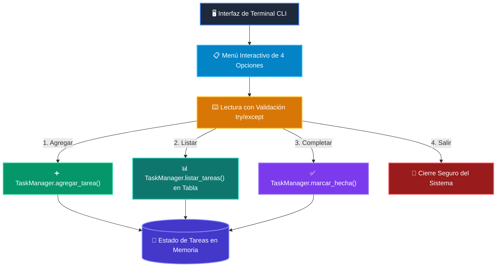

# 📘 Clase 08: Proyecto Integrador: Sistema CLI Completo

<div class="grid cards" markdown>

-   :material-bookmark: **Curso:** Curso 1: Fundamentos Básicos de Python (CLASE 08)
-   :material-signal-cellular-outline: **Nivel:** `Nivel 1 - Principiante`
-   :material-lightbulb-on: **Metáfora Central:** *«Construyendo tu Primera Aplicación Real de Consola»*
-   :material-file-pdf-box: **Manual PDF Oficial:** [Descargar clase-08-proyecto-integrador-basico.pdf](https://github.com/wisrovi/wisrovi-python/raw/main/01-fundamentos-python/clase-08-proyecto-integrador-basico/clase-08-proyecto-integrador-basico.pdf)

</div>

<div align="center" style="margin: 1rem 0;" markdown>

[](https://colab.research.google.com/github/wisrovi/wisrovi-python/blob/main/01-fundamentos-python/clase-08-proyecto-integrador-basico/notebook/clase-08-proyecto-integrador-basico.ipynb)
[](https://github.com/wisrovi/wisrovi-python/tree/main/01-fundamentos-python/clase-08-proyecto-integrador-basico)

</div>

---

## 1. 💡 Fundamentación Teórica y Modelo Mental


!!! note "🌟 Modelo Mental de la Sesión: «Construyendo tu Primera Aplicación Real de Consola»"
    Construir tu primera aplicación es como armar tu propia bicicleta: cada pieza encaja para ponerla en marcha.

### Principios Fundamentales de la Sesión


!!! info "⚡ Regla de Oro en Python"
    Estructura siempre tu punto de entrada con el patrón estándar if __name__ == '__main__':.

---

## 2. 🗺️ Arquitectura de Ejecución y Diagrama de Flujo



---

## 3. 💻 Código de Implementación Práctica

```python
class TaskManager:
    def __init__(self):
        self.tasks = []

    def add_task(self, title: str):
        self.tasks.append({"id": len(self.tasks) + 1, "title": title, "done": False})

    def list_tasks(self):
        return self.tasks

tm = TaskManager()
tm.add_task("Aprender Python con Wisrovi")
print("Tareas registradas:", tm.list_tasks())
```

---

## 4. 🛡️ Buenas Prácticas, Gotchas y Prevención de Errores

!!! warning "⚠️ Trampa Frecuente (Gotcha)"
    Escribir todo el código en un solo archivo plano sin funciones ni modularidad.

=== "❌ Antipatrón / Código Inadecuado"
    ```python
    # 500 líneas de código plano desordenado ❌
    ```

=== "✅ Patrón Recomendado / Pythonic"
    ```python
    # Funciones modulares y clases con responsabilidades únicas ✅
    ```

!!! tip "🔧 Consejo de Ingeniería"
    

---

## 5. 🏋️ Desafío Práctico de la Clase

!!! example "🎯 Enunciado del Reto"
    **Amplía el TaskManager para permitir marcar tareas como completadas y eliminarlas por ID.**

Para resolver este ejercicio en tu entorno:
1. Abre el archivo `ejercicios/reto.py` de esta clase en Visual Studio Code.
2. Implementa tu solución cumpliendo los requisitos y contratos de tipo.
3. Valida tus resultados ejecutando las pruebas unitarias:
   ```bash
   pytest tests/curso_01/test_clase_08_proyecto_integrador_basico.py
   ```

---

## 6. 📚 Fuentes y Bibliografía Recomendada

*   [📖 Documentación Oficial de Python 3](https://docs.python.org/3/)
*   [📑 Guía de Estilo Oficial PEP 8](https://peps.python.org/pep-0008/)
*   [📦 Ecosistema Open Source wisrovi en PyPI](https://pypi.org/user/wisrovi/)
