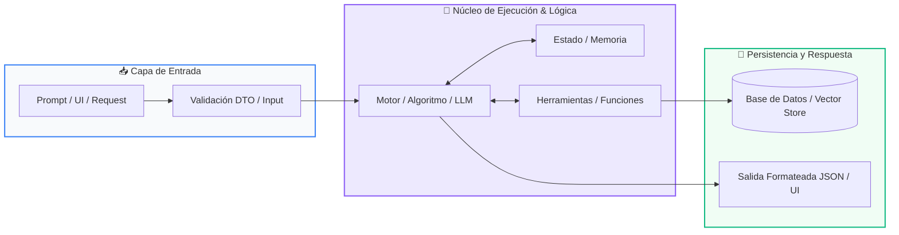

# Clase 08: Integración Total & Proyecto Integrador

<div class="grid cards" markdown>

-   :material-school: __Nivel:__ Principiante a Intermedio
-   :material-book-open-page-variant: __Curso:__ Curso 1: Fundamentos Básicos de Python
-   :material-lightbulb-on: __Metáfora:__ *«El Casco de Seguridad y Salir a Rodar en Bici»*
-   :material-file-pdf-box: __Descargar PDF:__ [clase-08-proyecto-integrador-basico.pdf](https://github.com/wisrovi/wisrovi-python/blob/main/01-fundamentos-python/clase-08-proyecto-integrador-basico/clase-08-proyecto-integrador-basico.pdf)

</div>

---

## 🎯 Objetivos de Aprendizaje

!!! abstract "Competencias Clave de la Sesión"
    *   **Competencia Conceptual:** Comprender cómo se interconectan todos los pilares del lenguaje para crear una aplicación funcional y resiliente.
    *   **Competencia Práctica:** Construir de principio a fin un sistema de gestión en terminal con menús interactivos, validaciones y persistencia conceptual.

---

## 1. 💡 Fundamentos Teóricos y Modelo Mental

Llegó el momento de unir todas las piezas: variables, condicionales, bucles, listas, diccionarios y funciones trabajando en armonía.

!!! note "🌟 Metáfora Central: El Casco de Seguridad y Salir a Rodar en Bici"
    Hasta ahora hemos practicado el equilibrio con las rueditas de entrenamiento. Hoy nos quitamos las rueditas, nos ponemos el casco de seguridad y salimos a rodar en la bicicleta por nosotros mismos en el mundo real.

### Principios Fundamentales

Patrón de Menú Principal: Un bucle infinito while True mantiene viva la aplicación hasta que el usuario decida salir explícitamente.

Capa de Datos: Una lista de diccionarios en memoria actúa como la base de datos temporal de la aplicación.

!!! tip "⚡ Regla de Oro en Python"
    Separa la presentación (print, input) de la lógica de negocio (las funciones que agregan, buscan y transforman datos).

---

## 2. 🗺️ Diagrama de Arquitectura y Flujo de Control

Interacción entre la capa de interfaz de consola, el enrutador de comandos y el modelo de datos.



### Desglose Paso a Paso del Flujo

| Fase del Flujo | Acción del Intérprete | Estado en Memoria |
| :--- | :--- | :--- |
| **1. Inicialización** | Bucle principal muestra el menú de opciones (1. Agregar, 2. Listar, 3. Completar, 4. Salir). | `Esperando opción del usuario` |
| **2. Evaluación** | Enrutador if/elif invoca la función específica según la opción elegida. | `Despacho a función modular` |
| **3. Transformación** | La función ejecuta la operación CRUD sobre la lista de tareas en memoria. | `Actualización del estado` |
| **4. Retorno / Salida** | Se muestra retroalimentación visual al usuario y se reinicia el ciclo del menú. | `Ciclo listo para nueva orden` |

!!! info "🔍 Visualización Mental"
    Esta arquitectura modular en consola es idéntica en concepto a los controladores y servicios de las APIs web modernas.

---

## 3. 💻 Implementación Práctica en Python

Estructura modular del proyecto integrador con funciones CRUD completas:

```python title="main.py - Python 3.10+ (PEP 8)" linenums="1"
tareas: list[dict] = []

def agregar_tarea(titulo: str) -> None:
    nueva_tarea = {"id": len(tareas) + 1, "titulo": titulo, "completada": False}
    tareas.append(nueva_tarea)
    print(f"✅ Tarea #{nueva_tarea['id']} agregada con éxito.")

def listar_tareas() -> None:
    if not tareas:
        print("📭 No hay tareas registradas.")
        return
    for t in tareas:
        estado = "✔️ [LISTA]" if t["completada"] else "⏳ [PENDIENTE]"
        print(f"#{t['id']} - {t['titulo']} {estado}")

def completar_tarea(id_tarea: int) -> None:
    for t in tareas:
        if t["id"] == id_tarea:
            t["completada"] = True
            print(f"🎉 Tarea #{id_tarea} marcada como completada.")
            return
    print("❌ ID de tarea no encontrado.")
```

### Análisis Detallado del Código

Sistema modular que implementa el ciclo CRUD completo, demostrando el dominio integral de las estructuras de datos y funciones.

---

## 4. 🛡️ Buenas Prácticas, Gotchas y Depuración

Reglas de oro para dar el salto de principiante a desarrollador junior estructurado:

!!! warning "⚠️ Gotcha Frecuente (Trampa de Principiante)"
    Escribir código espagueti con cientos de líneas sin funciones y mezclando variables globales descontroladas.

### Comparativa: Patrón Recomendado vs Antipatrón

=== "✅ Patrón Pythonic Recomendado"
    ```python
# Código desacoplado
def main():
    while True:
        mostrar_menu()
        procesar_opcion()
    ```

=== "❌ Antipatrón / Mal Código"
    ```python
# Código monolítico sin funciones ni modularidad
while True:
    op = input()
    # 300 líneas de if/else anidados sin separación
    ```

!!! success "🛡️ Consejo de Resiliencia en Producción"
    Encapsula siempre el punto de entrada de tu programa dentro de if __name__ == '__main__': main().

---

## 5. 🏋️ Ejercicios y Desafío de Autoestudio

!!! example "Desafío Práctico Recomendado"
    Agrega la función para guardar y cargar las tareas en un archivo JSON en disco para tener persistencia real.

???+ tip "🧪 Cómo validar tu solución con Pytest"
    Abre tu terminal en VS Code y ejecuta:
    ```bash
    pytest 01-fundamentos-python/clase-08-proyecto-integrador-basico/ejercicios/
    ```

---

## 6. 📚 Fuentes y Referencias Oficiales

| Fuente / Recurso | Descripción Temática | Enlace Oficial |
| :--- | :--- | :--- |
| **Documentación Oficial de Python** | Referencia canónica del lenguaje y librería estándar | [docs.python.org/3/](https://docs.python.org/3/) |
| **PEP 8 — Style Guide for Python** | Guía oficial de estilo, formato e indentación | [peps.python.org/pep-0008/](https://peps.python.org/pep-0008/) |
| **Real Python Tutorials** | Artículos técnicos y patrones de desarrollo moderno | [realpython.com](https://realpython.com/) |
| **Suite Open Source wisrovi** | Paquetes Python para orquestación y rendimiento | [github.com/wisrovi](https://github.com/wisrovi) |
