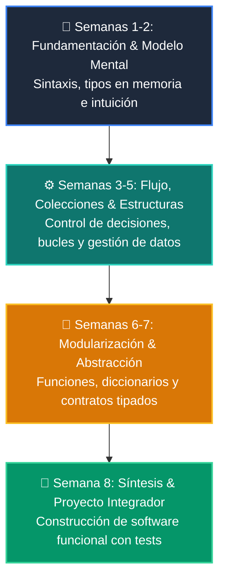

# 📚 Manual Oficial: Curso 2: Algoritmos Avanzados y Estructuras de Datos

-   :material-school: **Nivel:** `Nivel 2 (Intermedio)`
-   :material-calendar-clock: **Duración:** 8 Semanas Formativas
-   :material-account-tie: **Instructor:** [William Rodríguez (Wisrovi)](https://wisrovi.dev)
-   :material-file-pdf-box: **PDF Completo:** [Descargar curso-02-algoritmos-estructuras.pdf](https://github.com/wisrovi/wisrovi-python/raw/main/02-algoritmos-estructuras/curso-02-algoritmos-estructuras.pdf)

---

## 🗺️ Mapa de Clases Semanales

| Semana | Unidad Temática | Metáfora Didáctica |
| :---: | :--- | :--- |
| **CLASE 01** | [Análisis de Complejidad y Notación Big-O](clase-01-analisis-complejidad-big-o.md) | *«Medir el Rendimiento de un Algoritmo a Medida que Crece la Entrada»* |
| **CLASE 02** | [Pilas (Stacks) y Colas (Queues) con collections.deque](clase-02-pilas-y-colas.md) | *«Pilas LIFO como Platos Apilados y Colas FIFO como la Fila del Supermercado»* |
| **CLASE 03** | [Tablas Hash y Conjuntos (Sets) para Búsqueda O(1)](clase-03-tablas-hash-y-sets.md) | *«Tablas Hash como un Fichero con Índice Alfabético Instantáneo»* |
| **CLASE 04** | [Lineal vs Binaria O(log n)](clase-04-algoritmos-busqueda.md) | *«Búsqueda Binaria como Buscar una Palabra en el Diccionario Dividiendo a la Mitad»* |
| **CLASE 05** | [QuickSort y MergeSort](clase-05-algoritmos-ordenamiento.md) | *«Ordenar Barajas de Cartas con Divide y Vencerás»* |
| **CLASE 06** | [Árboles Binarios de Búsqueda (BST) y Recorridos](clase-06-arboles-binarios-busqueda.md) | *«Árboles como Organigramas Jerárquicos con Ramas Izquierda y Derecha»* |
| **CLASE 07** | [Grafos, Matrices de Adyacencia y Recorridos BFS/DFS](clase-07-grafos-y-recorridos.md) | *«Grafos como Redes de Ciudades y Rutas de Vuelo»* |
| **CLASE 08** | [Recursividad y Programación Dinámica con Memoización](clase-08-recursividad-y-programacion-dinamica.md) | *«Programación Dinámica como Recordar el Pasado para no Resolverlo Dos Veces»* |

---

## 🌀 Progresión Formativa del Curso

---

## 📑 Clases del Curso
Haz clic en cualquiera de las clases del menú lateral o de la tabla superior para estudiar la teoría, ejecutar los ejemplos y resolver los retos prácticos.
