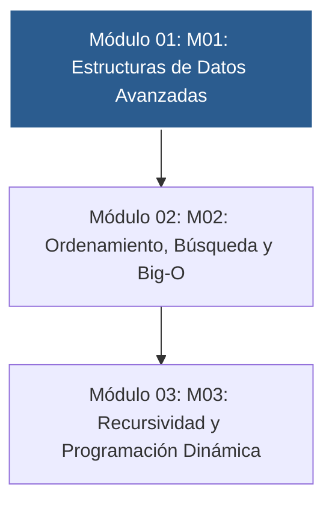

# 📚 Curso 2: Algoritmos Avanzados y Estructuras de Datos

> **Optimización de Memoria, Big-O, Pilas, Colas y Programación Dinámica**  
> **Nivel:** Intermedio &bull; **Instructor:** **William Rodríguez (Wisrovi)** (AI Solutions Architect & Principal Software Engineer)

---

## 🗺️ Mapa de Contenidos del Curso

---

## 📑 Unidades Didácticas del Curso

| Unidad | Título | Metáfora Central | Enfoque Principal |
| :---: | :--- | :--- | :--- |
| **Módulo 01** | **Módulo 01: Estructuras de Datos Avanzadas** | *«Pilas LIFO, Colas FIFO y Árboles Jerárquicos»* | Comprender las disciplinas de acceso LIFO y FIFO y el coste temporal O(1) vs O(n... |
| **Módulo 02** | **Módulo 02: Ordenamiento, Búsqueda y Big-O** | *«El Diccionario por la Mitad y Divide y Vencerás»* | Comprender cómo escala el tiempo de ejecución a medida que el tamaño de entrada ... |
| **Módulo 03** | **Módulo 03: Recursividad y Programación Dinámica** | *«Las Muñecas Rusas (Matrioshkas) y la Libreta de Apuntes»* | Comprender la descomposición recursiva y cómo la memoización transforma compleji... |

---

## 🚲 Metodología: La Regla de la Bicicleta

> *"Nadie aprende a montar en bicicleta viendo tutoriales. El verdadero dominio de la programación surge cuando abres tu editor, escribes código con tus propias manos, resuelves errores y construyes proyectos reales."*

!!! tip "Cómo estudiar este curso"
    1. Lee la lección temática de cada unidad.
    2. Analiza el diagrama de flujo y comprende el movimiento de los datos en memoria.
    3. Escribe y ejecuta el código en VS Code o en Google Colab.
    4. Resuelve los ejercicios y valida tu código ejecutando `pytest`.
