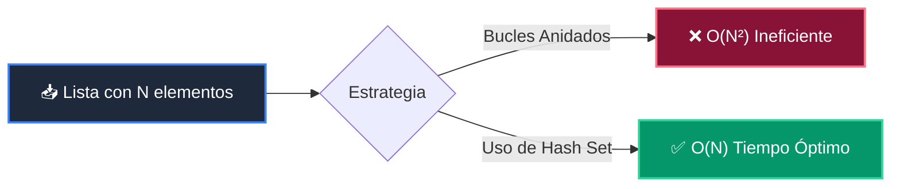

# 📘 Clase 01: Análisis de Complejidad y Notación Big-O

<div class="grid cards" markdown>

-   :material-bookmark: **Curso:** Curso 2: Algoritmos Avanzados y Estructuras de Datos (CLASE 01)
-   :material-signal-cellular-outline: **Nivel:** `Nivel 2 - Intermedio`
-   :material-lightbulb-on: **Metáfora Central:** *«El Velocímetro y el Odómetro Big-O (Tiempo vs Espacio)»*
-   :material-laptop: **Wisrovi Studio (Local):** [🚀 Abrir Reto](http://127.0.0.1:8501/?course=2&class=1) &bull; [👨‍🏫 Modo Tutor](http://127.0.0.1:8501/tutor?course=2&class=1)
-   :material-file-pdf-box: **Manual PDF Oficial:** [Descargar clase-01-analisis-complejidad-big-o.pdf](https://github.com/wisrovi/wisrovi-python/raw/main/02-algoritmos-estructuras/clase-01-analisis-complejidad-big-o/clase-01-analisis-complejidad-big-o.pdf)

</div>

<div align="center" style="margin: 1rem 0;" markdown>

[](https://colab.research.google.com/github/wisrovi/wisrovi-python/blob/main/02-algoritmos-estructuras/clase-01-analisis-complejidad-big-o/notebook/clase-01-analisis-complejidad-big-o.ipynb)
[-0284c7?logo=python&logoColor=white)](http://127.0.0.1:8501/?course=2&class=1)
[](https://github.com/wisrovi/wisrovi-python/tree/main/02-algoritmos-estructuras/clase-01-analisis-complejidad-big-o)

</div>

---

## 1. 💡 Fundamentación Teórica y Modelo Mental

La notación Big-O formaliza la eficiencia asintótica de un algoritmo al crecer el tamaño $N$:
1. **$O(1)$ Constante**: Acceso a array por índice o búsqueda en tabla hash.
2. **$O(N)$ Lineal**: Búsqueda en listas no ordenadas o un único bucle.
3. **$O(N^2)$ Cuadrático**: Bucles anidados comparando todos contra todos.
4. **Optimización con Conjuntos**: Transformar búsquedas $O(N^2)$ en $O(N)$ usando `set`.

!!! note "🌟 Modelo Mental de la Sesión: «El Velocímetro y el Odómetro Big-O (Tiempo vs Espacio)»"
    En esta sesión anclamos el aprendizaje en la metáfora del mundo real para visualizar cómo fluyen las estructuras de datos y el flujo de ejecución en la memoria.

---

## 2. 🗺️ Arquitectura de Ejecución y Diagrama de Flujo



---

## 3. 💻 Código de Implementación Práctica

=== "🚀 Demostración en Vivo"
    ```python
    # Detección de duplicados en O(N) vs O(N^2)
def tiene_duplicados_rapido(items: list) -> bool:
    return len(items) != len(set(items))

print("[1, 2, 3, 2] ->", tiene_duplicados_rapido([1, 2, 3, 2]))
print("[1, 2, 3, 4] ->", tiene_duplicados_rapido([1, 2, 3, 4]))
    ```

=== "🔬 Arenero de Exploración de Memoria (RAM)"
    ```python
    lista_grande = list(range(10000)) + [42]
vistos = set()
duplicados = [x for x in lista_grande if x in vistos or vistos.add(x)]
print("Duplicado encontrado en O(N):", duplicados)
    ```

---

## 4. 🛡️ Buenas Prácticas PEP 8: Antipatrones vs Código Pythonic

!!! warning "⚠️ Cuidado con los Antipatrones"
    

=== "❌ Antipatrón / Código Inadecuado"
    ```python
    for elem in lista_a:
    if elem in lista_b:  # ❌ 'in' en lista es O(n), total O(n^2)
        comunes.append(elem)
    ```

=== "✅ Patrón Recomendado / Pythonic"
    ```python
    set_b = set(lista_b)  # O(n)
for elem in lista_a:
    if elem in set_b:    # ✅ 'in' en set es O(1), total O(n)
        comunes.append(elem)
    ```

---

## 5. 🏋️ Desafío Práctico de la Clase

!!! example "🎯 Enunciado del Reto"
    **Crea una función `encontrar_duplicados_o_n(lista: list[int]) -> set[int]` que encuentre y retorne todos los números que aparecen más de una vez en tiempo lineal O(N) usando un `set` auxiliar.**

!!! tip "⚡ Resolución Híbrida en 1 Clic (Local + Web)"
    Si tienes ejecutando `wisrovi ui` en tu terminal local, puedes [🚀 Abrir este Reto directamente en tu Studio Local (127.0.0.1:8501)](http://127.0.0.1:8501/?course=2&class=1) para escribir tu código con auto-formateo AST, inspeccionar variables en el Heap/Stack y evaluarlo con pruebas en tiempo real.

=== "💻 Plantilla de Inicio (Starter Code)"
    ```python
    def encontrar_duplicados_o_n(lista: list[int]) -> set[int]:
    # ✍️ Encuentra duplicados en O(N)
    vistos = set()
    duplicados = set()
    for num in lista:
        if num in vistos:
            duplicados.add(num)
        else:
            vistos.add(num)
    return duplicados

    ```

??? info "💡 Pista Socrática 1"
    💡 Pista 1: Mantén un conjunto `vistos = set()` para registrar números procesados.

??? info "💡 Pista Socrática 2"
    💡 Pista 2: Si el número ya está en `vistos`, agrégalo a `duplicados.add(num)`.

??? info "💡 Pista Socrática 3"
    💡 Pista 3: Retorna el conjunto `duplicados`.


Para resolver este ejercicio en tu entorno:
1. Abre el archivo `ejercicios/reto.py` de esta clase en Visual Studio Code o utiliza `wisrovi ui` / `wisrovi tutor`.
2. Implementa tu solución cumpliendo los requisitos y contratos de tipado.
3. Valida tus resultados ejecutando las pruebas unitarias:
   ```bash
   pytest tests/curso_02/test_clase_01_analisis_complejidad_big_o.py
   ```

---


## 6. 📚 Fuentes y Bibliografía Recomendada

*   [📖 Documentación Oficial de Python 3](https://docs.python.org/3/)
*   [📑 Guía de Estilo Oficial PEP 8](https://peps.python.org/pep-0008/)
*   [📦 Ecosistema Open Source wisrovi en PyPI](https://pypi.org/user/wisrovi/)
