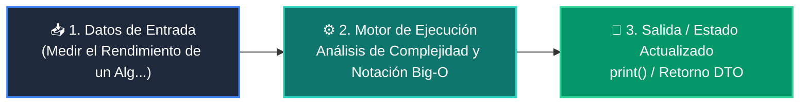

# 📘 Clase 01: Análisis de Complejidad y Notación Big-O

<div class="grid cards" markdown>

-   :material-bookmark: **Curso:** Curso 2: Algoritmos Avanzados y Estructuras de Datos (CLASE 01)
-   :material-signal-cellular-outline: **Nivel:** `Nivel 2 - Intermedio`
-   :material-lightbulb-on: **Metáfora Central:** *«Medir el Rendimiento de un Algoritmo a Medida que Crece la Entrada»*
-   :material-file-pdf-box: **Manual PDF Oficial:** [Descargar clase-01-analisis-complejidad-big-o.pdf](https://github.com/wisrovi/wisrovi-python/raw/main/02-algoritmos-estructuras/clase-01-analisis-complejidad-big-o/clase-01-analisis-complejidad-big-o.pdf)

</div>

<div align="center" style="margin: 1rem 0;" markdown>

[](https://colab.research.google.com/github/wisrovi/wisrovi-python/blob/main/02-algoritmos-estructuras/clase-01-analisis-complejidad-big-o/notebook/clase-01-analisis-complejidad-big-o.ipynb)
[](https://github.com/wisrovi/wisrovi-python/tree/main/02-algoritmos-estructuras/clase-01-analisis-complejidad-big-o)

</div>

---

## 1. 💡 Fundamentación Teórica y Modelo Mental


!!! note "🌟 Modelo Mental de la Sesión: «Medir el Rendimiento de un Algoritmo a Medida que Crece la Entrada»"
    Big-O es como calcular cuánta gasolina consumirá un camión de carga según el número de kilómetros y peso.

### Principios Fundamentales de la Sesión


!!! info "⚡ Regla de Oro en Python"
    Evita los bucles anidados innecesarios para prevenir la degradación a O(n^2).

---

## 2. 🗺️ Arquitectura de Ejecución y Diagrama de Flujo



---

## 3. 💻 Código de Implementación Práctica

```python
import time

def acceso_o1(lista: list, idx: int):
    return lista[idx]  # O(1)

def busqueda_on(lista: list, target: int):
    for item in lista:  # O(n)
        if item == target:
            return True
    return False

datos = list(range(1_000_000))
print("O(1) Acceso:", acceso_o1(datos, 500_000))
print("O(n) Búsqueda:", busqueda_on(datos, 999_999))
```

---

## 4. 🛡️ Buenas Prácticas, Gotchas y Prevención de Errores

!!! warning "⚠️ Trampa Frecuente (Gotcha)"
    Usar 'if x in lista:' dentro de un bucle for convierte tu código silenciosamente en O(n^2).

=== "❌ Antipatrón / Código Inadecuado"
    ```python
    for elem in lista_a:
    if elem in lista_b:  # ❌ 'in' en lista es O(n), total O(n^2)
        comunes.append(elem)
    ```

=== "✅ Patrón Recomendado / Pythonic"
    ```python
    set_b = set(lista_b)  # O(n)
for elem in lista_a:
    if elem in set_b:    # ✅ 'in' en set es O(1), total O(n)
        comunes.append(elem)
    ```

!!! tip "🔧 Consejo de Ingeniería"
    

---

## 5. 🏋️ Desafío Práctico de la Clase

!!! example "🎯 Enunciado del Reto"
    **Escribe un script que compare el tiempo real de buscar un elemento en una lista vs un set de 500.000 elementos.**

Para resolver este ejercicio en tu entorno:
1. Abre el archivo `ejercicios/reto.py` de esta clase en Visual Studio Code.
2. Implementa tu solución cumpliendo los requisitos y contratos de tipo.
3. Valida tus resultados ejecutando las pruebas unitarias:
   ```bash
   pytest tests/curso_02/test_clase_01_analisis_complejidad_big_o.py
   ```

---

## 6. 📚 Fuentes y Bibliografía Recomendada

*   [📖 Documentación Oficial de Python 3](https://docs.python.org/3/)
*   [📑 Guía de Estilo Oficial PEP 8](https://peps.python.org/pep-0008/)
*   [📦 Ecosistema Open Source wisrovi en PyPI](https://pypi.org/user/wisrovi/)
