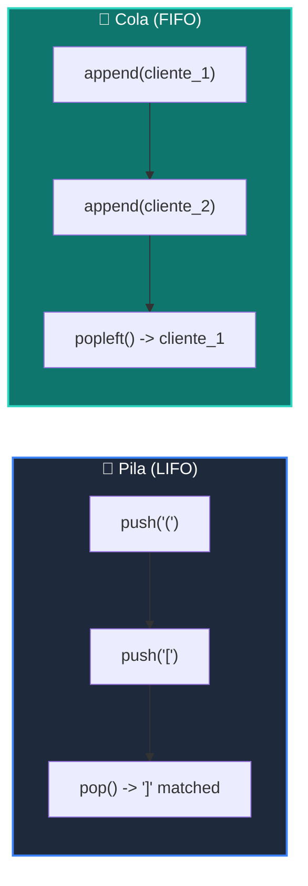

# 📘 Clase 02: Pilas (Stacks) y Colas (Queues) con collections.deque

<div class="grid cards" markdown>

-   :material-bookmark: **Curso:** Curso 2: Algoritmos Avanzados y Estructuras de Datos (CLASE 02)
-   :material-signal-cellular-outline: **Nivel:** `Nivel 2 - Intermedio`
-   :material-lightbulb-on: **Metáfora Central:** *«La Pila de Platos (LIFO) y la Fila del Banco (FIFO)»*
-   :material-laptop: **Wisrovi Studio (Local):** [🚀 Abrir Reto](http://127.0.0.1:8501/?course=2&class=2) &bull; [👨‍🏫 Modo Tutor](http://127.0.0.1:8501/tutor?course=2&class=2)
-   :material-file-pdf-box: **Manual PDF Oficial:** [Descargar clase-02-pilas-y-colas.pdf](https://github.com/wisrovi/wisrovi-python/raw/main/02-algoritmos-estructuras/clase-02-pilas-y-colas/clase-02-pilas-y-colas.pdf)

</div>

<div align="center" style="margin: 1rem 0;" markdown>

[](https://colab.research.google.com/github/wisrovi/wisrovi-python/blob/main/02-algoritmos-estructuras/clase-02-pilas-y-colas/notebook/clase-02-pilas-y-colas.ipynb)
[-0284c7?logo=python&logoColor=white)](http://127.0.0.1:8501/?course=2&class=2)
[](https://github.com/wisrovi/wisrovi-python/tree/main/02-algoritmos-estructuras/clase-02-pilas-y-colas)

</div>

---

## 1. 💡 Fundamentación Teórica y Modelo Mental

Estructuras fundamentales de control secuencial:
1. **Pila (Stack - LIFO)**: Last-In, First-Out. Usada para llamadas a funciones, parseo de paréntesis y backtracking.
2. **Cola (Queue - FIFO)**: First-In, First-Out. Usada para procesamiento de tareas en segundo plano y BFS.
3. **`collections.deque`**: Estructura de doble extremo con inserción/extracción $O(1)$ en ambos lados.

!!! note "🌟 Modelo Mental de la Sesión: «La Pila de Platos (LIFO) y la Fila del Banco (FIFO)»"
    En esta sesión anclamos el aprendizaje en la metáfora del mundo real para visualizar cómo fluyen las estructuras de datos y el flujo de ejecución en la memoria.

---

## 2. 🗺️ Arquitectura de Ejecución y Diagrama de Flujo



---

## 3. 💻 Código de Implementación Práctica

=== "🚀 Demostración en Vivo"
    ```python
    from collections import deque

cola = deque(["Tarea 1", "Tarea 2", "Tarea 3"])
cola.append("Tarea 4")
atendida = cola.popleft()
print(f"Atendida: {atendida} | En cola:", list(cola))
    ```

=== "🔬 Arenero de Exploración de Memoria (RAM)"
    ```python
    pila = []
pila.append("Página 1")
pila.append("Página 2")
print("Atrás a:", pila.pop())
    ```

---

## 4. 🛡️ Buenas Prácticas PEP 8: Antipatrones vs Código Pythonic

!!! warning "⚠️ Cuidado con los Antipatrones"
    

=== "❌ Antipatrón / Código Inadecuado"
    ```python
    cola = []
cola.append(x)
primero = cola.pop(0)  # ❌ O(n) movimiento de bloques en memoria
    ```

=== "✅ Patrón Recomendado / Pythonic"
    ```python
    from collections import deque
cola = deque()
cola.append(x)
primero = cola.popleft()  # ✅ O(1) instantáneo
    ```

---

## 5. 🏋️ Desafío Práctico de la Clase

!!! example "🎯 Enunciado del Reto"
    **Crea una función `validar_parentesis(cadena: str) -> bool` que use una pila (`list`) para verificar si los símbolos '()', '[]' y '{}' están correctamente balanceados y anidados.**

!!! tip "⚡ Resolución Híbrida en 1 Clic (Local + Web)"
    Si tienes ejecutando `wisrovi ui` en tu terminal local, puedes [🚀 Abrir este Reto directamente en tu Studio Local (127.0.0.1:8501)](http://127.0.0.1:8501/?course=2&class=2) para escribir tu código con auto-formateo AST, inspeccionar variables en el Heap/Stack y evaluarlo con pruebas en tiempo real.

=== "💻 Plantilla de Inicio (Starter Code)"
    ```python
    def validar_parentesis(cadena: str) -> bool:
    # ✍️ Usa una pila para validar balance de () [] {}
    pila = []
    pares = {')': '(', ']': '[', '}': '{'}
    for char in cadena:
        if char in pares.values():
            pila.append(char)
        elif char in pares:
            if not pila or pila.pop() != pares[char]:
                return False
    return len(pila) == 0

    ```

??? info "💡 Pista Socrática 1"
    💡 Pista 1: Empuja los caracteres de apertura `(`, `[`, `{` a la pila.

??? info "💡 Pista Socrática 2"
    💡 Pista 2: Al encontrar uno de cierre, comprueba si coincide con el `pop()` de la pila.

??? info "💡 Pista Socrática 3"
    💡 Pista 3: Retorna `True` únicamente si al final la pila queda vacía (`len(pila) == 0`).


Para resolver este ejercicio en tu entorno:
1. Abre el archivo `ejercicios/reto.py` de esta clase en Visual Studio Code o utiliza `wisrovi ui` / `wisrovi tutor`.
2. Implementa tu solución cumpliendo los requisitos y contratos de tipado.
3. Valida tus resultados ejecutando las pruebas unitarias:
   ```bash
   pytest tests/curso_02/test_clase_02_pilas_y_colas.py
   ```

---


## 6. 📚 Fuentes y Bibliografía Recomendada

*   [📖 Documentación Oficial de Python 3](https://docs.python.org/3/)
*   [📑 Guía de Estilo Oficial PEP 8](https://peps.python.org/pep-0008/)
*   [📦 Ecosistema Open Source wisrovi en PyPI](https://pypi.org/user/wisrovi/)
