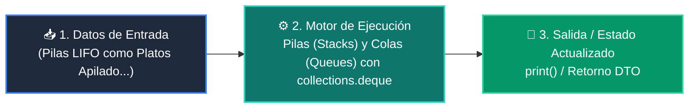

# 📘 Clase 02: Pilas (Stacks) y Colas (Queues) con collections.deque

<div class="grid cards" markdown>

-   :material-bookmark: **Curso:** Curso 2: Algoritmos Avanzados y Estructuras de Datos (CLASE 02)
-   :material-signal-cellular-outline: **Nivel:** `Nivel 2 - Intermedio`
-   :material-lightbulb-on: **Metáfora Central:** *«Pilas LIFO como Platos Apilados y Colas FIFO como la Fila del Supermercado»*
-   :material-file-pdf-box: **Manual PDF Oficial:** [Descargar clase-02-pilas-y-colas.pdf](https://github.com/wisrovi/wisrovi-python/raw/main/02-algoritmos-estructuras/clase-02-pilas-y-colas/clase-02-pilas-y-colas.pdf)

</div>

<div align="center" style="margin: 1rem 0;" markdown>

[](https://colab.research.google.com/github/wisrovi/wisrovi-python/blob/main/02-algoritmos-estructuras/clase-02-pilas-y-colas/notebook/clase-02-pilas-y-colas.ipynb)
[](https://github.com/wisrovi/wisrovi-python/tree/main/02-algoritmos-estructuras/clase-02-pilas-y-colas)

</div>

---

## 1. 💡 Fundamentación Teórica y Modelo Mental


!!! note "🌟 Modelo Mental de la Sesión: «Pilas LIFO como Platos Apilados y Colas FIFO como la Fila del Supermercado»"
    Una pila es como una torre de platos (el último que pones es el primero que lavas); una cola es la fila del banco (el primero en llegar es el primero en ser atendido).

### Principios Fundamentales de la Sesión


!!! info "⚡ Regla de Oro en Python"
    Nunca uses lista.pop(0) para colas; usa siempre collections.deque().popleft().

---

## 2. 🗺️ Arquitectura de Ejecución y Diagrama de Flujo



---

## 3. 💻 Código de Implementación Práctica

```python
from collections import deque\n\n# 1. Pila (Stack LIFO)\ndef balanceado(expr: str) -> bool:\n    pila = []\n    mapa = {")": "(", "}": "{", "]": "["}\n    for char in expr:\n        if char in mapa.values(): pila.append(char)\n        elif char in mapa:\n            if not pila or pila.pop() != mapa[char]: return False\n    return len(pila) == 0\n\n# 2. Cola (Queue FIFO)\ncola = deque(["Ticket 1", "Ticket 2", "Ticket 3"])\ncola.append("Ticket 4")\nprint("Atendido:", cola.popleft())  # Ticket 1\nprint("Es valido:", balanceado("{[()]}"))
```

---

## 4. 🛡️ Buenas Prácticas, Gotchas y Prevención de Errores

!!! warning "⚠️ Trampa Frecuente (Gotcha)"
    Usar list.pop(0) en colas con miles de elementos colapsa el rendimiento de la CPU.

=== "❌ Antipatrón / Código Inadecuado"
    ```python
    cola = []
cola.append(x)
primero = cola.pop(0)  # ❌ O(n) movimiento de bloques en memoria
    ```

=== "✅ Patrón Recomendado / Pythonic"
    ```python
    from collections import deque
cola = deque()
cola.append(x)
primero = cola.popleft()  # ✅ O(1) instantáneo
    ```

!!! tip "🔧 Consejo de Ingeniería"
    

---

## 5. 🏋️ Desafío Práctico de la Clase

!!! example "🎯 Enunciado del Reto"
    **Implementa un historial de navegación web con funciones ir_a(url), atras() y adelante() usando dos pilas.**

Para resolver este ejercicio en tu entorno:
1. Abre el archivo `ejercicios/reto.py` de esta clase en Visual Studio Code.
2. Implementa tu solución cumpliendo los requisitos y contratos de tipo.
3. Valida tus resultados ejecutando las pruebas unitarias:
   ```bash
   pytest tests/curso_02/test_clase_02_pilas_y_colas.py
   ```

---

## 6. 📚 Fuentes y Bibliografía Recomendada

*   [📖 Documentación Oficial de Python 3](https://docs.python.org/3/)
*   [📑 Guía de Estilo Oficial PEP 8](https://peps.python.org/pep-0008/)
*   [📦 Ecosistema Open Source wisrovi en PyPI](https://pypi.org/user/wisrovi/)
