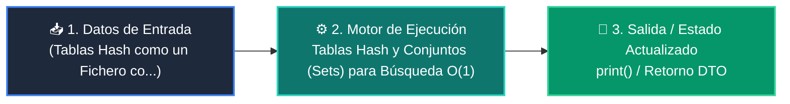

# 📘 Clase 03: Tablas Hash y Conjuntos (Sets) para Búsqueda O(1)

<div class="grid cards" markdown>

-   :material-bookmark: **Curso:** Curso 2: Algoritmos Avanzados y Estructuras de Datos (CLASE 03)
-   :material-signal-cellular-outline: **Nivel:** `Nivel 2 - Intermedio`
-   :material-lightbulb-on: **Metáfora Central:** *«Tablas Hash como un Fichero con Índice Alfabético Instantáneo»*
-   :material-file-pdf-box: **Manual PDF Oficial:** [Descargar clase-03-tablas-hash-y-sets.pdf](https://github.com/wisrovi/wisrovi-python/raw/main/02-algoritmos-estructuras/clase-03-tablas-hash-y-sets/clase-03-tablas-hash-y-sets.pdf)

</div>

<div align="center" style="margin: 1rem 0;" markdown>

[](https://colab.research.google.com/github/wisrovi/wisrovi-python/blob/main/02-algoritmos-estructuras/clase-03-tablas-hash-y-sets/notebook/clase-03-tablas-hash-y-sets.ipynb)
[](https://github.com/wisrovi/wisrovi-python/tree/main/02-algoritmos-estructuras/clase-03-tablas-hash-y-sets)

</div>

---

## 1. 💡 Fundamentación Teórica y Modelo Mental


!!! note "🌟 Modelo Mental de la Sesión: «Tablas Hash como un Fichero con Índice Alfabético Instantáneo»"
    Es como un conserje de hotel que sabe instantáneamente el casillero de cada huésped con solo mirar su apellido.

### Principios Fundamentales de la Sesión


!!! info "⚡ Regla de Oro en Python"
    Cualquier objeto que uses como clave de diccionario o elemento de set debe implementar __hash__ e inmutabilidad.

---

## 2. 🗺️ Arquitectura de Ejecución y Diagrama de Flujo



---

## 3. 💻 Código de Implementación Práctica

```python
def two_sum(nums: list[int], target: int) -> tuple[int, int]:
    vistos = {}  # mapa: valor -> indice
    for i, num in enumerate(nums):
        complemento = target - num
        if complemento in vistos:
            return (vistos[complemento], i)
        vistos[num] = i
    return (-1, -1)

indices = two_sum([2, 7, 11, 15], 9)
print("Índices que suman 9:", indices)  # (0, 1)
```

---

## 4. 🛡️ Buenas Prácticas, Gotchas y Prevención de Errores

!!! warning "⚠️ Trampa Frecuente (Gotcha)"
    Intentar usar una lista mutable como clave de diccionario o elemento de set genera TypeError: unhashable type.

=== "❌ Antipatrón / Código Inadecuado"
    ```python
    mi_dict = {}
mi_dict[[1, 2]] = 'valor'  # ❌ TypeError: unhashable type: 'list'
    ```

=== "✅ Patrón Recomendado / Pythonic"
    ```python
    mi_dict = {}
mi_dict[(1, 2)] = 'valor'  # ✅ Tupla inmutable hashable
    ```

!!! tip "🔧 Consejo de Ingeniería"
    

---

## 5. 🏋️ Desafío Práctico de la Clase

!!! example "🎯 Enunciado del Reto"
    **Implementa una función que encuentre el primer carácter no repetido en una cadena en tiempo O(n).**

Para resolver este ejercicio en tu entorno:
1. Abre el archivo `ejercicios/reto.py` de esta clase en Visual Studio Code.
2. Implementa tu solución cumpliendo los requisitos y contratos de tipo.
3. Valida tus resultados ejecutando las pruebas unitarias:
   ```bash
   pytest tests/curso_02/test_clase_03_tablas_hash_y_sets.py
   ```

---

## 6. 📚 Fuentes y Bibliografía Recomendada

*   [📖 Documentación Oficial de Python 3](https://docs.python.org/3/)
*   [📑 Guía de Estilo Oficial PEP 8](https://peps.python.org/pep-0008/)
*   [📦 Ecosistema Open Source wisrovi en PyPI](https://pypi.org/user/wisrovi/)
