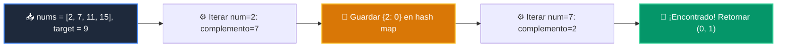

# 📘 Clase 03: Tablas Hash y Conjuntos (Sets) para Búsqueda O(1)

<div class="grid cards" markdown>

-   :material-bookmark: **Curso:** Curso 2: Algoritmos Avanzados y Estructuras de Datos (CLASE 03)
-   :material-signal-cellular-outline: **Nivel:** `Nivel 2 - Intermedio`
-   :material-lightbulb-on: **Metáfora Central:** *«El Casillero Postal Inteligente»*
-   :material-laptop: **Wisrovi Studio (Local):** [🚀 Abrir Reto](http://127.0.0.1:8501/?course=2&class=3) &bull; [👨‍🏫 Modo Tutor](http://127.0.0.1:8501/tutor?course=2&class=3)
-   :material-file-pdf-box: **Manual PDF Oficial:** [Descargar clase-03-tablas-hash-y-sets.pdf](https://github.com/wisrovi/wisrovi-python/raw/main/02-algoritmos-estructuras/clase-03-tablas-hash-y-sets/clase-03-tablas-hash-y-sets.pdf)

</div>

<div align="center" style="margin: 1rem 0;" markdown>

[](https://colab.research.google.com/github/wisrovi/wisrovi-python/blob/main/02-algoritmos-estructuras/clase-03-tablas-hash-y-sets/notebook/clase-03-tablas-hash-y-sets.ipynb)
[-0284c7?logo=python&logoColor=white)](http://127.0.0.1:8501/?course=2&class=3)
[](https://github.com/wisrovi/wisrovi-python/tree/main/02-algoritmos-estructuras/clase-03-tablas-hash-y-sets)

</div>

---

## 1. 💡 Fundamentación Teórica y Modelo Mental

Búsquedas en tiempo constante $O(1)$ gracias al direccionamiento por dispersión (Hashing):
1. **Función Hash**: Convierte una clave en un índice numérico de memoria.
2. **Patrón Two-Sum**: Resolver el problema de la suma objetivo en $O(N)$ usando un mapa hash en lugar de $O(N^2)$.
3. **Resolución de Colisiones**: Encadenamiento y sondeo lineal internos en CPython.

!!! note "🌟 Modelo Mental de la Sesión: «El Casillero Postal Inteligente»"
    En esta sesión anclamos el aprendizaje en la metáfora del mundo real para visualizar cómo fluyen las estructuras de datos y el flujo de ejecución en la memoria.

---

## 2. 🗺️ Arquitectura de Ejecución y Diagrama de Flujo



---

## 3. 💻 Código de Implementación Práctica

=== "🚀 Demostración en Vivo"
    ```python
    def two_sum_demo(nums: list[int], target: int) -> tuple[int, int]:
    vistos = {}
    for idx, n in enumerate(nums):
        comp = target - n
        if comp in vistos:
            return (vistos[comp], idx)
        vistos[n] = idx
    return (-1, -1)

print(two_sum_demo([2, 7, 11, 15], 9))
    ```

=== "🔬 Arenero de Exploración de Memoria (RAM)"
    ```python
    tabla = {"usuario_1": "Ana", "usuario_2": "Carlos"}
print("Búsqueda O(1):", tabla.get("usuario_1"))
    ```

---

## 4. 🛡️ Buenas Prácticas PEP 8: Antipatrones vs Código Pythonic

!!! warning "⚠️ Cuidado con los Antipatrones"
    

=== "❌ Antipatrón / Código Inadecuado"
    ```python
    mi_dict = {}
mi_dict[[1, 2]] = 'valor'  # ❌ TypeError: unhashable type: 'list'
    ```

=== "✅ Patrón Recomendado / Pythonic"
    ```python
    mi_dict = {}
mi_dict[(1, 2)] = 'valor'  # ✅ Tupla inmutable hashable
    ```

---

## 5. 🏋️ Desafío Práctico de la Clase

!!! example "🎯 Enunciado del Reto"
    **Crea una función `two_sum_hash(nums: list[int], objetivo: int) -> tuple[int, int]` que encuentre y retorne los dos índices `(i, j)` cuya suma sea igual a `objetivo` en tiempo $O(N)$.**

!!! tip "⚡ Resolución Híbrida en 1 Clic (Local + Web)"
    Si tienes ejecutando `wisrovi ui` en tu terminal local, puedes [🚀 Abrir este Reto directamente en tu Studio Local (127.0.0.1:8501)](http://127.0.0.1:8501/?course=2&class=3) para escribir tu código con auto-formateo AST, inspeccionar variables en el Heap/Stack y evaluarlo con pruebas en tiempo real.

=== "💻 Plantilla de Inicio (Starter Code)"
    ```python
    def two_sum_hash(nums: list[int], objetivo: int) -> tuple[int, int]:
    # ✍️ Implementa el patrón Two-Sum en O(N)
    mapa = {}
    for i, num in enumerate(nums):
        complemento = objetivo - num
        if complemento in mapa:
            return (mapa[complemento], i)
        mapa[num] = i
    return (-1, -1)

    ```

??? info "💡 Pista Socrática 1"
    💡 Pista 1: Almacena cada número y su índice en un diccionario: `mapa[num] = i`.

??? info "💡 Pista Socrática 2"
    💡 Pista 2: Para cada número, calcula `complemento = objetivo - num` y consulta `if complemento in mapa:`.

??? info "💡 Pista Socrática 3"
    💡 Pista 3: Retorna la tupla con los dos índices `(mapa[complemento], i)`.


Para resolver este ejercicio en tu entorno:
1. Abre el archivo `ejercicios/reto.py` de esta clase en Visual Studio Code o utiliza `wisrovi ui` / `wisrovi tutor`.
2. Implementa tu solución cumpliendo los requisitos y contratos de tipado.
3. Valida tus resultados ejecutando las pruebas unitarias:
   ```bash
   pytest tests/curso_02/test_clase_03_tablas_hash_y_sets.py
   ```

---


## 6. 📚 Fuentes y Bibliografía Recomendada

*   [📖 Documentación Oficial de Python 3](https://docs.python.org/3/)
*   [📑 Guía de Estilo Oficial PEP 8](https://peps.python.org/pep-0008/)
*   [📦 Ecosistema Open Source wisrovi en PyPI](https://pypi.org/user/wisrovi/)
