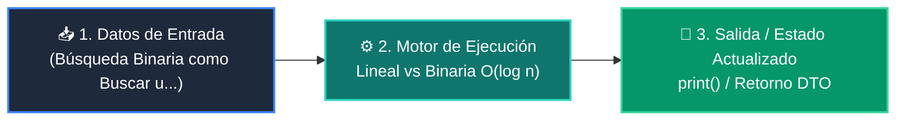

# 📘 Clase 04: Algoritmos de Búsqueda: Lineal vs Binaria O(log n)

<div class="grid cards" markdown>

-   :material-bookmark: **Curso:** Curso 2: Algoritmos Avanzados y Estructuras de Datos (CLASE 04)
-   :material-signal-cellular-outline: **Nivel:** `Nivel 2 - Intermedio`
-   :material-lightbulb-on: **Metáfora Central:** *«Búsqueda Binaria como Buscar una Palabra en el Diccionario Dividiendo a la Mitad»*
-   :material-file-pdf-box: **Manual PDF Oficial:** [Descargar clase-04-algoritmos-busqueda.pdf](https://github.com/wisrovi/wisrovi-python/raw/main/02-algoritmos-estructuras/clase-04-algoritmos-busqueda/clase-04-algoritmos-busqueda.pdf)

</div>

<div align="center" style="margin: 1rem 0;" markdown>

[](https://colab.research.google.com/github/wisrovi/wisrovi-python/blob/main/02-algoritmos-estructuras/clase-04-algoritmos-busqueda/notebook/clase-04-algoritmos-busqueda.ipynb)
[](https://github.com/wisrovi/wisrovi-python/tree/main/02-algoritmos-estructuras/clase-04-algoritmos-busqueda)

</div>

---

## 1. 💡 Fundamentación Teórica y Modelo Mental


!!! note "🌟 Modelo Mental de la Sesión: «Búsqueda Binaria como Buscar una Palabra en el Diccionario Dividiendo a la Mitad»"
    Para encontrar la página 500 de un libro de 1000 páginas, lo abres a la mitad exacta y descartas 500 páginas de golpe.

### Principios Fundamentales de la Sesión


!!! info "⚡ Regla de Oro en Python"
    La búsqueda binaria solo es válida sobre arreglos previamente ordenados.

---

## 2. 🗺️ Arquitectura de Ejecución y Diagrama de Flujo



---

## 3. 💻 Código de Implementación Práctica

```python
import bisect

def busqueda_binaria(arr: list[int], target: int) -> int:
    left, right = 0, len(arr) - 1
    while left <= right:
        mid = (left + right) // 2
        if arr[mid] == target:
            return mid
        elif arr[mid] < target:
            left = mid + 1
        else:
            right = mid - 1
    return -1

datos = [10, 20, 30, 40, 50, 60, 70, 80]
idx = busqueda_binaria(datos, 60)
print("Índice de 60:", idx)  # 5
print("Índice con bisect_left:", bisect.bisect_left(datos, 60))
```

---

## 4. 🛡️ Buenas Prácticas, Gotchas y Prevención de Errores

!!! warning "⚠️ Trampa Frecuente (Gotcha)"
    Escribir while left < right en lugar de left <= right omite evaluar el último elemento restante.

=== "❌ Antipatrón / Código Inadecuado"
    ```python
    while left < right:  # ❌ Puede fallar si el target está en el último elemento
    ```

=== "✅ Patrón Recomendado / Pythonic"
    ```python
    while left <= right:  # ✅ Evalúa todos los casos correctamente
    ```

!!! tip "🔧 Consejo de Ingeniería"
    

---

## 5. 🏋️ Desafío Práctico de la Clase

!!! example "🎯 Enunciado del Reto"
    **Modifica la búsqueda binaria para encontrar la primera y última posición de un elemento repetido.**

Para resolver este ejercicio en tu entorno:
1. Abre el archivo `ejercicios/reto.py` de esta clase en Visual Studio Code.
2. Implementa tu solución cumpliendo los requisitos y contratos de tipo.
3. Valida tus resultados ejecutando las pruebas unitarias:
   ```bash
   pytest tests/curso_02/test_clase_04_algoritmos_busqueda.py
   ```

---

## 6. 📚 Fuentes y Bibliografía Recomendada

*   [📖 Documentación Oficial de Python 3](https://docs.python.org/3/)
*   [📑 Guía de Estilo Oficial PEP 8](https://peps.python.org/pep-0008/)
*   [📦 Ecosistema Open Source wisrovi en PyPI](https://pypi.org/user/wisrovi/)
