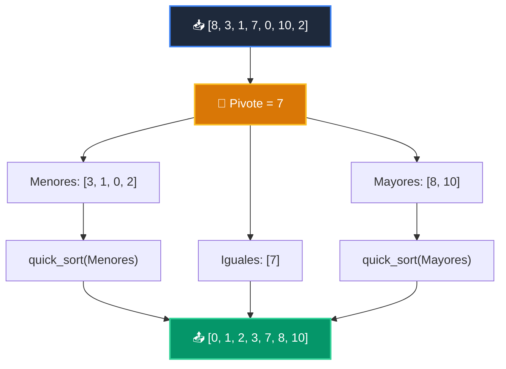

# 📘 Clase 05: Algoritmos de Ordenamiento: QuickSort y MergeSort

<div class="grid cards" markdown>

-   :material-bookmark: **Curso:** Curso 2: Algoritmos Avanzados y Estructuras de Datos (CLASE 05)
-   :material-signal-cellular-outline: **Nivel:** `Nivel 2 - Intermedio`
-   :material-lightbulb-on: **Metáfora Central:** *«El Organizador de Barajas de Cartas (Divide y Vencerás)»*
-   :material-laptop: **Wisrovi Studio (Local):** [🚀 Abrir Reto](http://127.0.0.1:8501/?course=2&class=5) &bull; [👨‍🏫 Modo Tutor](http://127.0.0.1:8501/tutor?course=2&class=5)
-   :material-file-pdf-box: **Manual PDF Oficial:** [Descargar clase-05-algoritmos-ordenamiento.pdf](https://github.com/wisrovi/wisrovi-python/raw/main/02-algoritmos-estructuras/clase-05-algoritmos-ordenamiento/clase-05-algoritmos-ordenamiento.pdf)

</div>

<div align="center" style="margin: 1rem 0;" markdown>

[](https://colab.research.google.com/github/wisrovi/wisrovi-python/blob/main/02-algoritmos-estructuras/clase-05-algoritmos-ordenamiento/notebook/clase-05-algoritmos-ordenamiento.ipynb)
[-0284c7?logo=python&logoColor=white)](http://127.0.0.1:8501/?course=2&class=5)
[](https://github.com/wisrovi/wisrovi-python/tree/main/02-algoritmos-estructuras/clase-05-algoritmos-ordenamiento)

</div>

---

## 1. 💡 Fundamentación Teórica y Modelo Mental

Algoritmos de ordenamiento basados en el paradigma *Divide y Vencerás*:
1. **QuickSort**: Selecciona un pivote y particiona los elementos en menores, iguales y mayores ($O(N \log N)$ promedio).
2. **MergeSort**: Divide la lista recursivamente en mitades y las combina de forma ordenada ($O(N \log N)$ garantizado).
3. **Timsort**: El algoritmo híbrido nativo de Python (`sorted()` / `.sort()`).

!!! note "🌟 Modelo Mental de la Sesión: «El Organizador de Barajas de Cartas (Divide y Vencerás)»"
    En esta sesión anclamos el aprendizaje en la metáfora del mundo real para visualizar cómo fluyen las estructuras de datos y el flujo de ejecución en la memoria.

---

## 2. 🗺️ Arquitectura de Ejecución y Diagrama de Flujo



---

## 3. 💻 Código de Implementación Práctica

=== "🚀 Demostración en Vivo"
    ```python
    def quick_sort_demo(lista: list[int]) -> list[int]:
    if len(lista) <= 1: return lista
    pivote = lista[len(lista) // 2]
    menores = [x for x in lista if x < pivote]
    iguales = [x for x in lista if x == pivote]
    mayores = [x for x in lista if x > pivote]
    return quick_sort_demo(menores) + iguales + quick_sort_demo(mayores)

print("Ordenado:", quick_sort_demo([64, 34, 25, 12, 22, 11, 90]))
    ```

=== "🔬 Arenero de Exploración de Memoria (RAM)"
    ```python
    desordenados = [9, 3, 7, 1, 5]
print("Timsort nativo:", sorted(desordenados))
    ```

---

## 4. 🛡️ Buenas Prácticas PEP 8: Antipatrones vs Código Pythonic

!!! warning "⚠️ Cuidado con los Antipatrones"
    

=== "❌ Antipatrón / Código Inadecuado"
    ```python
    pivote = arr[0]  # ❌ Degrada a O(n^2) si la lista ya viene ordenada
    ```

=== "✅ Patrón Recomendado / Pythonic"
    ```python
    pivote = arr[len(arr) // 2]  # ✅ Pivote central o aleatorio
    ```

---

## 5. 🏋️ Desafío Práctico de la Clase

!!! example "🎯 Enunciado del Reto"
    **Crea una función `quick_sort(arr: list[int]) -> list[int]` que implemente el algoritmo QuickSort recursivo dividiendo por un elemento pivote.**

!!! tip "⚡ Resolución Híbrida en 1 Clic (Local + Web)"
    Si tienes ejecutando `wisrovi ui` en tu terminal local, puedes [🚀 Abrir este Reto directamente en tu Studio Local (127.0.0.1:8501)](http://127.0.0.1:8501/?course=2&class=5) para escribir tu código con auto-formateo AST, inspeccionar variables en el Heap/Stack y evaluarlo con pruebas en tiempo real.

=== "💻 Plantilla de Inicio (Starter Code)"
    ```python
    def quick_sort(arr: list[int]) -> list[int]:
    # ✍️ Implementa QuickSort recursivo
    if len(arr) <= 1:
        return arr
    pivote = arr[len(arr) // 2]
    menores = [x for x in arr if x < pivote]
    iguales = [x for x in arr if x == pivote]
    mayores = [x for x in arr if x > pivote]
    return quick_sort(menores) + iguales + quick_sort(mayores)

    ```

??? info "💡 Pista Socrática 1"
    💡 Pista 1: El caso base es `if len(arr) <= 1: return arr`.

??? info "💡 Pista Socrática 2"
    💡 Pista 2: Elige un pivote como `arr[len(arr) // 2]`.

??? info "💡 Pista Socrática 3"
    💡 Pista 3: Concatena `quick_sort(menores) + iguales + quick_sort(mayores)`.


Para resolver este ejercicio en tu entorno:
1. Abre el archivo `ejercicios/reto.py` de esta clase en Visual Studio Code o utiliza `wisrovi ui` / `wisrovi tutor`.
2. Implementa tu solución cumpliendo los requisitos y contratos de tipado.
3. Valida tus resultados ejecutando las pruebas unitarias:
   ```bash
   pytest tests/curso_02/test_clase_05_algoritmos_ordenamiento.py
   ```

---


## 6. 📚 Fuentes y Bibliografía Recomendada

*   [📖 Documentación Oficial de Python 3](https://docs.python.org/3/)
*   [📑 Guía de Estilo Oficial PEP 8](https://peps.python.org/pep-0008/)
*   [📦 Ecosistema Open Source wisrovi en PyPI](https://pypi.org/user/wisrovi/)
