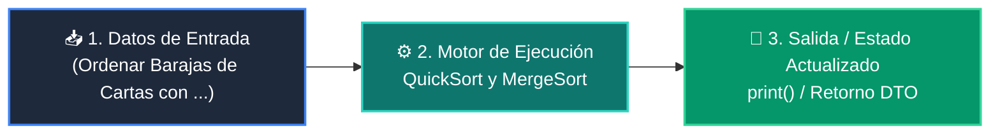

# 📘 Clase 05: Algoritmos de Ordenamiento: QuickSort y MergeSort

<div class="grid cards" markdown>

-   :material-bookmark: **Curso:** Curso 2: Algoritmos Avanzados y Estructuras de Datos (CLASE 05)
-   :material-signal-cellular-outline: **Nivel:** `Nivel 2 - Intermedio`
-   :material-lightbulb-on: **Metáfora Central:** *«Ordenar Barajas de Cartas con Divide y Vencerás»*
-   :material-file-pdf-box: **Manual PDF Oficial:** [Descargar clase-05-algoritmos-ordenamiento.pdf](https://github.com/wisrovi/wisrovi-python/raw/main/02-algoritmos-estructuras/clase-05-algoritmos-ordenamiento/clase-05-algoritmos-ordenamiento.pdf)

</div>

<div align="center" style="margin: 1rem 0;" markdown>

[](https://colab.research.google.com/github/wisrovi/wisrovi-python/blob/main/02-algoritmos-estructuras/clase-05-algoritmos-ordenamiento/notebook/clase-05-algoritmos-ordenamiento.ipynb)
[](https://github.com/wisrovi/wisrovi-python/tree/main/02-algoritmos-estructuras/clase-05-algoritmos-ordenamiento)

</div>

---

## 1. 💡 Fundamentación Teórica y Modelo Mental


!!! note "🌟 Modelo Mental de la Sesión: «Ordenar Barajas de Cartas con Divide y Vencerás»"
    QuickSort elige un elemento pivote y separa las cartas en dos montones: menores a la izquierda, mayores a la derecha.

### Principios Fundamentales de la Sesión


!!! info "⚡ Regla de Oro en Python"
    En producción, usa siempre el método .sort() de Python, que implementa Timsort (híbrido optimizado en C).

---

## 2. 🗺️ Arquitectura de Ejecución y Diagrama de Flujo



---

## 3. 💻 Código de Implementación Práctica

```python
def quicksort(arr: list[int]) -> list[int]:
    if len(arr)  pivote]
    return quicksort(menores) + iguales + quicksort(mayores)

desordenados = [38, 27, 43, 3, 9, 82, 10]
print("Ordenados:", quicksort(desordenados))
```

---

## 4. 🛡️ Buenas Prácticas, Gotchas y Prevención de Errores

!!! warning "⚠️ Trampa Frecuente (Gotcha)"
    Elegir siempre el primer elemento como pivote en una lista que ya está ordenada genera O(n^2).

=== "❌ Antipatrón / Código Inadecuado"
    ```python
    pivote = arr[0]  # ❌ Degrada a O(n^2) si la lista ya viene ordenada
    ```

=== "✅ Patrón Recomendado / Pythonic"
    ```python
    pivote = arr[len(arr) // 2]  # ✅ Pivote central o aleatorio
    ```

!!! tip "🔧 Consejo de Ingeniería"
    

---

## 5. 🏋️ Desafío Práctico de la Clase

!!! example "🎯 Enunciado del Reto"
    **Implementa MergeSort y compara el número de comparaciones frente a QuickSort.**

Para resolver este ejercicio en tu entorno:
1. Abre el archivo `ejercicios/reto.py` de esta clase en Visual Studio Code.
2. Implementa tu solución cumpliendo los requisitos y contratos de tipo.
3. Valida tus resultados ejecutando las pruebas unitarias:
   ```bash
   pytest tests/curso_02/test_clase_05_algoritmos_ordenamiento.py
   ```

---

## 6. 📚 Fuentes y Bibliografía Recomendada

*   [📖 Documentación Oficial de Python 3](https://docs.python.org/3/)
*   [📑 Guía de Estilo Oficial PEP 8](https://peps.python.org/pep-0008/)
*   [📦 Ecosistema Open Source wisrovi en PyPI](https://pypi.org/user/wisrovi/)
