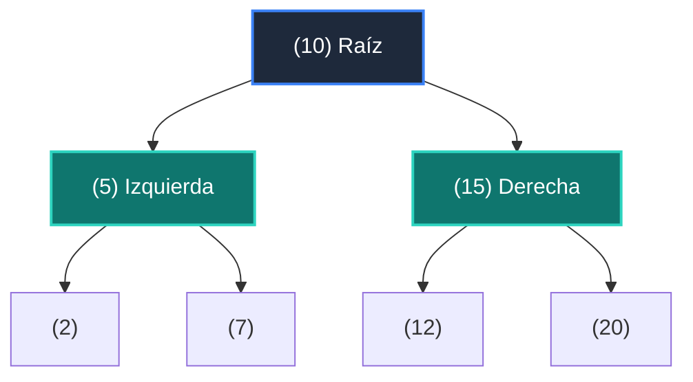

# 📘 Clase 06: Árboles Binarios de Búsqueda (BST) y Recorridos

<div class="grid cards" markdown>

-   :material-bookmark: **Curso:** Curso 2: Algoritmos Avanzados y Estructuras de Datos (CLASE 06)
-   :material-signal-cellular-outline: **Nivel:** `Nivel 2 - Intermedio`
-   :material-lightbulb-on: **Metáfora Central:** *«El Árbol Genealógico de Decisiones»*
-   :material-laptop: **Wisrovi Studio (Local):** [🚀 Abrir Reto](http://127.0.0.1:8501/?course=2&class=6) &bull; [👨‍🏫 Modo Tutor](http://127.0.0.1:8501/tutor?course=2&class=6)
-   :material-file-pdf-box: **Manual PDF Oficial:** [Descargar clase-06-arboles-binarios-busqueda.pdf](https://github.com/wisrovi/wisrovi-python/raw/main/02-algoritmos-estructuras/clase-06-arboles-binarios-busqueda/clase-06-arboles-binarios-busqueda.pdf)

</div>

<div align="center" style="margin: 1rem 0;" markdown>

[](https://colab.research.google.com/github/wisrovi/wisrovi-python/blob/main/02-algoritmos-estructuras/clase-06-arboles-binarios-busqueda/notebook/clase-06-arboles-binarios-busqueda.ipynb)
[-0284c7?logo=python&logoColor=white)](http://127.0.0.1:8501/?course=2&class=6)
[](https://github.com/wisrovi/wisrovi-python/tree/main/02-algoritmos-estructuras/clase-06-arboles-binarios-busqueda)

</div>

---

## 1. 💡 Fundamentación Teórica y Modelo Mental

Estructura jerárquica no lineal con propiedad de ordenamiento:
1. **Propiedad BST**: Para todo nodo, los valores a la izquierda son menores y a la derecha son mayores.
2. **Recorrido In-Order (Izquierda -> Raíz -> Derecha)**: Visita los nodos en orden ascendente exacto.
3. **Complejidad**: Búsqueda e inserción en $O(\log N)$ si el árbol está balanceado.

!!! note "🌟 Modelo Mental de la Sesión: «El Árbol Genealógico de Decisiones»"
    En esta sesión anclamos el aprendizaje en la metáfora del mundo real para visualizar cómo fluyen las estructuras de datos y el flujo de ejecución en la memoria.

---

## 2. 🗺️ Arquitectura de Ejecución y Diagrama de Flujo



---

## 3. 💻 Código de Implementación Práctica

=== "🚀 Demostración en Vivo"
    ```python
    class NodoBST:
    def __init__(self, val: int):
        self.val = val
        self.izq = None
        self.der = None

raiz = NodoBST(10)
raiz.izq = NodoBST(5)
raiz.der = NodoBST(15)
print(f"Raíz: {raiz.val}, Izq: {raiz.izq.val}, Der: {raiz.der.val}")
    ```

=== "🔬 Arenero de Exploración de Memoria (RAM)"
    ```python
    def in_order_traversal(nodo, res):
    if nodo:
        in_order_traversal(nodo.izq, res)
        res.append(nodo.val)
        in_order_traversal(nodo.der, res)
    ```

---

## 4. 🛡️ Buenas Prácticas PEP 8: Antipatrones vs Código Pythonic

!!! warning "⚠️ Cuidado con los Antipatrones"
    

=== "❌ Antipatrón / Código Inadecuado"
    ```python
    def buscar(nodo, val):
    if nodo.val == val: return True  # ❌ Falla si nodo es None
    ```

=== "✅ Patrón Recomendado / Pythonic"
    ```python
    def buscar(nodo, val):
    if not nodo: return False       # ✅ Caso base de seguridad
    if nodo.val == val: return True
    ```

---

## 5. 🏋️ Desafío Práctico de la Clase

!!! example "🎯 Enunciado del Reto"
    **Crea una clase `NodoBST` con atributos `val`, `izq` y `der`, y una función `in_order(raiz: Optional[NodoBST]) -> list[int]` que retorne la lista de valores en recorrido in-order (orden ascendente).**

!!! tip "⚡ Resolución Híbrida en 1 Clic (Local + Web)"
    Si tienes ejecutando `wisrovi ui` en tu terminal local, puedes [🚀 Abrir este Reto directamente en tu Studio Local (127.0.0.1:8501)](http://127.0.0.1:8501/?course=2&class=6) para escribir tu código con auto-formateo AST, inspeccionar variables en el Heap/Stack y evaluarlo con pruebas en tiempo real.

=== "💻 Plantilla de Inicio (Starter Code)"
    ```python
    from typing import Optional, List

class NodoBST:
    def __init__(self, val: int):
        self.val = val
        self.izq: Optional['NodoBST'] = None
        self.der: Optional['NodoBST'] = None

def in_order(raiz: Optional[NodoBST]) -> List[int]:
    # ✍️ Recorrido in-order recursivo
    res = []
    def recorrer(n):
        if n:
            recorrer(n.izq)
            res.append(n.val)
            recorrer(n.der)
    recorrer(raiz)
    return res

    ```

??? info "💡 Pista Socrática 1"
    💡 Pista 1: En un recorrido in-order, visita primero `n.izq`, luego procesa `n.val` y finalmente `n.der`.

??? info "💡 Pista Socrática 2"
    💡 Pista 2: Usa una función auxiliar recursiva que acumule en una lista `res`.

??? info "💡 Pista Socrática 3"
    💡 Pista 3: Retorna la lista resultante.


Para resolver este ejercicio en tu entorno:
1. Abre el archivo `ejercicios/reto.py` de esta clase en Visual Studio Code o utiliza `wisrovi ui` / `wisrovi tutor`.
2. Implementa tu solución cumpliendo los requisitos y contratos de tipado.
3. Valida tus resultados ejecutando las pruebas unitarias:
   ```bash
   pytest tests/curso_02/test_clase_06_arboles_binarios_busqueda.py
   ```

---


## 6. 📚 Fuentes y Bibliografía Recomendada

*   [📖 Documentación Oficial de Python 3](https://docs.python.org/3/)
*   [📑 Guía de Estilo Oficial PEP 8](https://peps.python.org/pep-0008/)
*   [📦 Ecosistema Open Source wisrovi en PyPI](https://pypi.org/user/wisrovi/)
