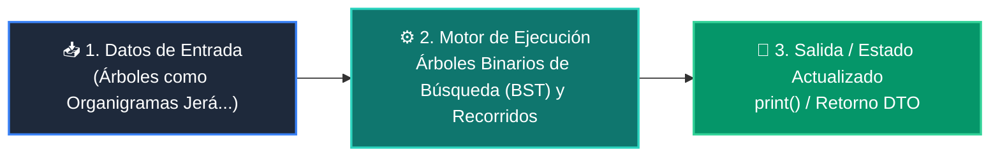

# 📘 Clase 06: Árboles Binarios de Búsqueda (BST) y Recorridos

<div class="grid cards" markdown>

-   :material-bookmark: **Curso:** Curso 2: Algoritmos Avanzados y Estructuras de Datos (CLASE 06)
-   :material-signal-cellular-outline: **Nivel:** `Nivel 2 - Intermedio`
-   :material-lightbulb-on: **Metáfora Central:** *«Árboles como Organigramas Jerárquicos con Ramas Izquierda y Derecha»*
-   :material-file-pdf-box: **Manual PDF Oficial:** [Descargar clase-06-arboles-binarios-busqueda.pdf](https://github.com/wisrovi/wisrovi-python/raw/main/02-algoritmos-estructuras/clase-06-arboles-binarios-busqueda/clase-06-arboles-binarios-busqueda.pdf)

</div>

<div align="center" style="margin: 1rem 0;" markdown>

[](https://colab.research.google.com/github/wisrovi/wisrovi-python/blob/main/02-algoritmos-estructuras/clase-06-arboles-binarios-busqueda/notebook/clase-06-arboles-binarios-busqueda.ipynb)
[](https://github.com/wisrovi/wisrovi-python/tree/main/02-algoritmos-estructuras/clase-06-arboles-binarios-busqueda)

</div>

---

## 1. 💡 Fundamentación Teórica y Modelo Mental


!!! note "🌟 Modelo Mental de la Sesión: «Árboles como Organigramas Jerárquicos con Ramas Izquierda y Derecha»"
    Un árbol BST es como un árbol genealógico donde a la izquierda van los números menores y a la derecha los mayores.

### Principios Fundamentales de la Sesión


!!! info "⚡ Regla de Oro en Python"
    Un árbol desbalanceado degenera en una lista enlazada O(n); los árboles balanceados mantienen O(log n).

---

## 2. 🗺️ Arquitectura de Ejecución y Diagrama de Flujo



---

## 3. 💻 Código de Implementación Práctica

```python
class Nodo:
    def __init__(self, val: int):
        self.val = val
        self.izq = None
        self.der = None

def insertar(raiz: Nodo, val: int) -> Nodo:
    if not raiz: return Nodo(val)
    if val < raiz.val: raiz.izq = insertar(raiz.izq, val)
    else: raiz.der = insertar(raiz.der, val)
    return raiz

def in_order(raiz: Nodo, res: list):
    if raiz:
        in_order(raiz.izq, res)
        res.append(raiz.val)
        in_order(raiz.der, res)

raiz = None
for num in [50, 30, 70, 20, 40, 60, 80]:
    raiz = insertar(raiz, num)

elementos = []
in_order(raiz, elementos)
print("Recorrido In-Order:", elementos)
```

---

## 4. 🛡️ Buenas Prácticas, Gotchas y Prevención de Errores

!!! warning "⚠️ Trampa Frecuente (Gotcha)"
    Olvidar validar if not nodo antes de acceder a nodo.izq produce AttributeError: 'NoneType' object has no attribute.

=== "❌ Antipatrón / Código Inadecuado"
    ```python
    def buscar(nodo, val):
    if nodo.val == val: return True  # ❌ Falla si nodo es None
    ```

=== "✅ Patrón Recomendado / Pythonic"
    ```python
    def buscar(nodo, val):
    if not nodo: return False       # ✅ Caso base de seguridad
    if nodo.val == val: return True
    ```

!!! tip "🔧 Consejo de Ingeniería"
    

---

## 5. 🏋️ Desafío Práctico de la Clase

!!! example "🎯 Enunciado del Reto"
    **Escribe una función que calcule la altura máxima (profundidad) de un árbol binario.**

Para resolver este ejercicio en tu entorno:
1. Abre el archivo `ejercicios/reto.py` de esta clase en Visual Studio Code.
2. Implementa tu solución cumpliendo los requisitos y contratos de tipo.
3. Valida tus resultados ejecutando las pruebas unitarias:
   ```bash
   pytest tests/curso_02/test_clase_06_arboles_binarios_busqueda.py
   ```

---

## 6. 📚 Fuentes y Bibliografía Recomendada

*   [📖 Documentación Oficial de Python 3](https://docs.python.org/3/)
*   [📑 Guía de Estilo Oficial PEP 8](https://peps.python.org/pep-0008/)
*   [📦 Ecosistema Open Source wisrovi en PyPI](https://pypi.org/user/wisrovi/)
