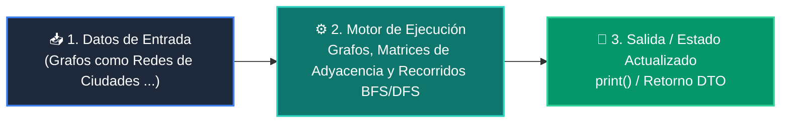

# 📘 Clase 07: Grafos, Matrices de Adyacencia y Recorridos BFS/DFS

<div class="grid cards" markdown>

-   :material-bookmark: **Curso:** Curso 2: Algoritmos Avanzados y Estructuras de Datos (CLASE 07)
-   :material-signal-cellular-outline: **Nivel:** `Nivel 2 - Intermedio`
-   :material-lightbulb-on: **Metáfora Central:** *«Grafos como Redes de Ciudades y Rutas de Vuelo»*
-   :material-file-pdf-box: **Manual PDF Oficial:** [Descargar clase-07-grafos-y-recorridos.pdf](https://github.com/wisrovi/wisrovi-python/raw/main/02-algoritmos-estructuras/clase-07-grafos-y-recorridos/clase-07-grafos-y-recorridos.pdf)

</div>

<div align="center" style="margin: 1rem 0;" markdown>

[](https://colab.research.google.com/github/wisrovi/wisrovi-python/blob/main/02-algoritmos-estructuras/clase-07-grafos-y-recorridos/notebook/clase-07-grafos-y-recorridos.ipynb)
[](https://github.com/wisrovi/wisrovi-python/tree/main/02-algoritmos-estructuras/clase-07-grafos-y-recorridos)

</div>

---

## 1. 💡 Fundamentación Teórica y Modelo Mental


!!! note "🌟 Modelo Mental de la Sesión: «Grafos como Redes de Ciudades y Rutas de Vuelo»"
    Un grafo es un mapa de aeropuertos (nodos) conectados por vuelos (aristas).

### Principios Fundamentales de la Sesión


!!! info "⚡ Regla de Oro en Python"
    En grafos con ciclos, mantén siempre un conjunto 'visitados = set()' para evitar bucles infinitos.

---

## 2. 🗺️ Arquitectura de Ejecución y Diagrama de Flujo



---

## 3. 💻 Código de Implementación Práctica

```python
from collections import deque

grafo = {
    "A": ["B", "C"],
    "B": ["A", "D", "E"],
    "C": ["A", "F"],
    "D": ["B"],
    "E": ["B", "F"],
    "F": ["C", "E"]
}

def bfs(grafo: dict, inicio: str) -> list[str]:
    visitados = {inicio}
    cola = deque([inicio])
    recorrido = []
    while cola:
        nodo = cola.popleft()
        recorrido.append(nodo)
        for vecino in grafo.get(nodo, []):
            if vecino not in visitados:
                visitados.add(vecino)
                cola.append(vecino)
    return recorrido

print("Recorrido BFS:", bfs(grafo, "A"))
```

---

## 4. 🛡️ Buenas Prácticas, Gotchas y Prevención de Errores

!!! warning "⚠️ Trampa Frecuente (Gotcha)"
    No registrar los nodos en visitados provoca un RecursionError o bucle infinito.

=== "❌ Antipatrón / Código Inadecuado"
    ```python
    def dfs(nodo):
    for v in grafo[nodo]: dfs(v)  # ❌ Sin control de visitados en grafo cíclico
    ```

=== "✅ Patrón Recomendado / Pythonic"
    ```python
    def dfs(nodo, visitados=None):
    if visitados is None: visitados = set()
    visitados.add(nodo)
    for v in grafo[nodo]:
        if v not in visitados: dfs(v, visitados)  # ✅ Seguro
    ```

!!! tip "🔧 Consejo de Ingeniería"
    

---

## 5. 🏋️ Desafío Práctico de la Clase

!!! example "🎯 Enunciado del Reto"
    **Implementa una función que determine si existe un camino entre dos nodos dados en un grafo.**

Para resolver este ejercicio en tu entorno:
1. Abre el archivo `ejercicios/reto.py` de esta clase en Visual Studio Code.
2. Implementa tu solución cumpliendo los requisitos y contratos de tipo.
3. Valida tus resultados ejecutando las pruebas unitarias:
   ```bash
   pytest tests/curso_02/test_clase_07_grafos_y_recorridos.py
   ```

---

## 6. 📚 Fuentes y Bibliografía Recomendada

*   [📖 Documentación Oficial de Python 3](https://docs.python.org/3/)
*   [📑 Guía de Estilo Oficial PEP 8](https://peps.python.org/pep-0008/)
*   [📦 Ecosistema Open Source wisrovi en PyPI](https://pypi.org/user/wisrovi/)
