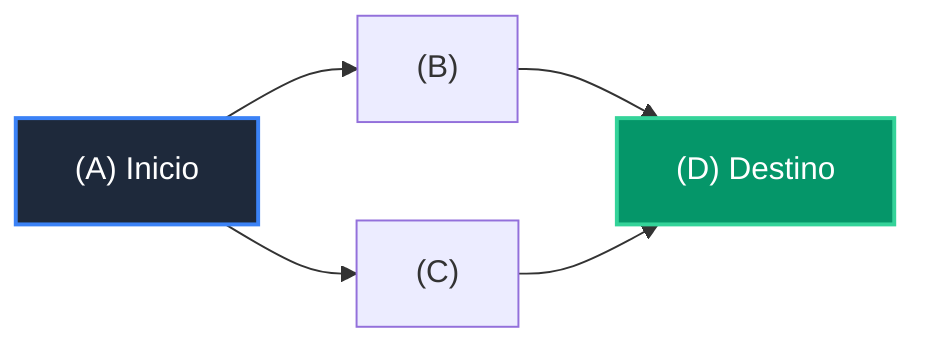

# 📘 Clase 07: Grafos, Matrices de Adyacencia y Recorridos BFS/DFS

<div class="grid cards" markdown>

-   :material-bookmark: **Curso:** Curso 2: Algoritmos Avanzados y Estructuras de Datos (CLASE 07)
-   :material-signal-cellular-outline: **Nivel:** `Nivel 2 - Intermedio`
-   :material-lightbulb-on: **Metáfora Central:** *«El Mapa de Metro y Vuelos (Redes de Conexión)»*
-   :material-laptop: **Wisrovi Studio (Local):** [🚀 Abrir Reto](http://127.0.0.1:8501/?course=2&class=7) &bull; [👨‍🏫 Modo Tutor](http://127.0.0.1:8501/tutor?course=2&class=7)
-   :material-file-pdf-box: **Manual PDF Oficial:** [Descargar clase-07-grafos-y-recorridos.pdf](https://github.com/wisrovi/wisrovi-python/raw/main/02-algoritmos-estructuras/clase-07-grafos-y-recorridos/clase-07-grafos-y-recorridos.pdf)

</div>

<div align="center" style="margin: 1rem 0;" markdown>

[](https://colab.research.google.com/github/wisrovi/wisrovi-python/blob/main/02-algoritmos-estructuras/clase-07-grafos-y-recorridos/notebook/clase-07-grafos-y-recorridos.ipynb)
[-0284c7?logo=python&logoColor=white)](http://127.0.0.1:8501/?course=2&class=7)
[](https://github.com/wisrovi/wisrovi-python/tree/main/02-algoritmos-estructuras/clase-07-grafos-y-recorridos)

</div>

---

## 1. 💡 Fundamentación Teórica y Modelo Mental

Modelado de redes, rutas y relaciones complejas:
1. **Representación con Listas de Adyacencia**: `grafo = {'A': ['B', 'C'], 'B': ['D']}` en $O(V + E)$.
2. **BFS (Breadth-First Search)**: Búsqueda en anchura mediante cola (`deque`), garantiza el camino más corto en grafos no ponderados.
3. **DFS (Depth-First Search)**: Búsqueda en profundidad mediante pila o recursión.

!!! note "🌟 Modelo Mental de la Sesión: «El Mapa de Metro y Vuelos (Redes de Conexión)»"
    En esta sesión anclamos el aprendizaje en la metáfora del mundo real para visualizar cómo fluyen las estructuras de datos y el flujo de ejecución en la memoria.

---

## 2. 🗺️ Arquitectura de Ejecución y Diagrama de Flujo



---

## 3. 💻 Código de Implementación Práctica

=== "🚀 Demostración en Vivo"
    ```python
    from collections import deque

grafo = {
    'A': ['B', 'C'],
    'B': ['A', 'D', 'E'],
    'C': ['A', 'F'],
    'D': ['B'], 'E': ['B', 'F'], 'F': ['C', 'E']
}

def bfs_recorrido(g, inicio):
    visitados = set([inicio])
    cola = deque([inicio])
    orden = []
    while cola:
        nodo = cola.popleft()
        orden.append(nodo)
        for vecino in g.get(nodo, []):
            if vecino not in visitados:
                visitados.add(vecino)
                cola.append(vecino)
    return orden

print("Recorrido BFS:", bfs_recorrido(grafo, 'A'))
    ```

=== "🔬 Arenero de Exploración de Memoria (RAM)"
    ```python
    grafo_simple = {"Madrid": ["Barcelona", "Sevilla"], "Barcelona": ["Valencia"]}
print("Conexiones de Madrid:", grafo_simple["Madrid"])
    ```

---

## 4. 🛡️ Buenas Prácticas PEP 8: Antipatrones vs Código Pythonic

!!! warning "⚠️ Cuidado con los Antipatrones"
    

=== "❌ Antipatrón / Código Inadecuado"
    ```python
    def dfs(nodo):
    for v in grafo[nodo]: dfs(v)  # ❌ Sin control de visitados en grafo cíclico
    ```

=== "✅ Patrón Recomendado / Pythonic"
    ```python
    def dfs(nodo, visitados=None):
    if visitados is None: visitados = set()
    visitados.add(nodo)
    for v in grafo[nodo]:
        if v not in visitados: dfs(v, visitados)  # ✅ Seguro
    ```

---

## 5. 🏋️ Desafío Práctico de la Clase

!!! example "🎯 Enunciado del Reto"
    **Crea una función `bfs_camino_mas_corto(grafo: dict[str, list[str]], inicio: str, destino: str) -> list[str]` que use BFS y retorne la lista de nodos del camino más corto desde `inicio` hasta `destino`.**

!!! tip "⚡ Resolución Híbrida en 1 Clic (Local + Web)"
    Si tienes ejecutando `wisrovi ui` en tu terminal local, puedes [🚀 Abrir este Reto directamente en tu Studio Local (127.0.0.1:8501)](http://127.0.0.1:8501/?course=2&class=7) para escribir tu código con auto-formateo AST, inspeccionar variables en el Heap/Stack y evaluarlo con pruebas en tiempo real.

=== "💻 Plantilla de Inicio (Starter Code)"
    ```python
    from collections import deque
from typing import Dict, List

def bfs_camino_mas_corto(grafo: Dict[str, List[str]], inicio: str, destino: str) -> List[str]:
    # ✍️ Encuentra la ruta más corta usando BFS con cola de rutas
    if inicio == destino:
        return [inicio]
    cola = deque([[inicio]])
    visitados = set([inicio])
    while cola:
        ruta = cola.popleft()
        nodo = ruta[-1]
        for vecino in grafo.get(nodo, []):
            if vecino == destino:
                return ruta + [vecino]
            if vecino not in visitados:
                visitados.add(vecino)
                cola.append(ruta + [vecino])
    return []

    ```

??? info "💡 Pista Socrática 1"
    💡 Pista 1: Guarda en la cola la ruta completa: `cola = deque([[inicio]])`.

??? info "💡 Pista Socrática 2"
    💡 Pista 2: En cada paso extrae la ruta actual y explora los vecinos del último nodo `ruta[-1]`.

??? info "💡 Pista Socrática 3"
    💡 Pista 3: Cuando un vecino sea igual a `destino`, retorna inmediatamente `ruta + [vecino]`.


Para resolver este ejercicio en tu entorno:
1. Abre el archivo `ejercicios/reto.py` de esta clase en Visual Studio Code o utiliza `wisrovi ui` / `wisrovi tutor`.
2. Implementa tu solución cumpliendo los requisitos y contratos de tipado.
3. Valida tus resultados ejecutando las pruebas unitarias:
   ```bash
   pytest tests/curso_02/test_clase_07_grafos_y_recorridos.py
   ```

---


## 6. 📚 Fuentes y Bibliografía Recomendada

*   [📖 Documentación Oficial de Python 3](https://docs.python.org/3/)
*   [📑 Guía de Estilo Oficial PEP 8](https://peps.python.org/pep-0008/)
*   [📦 Ecosistema Open Source wisrovi en PyPI](https://pypi.org/user/wisrovi/)
