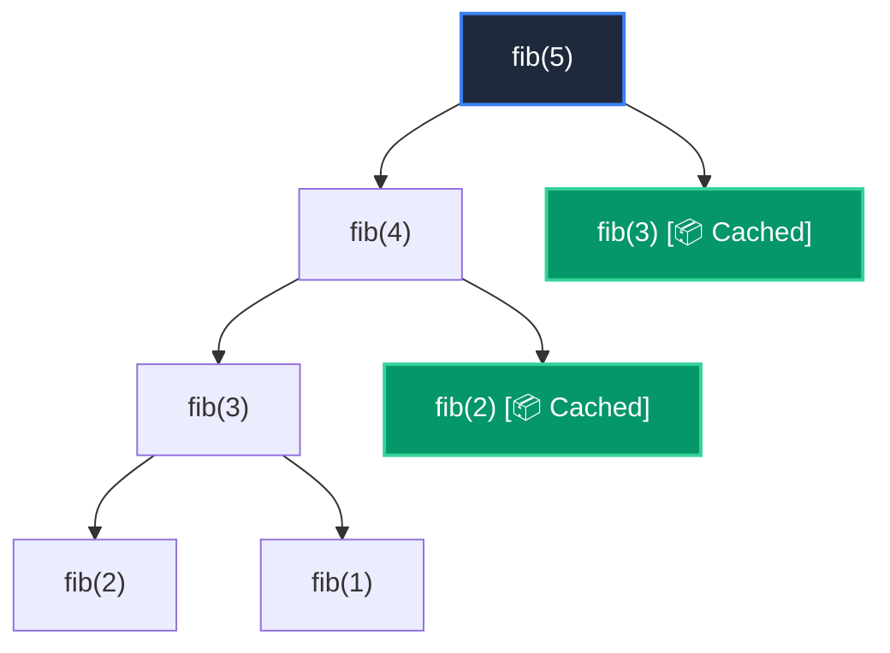

# 📘 Clase 08: Recursividad y Programación Dinámica con Memoización

<div class="grid cards" markdown>

-   :material-bookmark: **Curso:** Curso 2: Algoritmos Avanzados y Estructuras de Datos (CLASE 08)
-   :material-signal-cellular-outline: **Nivel:** `Nivel 2 - Intermedio`
-   :material-lightbulb-on: **Metáfora Central:** *«Las Muñecas Rusas y el Bloc de Notas de Resultados»*
-   :material-laptop: **Wisrovi Studio (Local):** [🚀 Abrir Reto](http://127.0.0.1:8501/?course=2&class=8) &bull; [👨‍🏫 Modo Tutor](http://127.0.0.1:8501/tutor?course=2&class=8)
-   :material-file-pdf-box: **Manual PDF Oficial:** [Descargar clase-08-recursividad-y-programacion-dinamica.pdf](https://github.com/wisrovi/wisrovi-python/raw/main/02-algoritmos-estructuras/clase-08-recursividad-y-programacion-dinamica/clase-08-recursividad-y-programacion-dinamica.pdf)

</div>

<div align="center" style="margin: 1rem 0;" markdown>

[](https://colab.research.google.com/github/wisrovi/wisrovi-python/blob/main/02-algoritmos-estructuras/clase-08-recursividad-y-programacion-dinamica/notebook/clase-08-recursividad-y-programacion-dinamica.ipynb)
[-0284c7?logo=python&logoColor=white)](http://127.0.0.1:8501/?course=2&class=8)
[](https://github.com/wisrovi/wisrovi-python/tree/main/02-algoritmos-estructuras/clase-08-recursividad-y-programacion-dinamica)

</div>

---

## 1. 💡 Fundamentación Teórica y Modelo Mental

Optimización exponencial $O(2^N)$ a lineal $O(N)$ mediante subproblemas superpuestos:
1. **Subestructura Óptima**: La solución global se compone de las soluciones óptimas de sus partes.
2. **Memoización (Top-Down)**: Almacenar en caché (`dict` o `@lru_cache`) los resultados ya computados.
3. **Tabulación (Bottom-Up)**: Construir la tabla de soluciones de forma iterativa desde el caso base.

!!! note "🌟 Modelo Mental de la Sesión: «Las Muñecas Rusas y el Bloc de Notas de Resultados»"
    En esta sesión anclamos el aprendizaje en la metáfora del mundo real para visualizar cómo fluyen las estructuras de datos y el flujo de ejecución en la memoria.

---

## 2. 🗺️ Arquitectura de Ejecución y Diagrama de Flujo



---

## 3. 💻 Código de Implementación Práctica

=== "🚀 Demostración en Vivo"
    ```python
    from functools import lru_cache

@lru_cache(maxsize=None)
def fibonacci(n: int) -> int:
    if n <= 1: return n
    return fibonacci(n - 1) + fibonacci(n - 2)

print("Fibonacci(50) en microsegundos:", fibonacci(50))
    ```

=== "🔬 Arenero de Exploración de Memoria (RAM)"
    ```python
    def fib_bottom_up(n: int) -> int:
    if n <= 1: return n
    a, b = 0, 1
    for _ in range(2, n + 1):
        a, b = b, a + b
    return b

print("Fib(10):", fib_bottom_up(10))
    ```

---

## 4. 🛡️ Buenas Prácticas PEP 8: Antipatrones vs Código Pythonic

!!! warning "⚠️ Cuidado con los Antipatrones"
    

=== "❌ Antipatrón / Código Inadecuado"
    ```python
    def contar(n):
    if n == 0: return 0
    return contar(n - 1)  # ❌ Falla con n > 1000 por RecursionError
    ```

=== "✅ Patrón Recomendado / Pythonic"
    ```python
    # Enfoque iterativo (Bottom-Up) o sys.setrecursionlimit
def contar_iterativo(n):
    return sum(range(n))  # ✅ O(1) memoria
    ```

---

## 5. 🏋️ Desafío Práctico de la Clase

!!! example "🎯 Enunciado del Reto"
    **Crea una función `fibonacci_dinamico(n: int) -> int` que calcule el n-ésimo número de Fibonacci en tiempo $O(N)$ utilizando programación dinámica o memoización.**

!!! tip "⚡ Resolución Híbrida en 1 Clic (Local + Web)"
    Si tienes ejecutando `wisrovi ui` en tu terminal local, puedes [🚀 Abrir este Reto directamente en tu Studio Local (127.0.0.1:8501)](http://127.0.0.1:8501/?course=2&class=8) para escribir tu código con auto-formateo AST, inspeccionar variables en el Heap/Stack y evaluarlo con pruebas en tiempo real.

=== "💻 Plantilla de Inicio (Starter Code)"
    ```python
    def fibonacci_dinamico(n: int) -> int:
    # ✍️ Implementa Fibonacci en O(N) sin recomputar
    if n <= 0:
        return 0
    if n == 1:
        return 1
    a, b = 0, 1
    for _ in range(2, n + 1):
        a, b = b, a + b
    return b

    ```

??? info "💡 Pista Socrática 1"
    💡 Pista 1: Puedes usar un enfoque iterativo con dos variables `a = 0, b = 1`.

??? info "💡 Pista Socrática 2"
    💡 Pista 2: En un bucle de `2` a `n + 1`, actualiza `a, b = b, a + b`.

??? info "💡 Pista Socrática 3"
    💡 Pista 3: Retorna `b` al finalizar el bucle.


Para resolver este ejercicio en tu entorno:
1. Abre el archivo `ejercicios/reto.py` de esta clase en Visual Studio Code o utiliza `wisrovi ui` / `wisrovi tutor`.
2. Implementa tu solución cumpliendo los requisitos y contratos de tipado.
3. Valida tus resultados ejecutando las pruebas unitarias:
   ```bash
   pytest tests/curso_02/test_clase_08_recursividad_y_programacion_dinamica.py
   ```

---


## 6. 📚 Fuentes y Bibliografía Recomendada

*   [📖 Documentación Oficial de Python 3](https://docs.python.org/3/)
*   [📑 Guía de Estilo Oficial PEP 8](https://peps.python.org/pep-0008/)
*   [📦 Ecosistema Open Source wisrovi en PyPI](https://pypi.org/user/wisrovi/)
