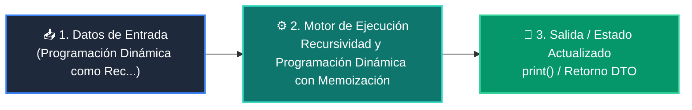

# 📘 Clase 08: Recursividad y Programación Dinámica con Memoización

<div class="grid cards" markdown>

-   :material-bookmark: **Curso:** Curso 2: Algoritmos Avanzados y Estructuras de Datos (CLASE 08)
-   :material-signal-cellular-outline: **Nivel:** `Nivel 2 - Intermedio`
-   :material-lightbulb-on: **Metáfora Central:** *«Programación Dinámica como Recordar el Pasado para no Resolverlo Dos Veces»*
-   :material-file-pdf-box: **Manual PDF Oficial:** [Descargar clase-08-recursividad-y-programacion-dinamica.pdf](https://github.com/wisrovi/wisrovi-python/raw/main/02-algoritmos-estructuras/clase-08-recursividad-y-programacion-dinamica/clase-08-recursividad-y-programacion-dinamica.pdf)

</div>

<div align="center" style="margin: 1rem 0;" markdown>

[](https://colab.research.google.com/github/wisrovi/wisrovi-python/blob/main/02-algoritmos-estructuras/clase-08-recursividad-y-programacion-dinamica/notebook/clase-08-recursividad-y-programacion-dinamica.ipynb)
[](https://github.com/wisrovi/wisrovi-python/tree/main/02-algoritmos-estructuras/clase-08-recursividad-y-programacion-dinamica)

</div>

---

## 1. 💡 Fundamentación Teórica y Modelo Mental


!!! note "🌟 Modelo Mental de la Sesión: «Programación Dinámica como Recordar el Pasado para no Resolverlo Dos Veces»"
    Si te pregunto cuánto es 1+1+1+1, cuentas 4. Si añado otro +1, sabes que es 5 porque recordaste el 4 anterior.

### Principios Fundamentales de la Sesión


!!! info "⚡ Regla de Oro en Python"
    En Python, decora tus funciones recursivas puras con @functools.lru_cache(maxsize=None).

---

## 2. 🗺️ Arquitectura de Ejecución y Diagrama de Flujo



---

## 3. 💻 Código de Implementación Práctica

```python
from functools import lru_cache
import time

@lru_cache(maxsize=None)
def fibonacci(n: int) -> int:
    if n <= 1:
        return n
    return fibonacci(n - 1) + fibonacci(n - 2)

t0 = time.perf_counter()
res = fibonacci(50)
t1 = time.perf_counter()

print(f"Fibonacci(50) = {res}")
print(f"Calculado en: {(t1 - t0)*1000:.4f} ms (Tiempo O(n))")
```

---

## 4. 🛡️ Buenas Prácticas, Gotchas y Prevención de Errores

!!! warning "⚠️ Trampa Frecuente (Gotcha)"
    Recursiones muy profundas superan el límite de la pila de llamadas (por defecto 1000).

=== "❌ Antipatrón / Código Inadecuado"
    ```python
    def contar(n):
    if n == 0: return 0
    return contar(n - 1)  # ❌ Falla con n > 1000 por RecursionError
    ```

=== "✅ Patrón Recomendado / Pythonic"
    ```python
    # Enfoque iterativo (Bottom-Up) o sys.setrecursionlimit
def contar_iterativo(n):
    return sum(range(n))  # ✅ O(1) memoria
    ```

!!! tip "🔧 Consejo de Ingeniería"
    

---

## 5. 🏋️ Desafío Práctico de la Clase

!!! example "🎯 Enunciado del Reto"
    **Resuelve el problema del cambio de monedas (mínimo número de monedas para formar un monto) usando DP.**

Para resolver este ejercicio en tu entorno:
1. Abre el archivo `ejercicios/reto.py` de esta clase en Visual Studio Code.
2. Implementa tu solución cumpliendo los requisitos y contratos de tipo.
3. Valida tus resultados ejecutando las pruebas unitarias:
   ```bash
   pytest tests/curso_02/test_clase_08_recursividad_y_programacion_dinamica.py
   ```

---

## 6. 📚 Fuentes y Bibliografía Recomendada

*   [📖 Documentación Oficial de Python 3](https://docs.python.org/3/)
*   [📑 Guía de Estilo Oficial PEP 8](https://peps.python.org/pep-0008/)
*   [📦 Ecosistema Open Source wisrovi en PyPI](https://pypi.org/user/wisrovi/)
