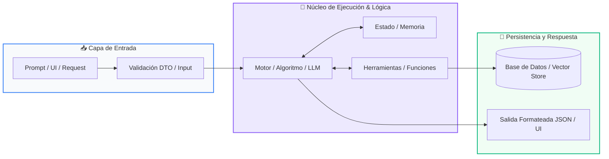

# Módulo 01: Estructuras de Datos Avanzadas

<div class="grid cards" markdown>

-   :material-school: __Nivel:__ Intermedio
-   :material-book-open-page-variant: __Curso:__ Curso 2: Algoritmos Avanzados y Estructuras de Datos
-   :material-lightbulb-on: __Metáfora:__ *«Pilas LIFO, Colas FIFO y Árboles Jerárquicos»*
-   :material-file-pdf-box: __Descargar PDF:__ [01-estructuras-datos-avanzadas.pdf](https://github.com/wisrovi/wisrovi-python/blob/main/02-algoritmos-estructuras/01-estructuras-datos-avanzadas/01-estructuras-datos-avanzadas.pdf)

</div>

---

## 🎯 Objetivos de Aprendizaje

!!! abstract "Competencias Clave de la Sesión"
    *   **Competencia Conceptual:** Comprender las disciplinas de acceso LIFO y FIFO y el coste temporal O(1) vs O(n) en memoria.
    *   **Competencia Práctica:** Implementar pilas para validación sintáctica, colas para buffers de tareas y árboles binarios para búsqueda rápida.

---

## 1. 💡 Fundamentos Teóricos y Modelo Mental

Las listas básicas no siempre son la estructura óptima cuando la velocidad de inserción y extracción en los extremos es crítica.

!!! note "🌟 Metáfora Central: Pilas LIFO, Colas FIFO y Árboles Jerárquicos"
    Una Pila (Stack) es como una pila de platos: el último que colocas arriba es el primero que lavas (LIFO: Last In, First Out). Una Cola (Queue) es como la fila del supermercado: el primero que llega es el primero en ser atendido (FIFO: First In, First Out).

### Principios Fundamentales

collections.deque en Python permite inserciones y extracciones O(1) tanto por la izquierda como por la derecha, a diferencia de list.pop(0) que cuesta O(n).

Los conjuntos (sets) implementan álgebra de conjuntos (unión, intersección, diferencia) con consultas O(1) y garantizan elementos únicos.

!!! tip "⚡ Regla de Oro en Python"
    Para colas FIFO de alto rendimiento en Python, utiliza siempre collections.deque en lugar de listas estándar.

---

## 2. 🗺️ Diagrama de Arquitectura y Flujo de Control

Mecanismos de inserción (push/enqueue) y extracción (pop/dequeue) en memoria:



### Desglose Paso a Paso del Flujo

| Fase del Flujo | Acción del Intérprete | Estado en Memoria |
| :--- | :--- | :--- |
| **1. Inicialización** | Operación Push / Enqueue: Ingreso de nuevo elemento. | `Elemento en memoria` |
| **2. Evaluación** | En Stack (LIFO): Se coloca en el tope y se extrae del tope. | `Último en entrar = Primero en salir` |
| **3. Transformación** | En Queue (FIFO): Se ingresa por la cola y se extrae por la cabeza. | `Primero en entrar = Primero en salir` |
| **4. Retorno / Salida** | Árboles: Ramifican decisiones jerárquicas izquierda/derecha. | `Acceso logarítmico O(log n)` |

!!! info "🔍 Visualización Mental"
    Las pilas gestionan llamadas de funciones y el botón Deshacer (Ctrl+Z); las colas gestionan mensajes y colas de impresión.

---

## 3. 💻 Implementación Práctica en Python

Algoritmo clásico de entrevistas técnicas implementado con una Pila LIFO:

```python title="main.py - Python 3.10+ (PEP 8)" linenums="1"
def validar_parentesis(expresion: str) -> bool:
    pila: list[str] = []
    pares = {")": "(", "}": "{", "]": "["}
    
    for char in expresion:
        if char in pares.values():
            pila.append(char) # Push
        elif char in pares:
            if not pila or pila.pop() != pares[char]: # Pop & Check
                return False
                
    return len(pila) == 0

# Pruebas
print(validar_parentesis("{[()()]}"))  # True
print(validar_parentesis("{[(])}"))    # False
```

### Análisis Detallado del Código

El algoritmo apila los caracteres de apertura y los desapila al encontrar cierres, garantizando correspondencia simétrica en O(n).

---

## 4. 🛡️ Buenas Prácticas, Gotchas y Depuración

Errores de rendimiento habituales al elegir estructuras de datos:

!!! warning "⚠️ Gotcha Frecuente (Trampa de Principiante)"
    Usar list.pop(0) para implementar una cola; obliga a desplazar todos los elementos restantes en memoria generando complejidad O(n).

### Comparativa: Patrón Recomendado vs Antipatrón

=== "✅ Patrón Pythonic Recomendado"
    ```python
from collections import deque
cola = deque()
cola.append(item) # O(1) instantáneo
    ```

=== "❌ Antipatrón / Mal Código"
    ```python
cola = []
cola.insert(0, item) # O(n) en cada inserción
    ```

!!! success "🛡️ Consejo de Resiliencia en Producción"
    Usa sets para eliminar duplicados de una lista en una sola operación: unicos = list(set(datos)).

---

## 5. 🏋️ Ejercicios y Desafío de Autoestudio

!!! example "Desafío Práctico Recomendado"
    Implementa una cola de prioridad utilizando el módulo heapq de Python para despachar tareas según su urgencia.

???+ tip "🧪 Cómo validar tu solución con Pytest"
    Abre tu terminal en VS Code y ejecuta:
    ```bash
    pytest 02-algoritmos-estructuras/01-estructuras-datos-avanzadas/ejercicios/
    ```

---

## 6. 📚 Fuentes y Referencias Oficiales

| Fuente / Recurso | Descripción Temática | Enlace Oficial |
| :--- | :--- | :--- |
| **Documentación Oficial de Python** | Referencia canónica del lenguaje y librería estándar | [docs.python.org/3/](https://docs.python.org/3/) |
| **PEP 8 — Style Guide for Python** | Guía oficial de estilo, formato e indentación | [peps.python.org/pep-0008/](https://peps.python.org/pep-0008/) |
| **Real Python Tutorials** | Artículos técnicos y patrones de desarrollo moderno | [realpython.com](https://realpython.com/) |
| **Suite Open Source wisrovi** | Paquetes Python para orquestación y rendimiento | [github.com/wisrovi](https://github.com/wisrovi) |
