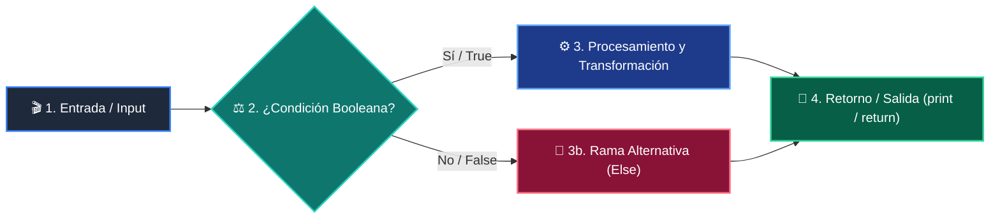

# Módulo 02: Ordenamiento, Búsqueda y Big-O

<div class="grid cards" markdown>

-   :material-school: __Nivel:__ Intermedio
-   :material-book-open-page-variant: __Curso:__ Curso 2: Algoritmos Avanzados y Estructuras de Datos
-   :material-lightbulb-on: __Metáfora:__ *«El Diccionario por la Mitad y Divide y Vencerás»*
-   :material-file-pdf-box: __Descargar PDF:__ [02-algoritmos-ordenamiento-busqueda.pdf](https://github.com/wisrovi/wisrovi-python/blob/main/02-algoritmos-estructuras/02-algoritmos-ordenamiento-busqueda/02-algoritmos-ordenamiento-busqueda.pdf)

</div>

---

## 🎯 Objetivos de Aprendizaje

!!! abstract "Competencias Clave de la Sesión"
    *   **Competencia Conceptual:** Comprender cómo escala el tiempo de ejecución a medida que el tamaño de entrada (n) crece hacia el infinito.
    *   **Competencia Práctica:** Implementar búsqueda binaria y entender la estrategia 'Divide y Vencerás' de QuickSort frente a BubbleSort.

---

## 1. 💡 Fundamentos Teóricos y Modelo Mental

En software la velocidad no se mide en segundos, sino en cómo crece el número de operaciones en función del volumen de datos (n).

!!! note "🌟 Metáfora Central: El Diccionario por la Mitad y Divide y Vencerás"
    Si buscas una palabra en un diccionario de 1,000 páginas hojeando página por página (búsqueda lineal), puedes tardar 1,000 pasos. Si abres el diccionario por la mitad exacta y descartas la mitad irrelevante (búsqueda binaria), encontrarás la palabra en solo 10 pasos.

### Principios Fundamentales

Escalas de Complejidad: O(1) Constante < O(log n) Logarítmica < O(n) Lineal < O(n log n) Casi-lineal < O(n^2) Cuadrática.

Búsqueda Binaria requiere que la colección esté previamente ordenada para garantizar reducción del espacio de búsqueda a la mitad.

!!! tip "⚡ Regla de Oro en Python"
    Evita los bucles anidados innecesarios: dos bucles anidados sobre n elementos convierten un algoritmo de O(n) a O(n^2).

---

## 2. 🗺️ Diagrama de Arquitectura y Flujo de Control

Estrategia de reducción logarítmica del intervalo de búsqueda con punteros low, mid y high.



### Desglose Paso a Paso del Flujo

| Fase del Flujo | Acción del Intérprete | Estado en Memoria |
| :--- | :--- | :--- |
| **1. Inicialización** | Calcula el punto medio: mid = (low + high) // 2. | `low=0, high=n-1, mid` |
| **2. Evaluación** | Compara el elemento en 'mid' con el objetivo buscado. | `Evalúa igualdad` |
| **3. Transformación** | Si objetivo < array[mid], descarta la mitad derecha ajustando high = mid - 1. | `Espacio reducido al 50%` |
| **4. Retorno / Salida** | Si objetivo > array[mid], descarta la mitad izquierda ajustando low = mid + 1. | `Repite hasta converger` |

!!! info "🔍 Visualización Mental"
    La búsqueda binaria puede encontrar un registro entre 4 mil millones de elementos en tan solo 32 comparaciones.

---

## 3. 💻 Implementación Práctica en Python

Implementación idiomática de búsqueda binaria y particionado recursivo QuickSort:

```python title="main.py - Python 3.10+ (PEP 8)" linenums="1"
def busqueda_binaria(lista: list[int], objetivo: int) -> int:
    low, high = 0, len(lista) - 1
    while low <= high:
        mid = (low + high) // 2
        if lista[mid] == objetivo:
            return mid # Encontrado
        elif lista[mid] < objetivo:
            low = mid + 1
        else:
            high = mid - 1
    return -1 # No existe

def quicksort(arr: list[int]) -> list[int]:
    if len(arr) <= 1:
        return arr
    pivote = arr[len(arr) // 2]
    izq = [x for x in arr if x < pivote]
    centro = [x for x in arr if x == pivote]
    der = [x for x in arr if x > pivote]
    return quicksort(izq) + centro + quicksort(der)
```

### Análisis Detallado del Código

Búsqueda Binaria O(log n) combinada con QuickSort O(n log n) basado en listas por comprensión.

---

## 4. 🛡️ Buenas Prácticas, Gotchas y Depuración

Errores clásicos al implementar algoritmos de búsqueda y ordenamiento:

!!! warning "⚠️ Gotcha Frecuente (Trampa de Principiante)"
    Ejecutar búsqueda binaria sobre una lista no ordenada; produce falsos negativos y resultados erráticos.

### Comparativa: Patrón Recomendado vs Antipatrón

=== "✅ Patrón Pythonic Recomendado"
    ```python
ordenada = sorted(desordenada)
busqueda_binaria(ordenada, 5) # Retorna índice correcto
    ```

=== "❌ Antipatrón / Mal Código"
    ```python
desordenada = [9, 1, 5, 2]
busqueda_binaria(desordenada, 5) # ¡Falla!
    ```

!!! success "🛡️ Consejo de Resiliencia en Producción"
    Python utiliza Timsort (híbrido de MergeSort e InsertionSort) en lista.sort(), el cual tiene complejidad garantizada O(n log n).

---

## 5. 🏋️ Ejercicios y Desafío de Autoestudio

!!! example "Desafío Práctico Recomendado"
    Compara el tiempo de ejecución en segundos entre una búsqueda lineal y una binaria sobre 1 millón de elementos con el módulo time.

???+ tip "🧪 Cómo validar tu solución con Pytest"
    Abre tu terminal en VS Code y ejecuta:
    ```bash
    pytest 02-algoritmos-estructuras/02-algoritmos-ordenamiento-busqueda/ejercicios/
    ```

---

## 6. 📚 Fuentes y Referencias Oficiales

| Fuente / Recurso | Descripción Temática | Enlace Oficial |
| :--- | :--- | :--- |
| **Documentación Oficial de Python** | Referencia canónica del lenguaje y librería estándar | [docs.python.org/3/](https://docs.python.org/3/) |
| **PEP 8 — Style Guide for Python** | Guía oficial de estilo, formato e indentación | [peps.python.org/pep-0008/](https://peps.python.org/pep-0008/) |
| **Real Python Tutorials** | Artículos técnicos y patrones de desarrollo moderno | [realpython.com](https://realpython.com/) |
| **Suite Open Source wisrovi** | Paquetes Python para orquestación y rendimiento | [github.com/wisrovi](https://github.com/wisrovi) |
