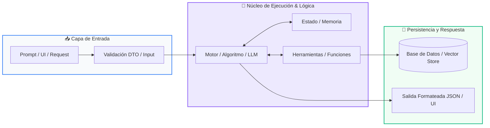

# Módulo 03: Recursividad y Programación Dinámica

<div class="grid cards" markdown>

-   :material-school: __Nivel:__ Intermedio
-   :material-book-open-page-variant: __Curso:__ Curso 2: Algoritmos Avanzados y Estructuras de Datos
-   :material-lightbulb-on: __Metáfora:__ *«Las Muñecas Rusas (Matrioshkas) y la Libreta de Apuntes»*
-   :material-file-pdf-box: __Descargar PDF:__ [03-recursividad-optimizacion.pdf](https://github.com/wisrovi/wisrovi-python/blob/main/02-algoritmos-estructuras/03-recursividad-optimizacion/03-recursividad-optimizacion.pdf)

</div>

---

## 🎯 Objetivos de Aprendizaje

!!! abstract "Competencias Clave de la Sesión"
    *   **Competencia Conceptual:** Comprender la descomposición recursiva y cómo la memoización transforma complejidades exponenciales O(2^n) en lineales O(n).
    *   **Competencia Práctica:** Implementar algoritmos recursivos seguros y optimizar cálculos pesados con decoradores nativos de Python.

---

## 1. 💡 Fundamentos Teóricos y Modelo Mental

La recursividad ocurre cuando una función se invoca a sí misma para resolver una versión más pequeña del mismo problema.

!!! note "🌟 Metáfora Central: Las Muñecas Rusas (Matrioshkas) y la Libreta de Apuntes"
    La recursión es como abrir una muñeca rusa (Matrioshka): abres una y hay otra idéntica más pequeña dentro, hasta llegar a la más diminuta que no se puede abrir (el Caso Base). La memoización es como tener una libreta de apuntes: cuando resuelves un cálculo difícil, anotas el resultado para no tener que volver a calcularlo jamás.

### Principios Fundamentales

Todo algoritmo recursivo DEBE tener al menos un Caso Base para detener las llamadas antes de saturar el Call Stack (RecursionError).

Programación Dinámica (DP): Técnica para resolver problemas complejos descomponiéndolos en subproblemas y guardando sus soluciones.

!!! tip "⚡ Regla de Oro en Python"
    Sin memoización, Fibonacci recursivo tiene complejidad O(2^n); con memoización se reduce a O(n).

---

## 2. 🗺️ Diagrama de Arquitectura y Flujo de Control

Eliminación de ramas redundantes en el árbol de ejecución mediante caché en memoria.



### Desglose Paso a Paso del Flujo

| Fase del Flujo | Acción del Intérprete | Estado en Memoria |
| :--- | :--- | :--- |
| **1. Inicialización** | Llamada inicial a la función con el parámetro n. | `f(5) en Call Stack` |
| **2. Evaluación** | Bifurcación recursiva en f(n-1) y f(n-2). | `Subárbol de cálculos` |
| **3. Transformación** | Verificación en caché: si el resultado ya existe, lo devuelve inmediatamente sin recalcular. | `Hit en caché O(1)` |
| **4. Retorno / Salida** | Si no existe, computa el caso base y almacena el resultado antes de retornar. | `Guardado en memoria` |

!!! info "🔍 Visualización Mental"
    La memoización es intercambiar memoria (RAM) por tiempo de CPU: un compromiso altamente beneficioso en sistemas modernos.

---

## 3. 💻 Implementación Práctica en Python

Comparativa entre recursión ingenua y optimización con el decorador lru_cache de la librería estándar:

```python title="main.py - Python 3.10+ (PEP 8)" linenums="1"
from functools import lru_cache
import time

# Versión Optimizada con Programación Dinámica
@lru_cache(maxsize=None)
def fibonacci_memo(n: int) -> int:
    if n <= 0: return 0
    if n == 1: return 1
    return fibonacci_memo(n - 1) + fibonacci_memo(n - 2)

# Cálculo instantáneo para n=100
inicio = time.perf_counter()
resultado = fibonacci_memo(100)
fin = time.perf_counter()

print(f"Fibonacci(100) = {resultado}")
print(f"Tiempo de cálculo: {(fin - inicio)*1000:.4f} ms")
```

### Análisis Detallado del Código

El decorador @lru_cache intercepta las llamadas y almacena los resultados en una tabla hash en memoria, logrando tiempo de ejecución instantáneo.

---

## 4. 🛡️ Buenas Prácticas, Gotchas y Depuración

Errores críticos que pueden derribar servicios productivos:

!!! warning "⚠️ Gotcha Frecuente (Trampa de Principiante)"
    Olvidar el caso base o no avanzar hacia él en cada iteración, provocando un RecursionError por desbordamiento de pila.

### Comparativa: Patrón Recomendado vs Antipatrón

=== "✅ Patrón Pythonic Recomendado"
    ```python
def loop(n):
    if n <= 0: return 0 # Caso base
    return n + loop(n - 1)
    ```

=== "❌ Antipatrón / Mal Código"
    ```python
def loop(n):
    return loop(n) # RecursionError: maximum recursion depth exceeded
    ```

!!! success "🛡️ Consejo de Resiliencia en Producción"
    Python tiene un límite de recursión por defecto de 1000 llamadas (sys.getrecursionlimit()).

---

## 5. 🏋️ Ejercicios y Desafío de Autoestudio

!!! example "Desafío Práctico Recomendado"
    Resuelve el clásico problema del cambio de monedas (Coin Change Problem) usando programación dinámica con tabulación.

???+ tip "🧪 Cómo validar tu solución con Pytest"
    Abre tu terminal en VS Code y ejecuta:
    ```bash
    pytest 02-algoritmos-estructuras/03-recursividad-optimizacion/ejercicios/
    ```

---

## 6. 📚 Fuentes y Referencias Oficiales

| Fuente / Recurso | Descripción Temática | Enlace Oficial |
| :--- | :--- | :--- |
| **Documentación Oficial de Python** | Referencia canónica del lenguaje y librería estándar | [docs.python.org/3/](https://docs.python.org/3/) |
| **PEP 8 — Style Guide for Python** | Guía oficial de estilo, formato e indentación | [peps.python.org/pep-0008/](https://peps.python.org/pep-0008/) |
| **Real Python Tutorials** | Artículos técnicos y patrones de desarrollo moderno | [realpython.com](https://realpython.com/) |
| **Suite Open Source wisrovi** | Paquetes Python para orquestación y rendimiento | [github.com/wisrovi](https://github.com/wisrovi) |
