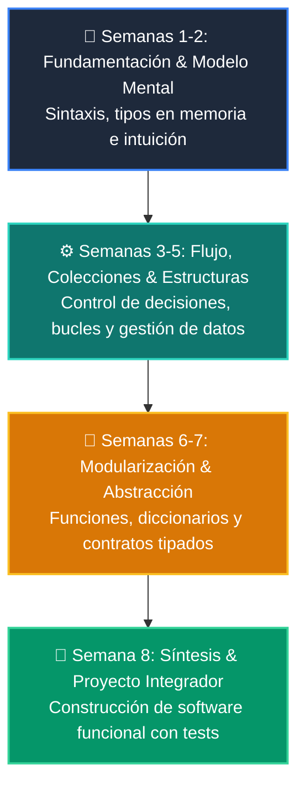

# 📚 Manual Oficial: Curso 3: Creación y Desarrollo de Agentes de IA

-   :material-school: **Nivel:** `Nivel 3 (Avanzado)`
-   :material-calendar-clock: **Duración:** 8 Semanas Formativas
-   :material-account-tie: **Instructor:** [William Rodríguez (Wisrovi)](https://wisrovi.dev)
-   :material-file-pdf-box: **PDF Completo:** [Descargar curso-03-agentes-ia.pdf](https://github.com/wisrovi/wisrovi-python/raw/main/03-agentes-ia/curso-03-agentes-ia.pdf)

---

## 🗺️ Mapa de Clases Semanales

| Semana | Unidad Temática | Metáfora Didáctica |
| :---: | :--- | :--- |
| **CLASE 01** | [Fundamentos de LLMs, Tokens y Arquitectura Transformer](clase-01-fundamentos-llm-tokenizacion.md) | *«Modelos de Lenguaje como Motores de Predicción Probabilística»* |
| **CLASE 02** | [Prompt Engineering Avanzado y Few-Shot Learning](clase-02-prompt-engineering-avanzado.md) | *«Prompts como Especificaciones Precisas para un Consultor Experto»* |
| **CLASE 03** | [Salidas Estructuradas y Validación Tipada con Pydantic V2](clase-03-salidas-estructuradas-pydantic.md) | *«Pydantic como la Aduana Estricta de Datos para Respuestas de IA»* |
| **CLASE 04** | [Tool Calling y Function Calling en Python](clase-04-tool-calling-funciones.md) | *«Dotando de Manos y Herramientas al Cerebro del LLM»* |
| **CLASE 05** | [Embeddings y Representación Vectorial Semántica](clase-05-embeddings-y-bases-vectoriales.md) | *«Embeddings como Coordenadas GPS del Significado de las Palabras»* |
| **CLASE 06** | [Arquitecturas RAG (Retrieval-Augmented Generation)](clase-06-arquitecturas-rag.md) | *«RAG como Darle al LLM un Libro Abierto con la Información Exacta»* |
| **CLASE 07** | [Agentes Autónomos y el Ciclo Cognitivo ReAct](clase-07-agentes-autonomos-react.md) | *«El Agente como un Detective que Piensa, Actúa y Observa hasta Resolver el Caso»* |
| **CLASE 08** | [Sistemas Multi-Agente, Supervisión y Guardrails](clase-08-sistemas-multi-agente.md) | *«Una Empresa de Agentes Especializados Coordinados por un Director»* |

---

## 🌀 Progresión Formativa del Curso

---

## 📑 Clases del Curso
Haz clic en cualquiera de las clases del menú lateral o de la tabla superior para estudiar la teoría, ejecutar los ejemplos y resolver los retos prácticos.
