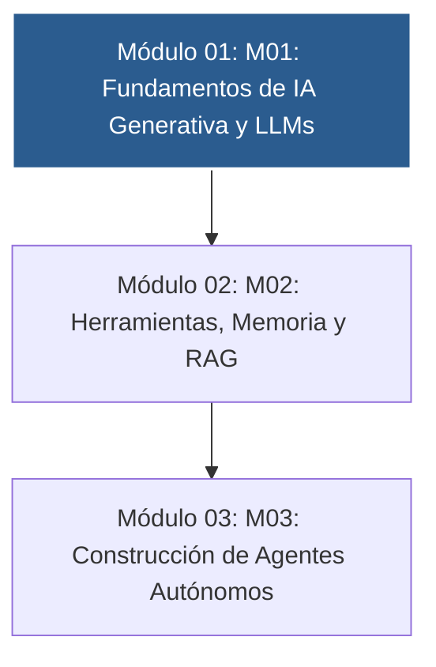

# 📚 Curso 3: Creación y Desarrollo de Agentes de IA

> **Modelos LLM, Tool Calling, Memoria Vectorial, RAG y Agentes Autónomos ReAct**  
> **Nivel:** Avanzado &bull; **Instructor:** **William Rodríguez (Wisrovi)** (AI Solutions Architect & Principal Software Engineer)

---

## 🗺️ Mapa de Contenidos del Curso

---

## 📑 Unidades Didácticas del Curso

| Unidad | Título | Metáfora Central | Enfoque Principal |
| :---: | :--- | :--- | :--- |
| **Módulo 01** | **Módulo 01: Fundamentos de IA Generativa y LLMs** | *«El Cerebro Probabilístico y el Molde de Salida»* | Comprender la naturaleza probabilística de los LLMs, el cálculo de tokens, la ve... |
| **Módulo 02** | **Módulo 02: Herramientas, Memoria y RAG** | *«La Caja de Herramientas y el Bibliotecario con Memoria»* | Comprender cómo un modelo utiliza herramientas externas para ejecutar código y c... |
| **Módulo 03** | **Módulo 03: Construcción de Agentes Autónomos** | *«El Ciclo Cognitivo ReAct y el Enjambre de Agentes»* | Comprender la diferencia entre un script lineal y un bucle de razonamiento autón... |

---

## 🚲 Metodología: La Regla de la Bicicleta

> *"Nadie aprende a montar en bicicleta viendo tutoriales. El verdadero dominio de la programación surge cuando abres tu editor, escribes código con tus propias manos, resuelves errores y construyes proyectos reales."*

!!! tip "Cómo estudiar este curso"
    1. Lee la lección temática de cada unidad.
    2. Analiza el diagrama de flujo y comprende el movimiento de los datos en memoria.
    3. Escribe y ejecuta el código en VS Code o en Google Colab.
    4. Resuelve los ejercicios y valida tu código ejecutando `pytest`.
