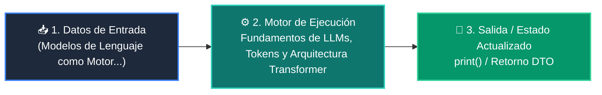

# 📘 Clase 01: Fundamentos de LLMs, Tokens y Arquitectura Transformer

<div class="grid cards" markdown>

-   :material-bookmark: **Curso:** Curso 3: Creación y Desarrollo de Agentes de IA (CLASE 01)
-   :material-signal-cellular-outline: **Nivel:** `Nivel 3 - Avanzado`
-   :material-lightbulb-on: **Metáfora Central:** *«Modelos de Lenguaje como Motores de Predicción Probabilística»*
-   :material-file-pdf-box: **Manual PDF Oficial:** [Descargar clase-01-fundamentos-llm-tokenizacion.pdf](https://github.com/wisrovi/wisrovi-python/raw/main/03-agentes-ia/clase-01-fundamentos-llm-tokenizacion/clase-01-fundamentos-llm-tokenizacion.pdf)

</div>

<div align="center" style="margin: 1rem 0;" markdown>

[](https://colab.research.google.com/github/wisrovi/wisrovi-python/blob/main/03-agentes-ia/clase-01-fundamentos-llm-tokenizacion/notebook/clase-01-fundamentos-llm-tokenizacion.ipynb)
[](https://github.com/wisrovi/wisrovi-python/tree/main/03-agentes-ia/clase-01-fundamentos-llm-tokenizacion)

</div>

---

## 1. 💡 Fundamentación Teórica y Modelo Mental


!!! note "🌟 Modelo Mental de la Sesión: «Modelos de Lenguaje como Motores de Predicción Probabilística»"
    Un LLM es como el teclado predictivo de tu móvil, pero entrenado con todo el conocimiento digital del planeta.

### Principios Fundamentales de la Sesión


!!! info "⚡ Regla de Oro en Python"
    Para tareas de extracción estructurada, código o datos, mantén siempre la temperatura en 0.0.

---

## 2. 🗺️ Arquitectura de Ejecución y Diagrama de Flujo



---

## 3. 💻 Código de Implementación Práctica

```python
def simular_tokenizador(texto: str) -> list[str]:
    # Simulación básica de subwords
    return texto.replace(".", " .").split()

tokens = simular_tokenizador("Python es el lenguaje líder en Inteligencia Artificial.")
print(f"Total tokens: {len(tokens)}")
print("Tokens extraídos:", tokens)
```

---

## 4. 🛡️ Buenas Prácticas, Gotchas y Prevención de Errores

!!! warning "⚠️ Trampa Frecuente (Gotcha)"
    Enviar documentos gigantes sin podar agota la ventana de contexto y dispara los costos de tokens.

=== "❌ Antipatrón / Código Inadecuado"
    ```python
    prompt = doc_entero_de_500_paginas + '\nResume esto'  # ❌ Desborda el contexto
    ```

=== "✅ Patrón Recomendado / Pythonic"
    ```python
    # Chunking previo y filtrado semántico RAG ✅
    ```

!!! tip "🔧 Consejo de Ingeniería"
    

---

## 5. 🏋️ Desafío Práctico de la Clase

!!! example "🎯 Enunciado del Reto"
    **Crea una función que estime el costo en USD de una llamada de inferencia dado un número de palabras.**

Para resolver este ejercicio en tu entorno:
1. Abre el archivo `ejercicios/reto.py` de esta clase en Visual Studio Code.
2. Implementa tu solución cumpliendo los requisitos y contratos de tipo.
3. Valida tus resultados ejecutando las pruebas unitarias:
   ```bash
   pytest tests/curso_03/test_clase_01_fundamentos_llm_tokenizacion.py
   ```

---

## 6. 📚 Fuentes y Bibliografía Recomendada

*   [📖 Documentación Oficial de Python 3](https://docs.python.org/3/)
*   [📑 Guía de Estilo Oficial PEP 8](https://peps.python.org/pep-0008/)
*   [📦 Ecosistema Open Source wisrovi en PyPI](https://pypi.org/user/wisrovi/)
