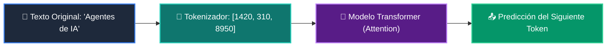

# 📘 Clase 01: Fundamentos de LLMs, Tokens y Arquitectura Transformer

<div class="grid cards" markdown>

-   :material-bookmark: **Curso:** Curso 3: Creación y Desarrollo de Agentes de IA (CLASE 01)
-   :material-signal-cellular-outline: **Nivel:** `Nivel 3 - Avanzado`
-   :material-lightbulb-on: **Metáfora Central:** *«El Traductor de Sílabas y Piezas de LEGO (Tokens & Context Window)»*
-   :material-laptop: **Wisrovi Studio (Local):** [🚀 Abrir Reto](http://127.0.0.1:8501/?course=3&class=1) &bull; [👨‍🏫 Modo Tutor](http://127.0.0.1:8501/tutor?course=3&class=1)
-   :material-file-pdf-box: **Manual PDF Oficial:** [Descargar clase-01-fundamentos-llm-tokenizacion.pdf](https://github.com/wisrovi/wisrovi-python/raw/main/03-agentes-ia/clase-01-fundamentos-llm-tokenizacion/clase-01-fundamentos-llm-tokenizacion.pdf)

</div>

<div align="center" style="margin: 1rem 0;" markdown>

[](https://colab.research.google.com/github/wisrovi/wisrovi-python/blob/main/03-agentes-ia/clase-01-fundamentos-llm-tokenizacion/notebook/clase-01-fundamentos-llm-tokenizacion.ipynb)
[-0284c7?logo=python&logoColor=white)](http://127.0.0.1:8501/?course=3&class=1)
[](https://github.com/wisrovi/wisrovi-python/tree/main/03-agentes-ia/clase-01-fundamentos-llm-tokenizacion)

</div>

---

## 1. 💡 Fundamentación Teórica y Modelo Mental

Los Modelos de Lenguaje Grande (LLMs) procesan texto transformado en tokens:
1. **Tokenización**: División de palabras en fragmentos semánticos (1 token ≈ 4 caracteres / 0.75 palabras).
2. **Context Window**: Límite de atención del modelo (ej: 128k tokens).
3. **Cálculo de Consumo**: Medición de tokens de entrada (Prompt) y salida (Completion) para presupuestación.

!!! note "🌟 Modelo Mental de la Sesión: «El Traductor de Sílabas y Piezas de LEGO (Tokens & Context Window)»"
    En esta sesión anclamos el aprendizaje en la metáfora del mundo real para visualizar cómo fluyen las estructuras de datos y el flujo de ejecución en la memoria.

---

## 2. 🗺️ Arquitectura de Ejecución y Diagrama de Flujo



---

## 3. 💻 Código de Implementación Práctica

=== "🚀 Demostración en Vivo"
    ```python
    def estimar_tokens_demo(texto: str) -> int:
    # Regla empírica estándar: ~4 caracteres por token
    return max(1, len(texto) // 4)

print("Tokens estimados para 'Wisrovi Python Academy':", estimar_tokens_demo("Wisrovi Python Academy"))
    ```

=== "🔬 Arenero de Exploración de Memoria (RAM)"
    ```python
    texto_prompt = "Explica la teoría de la relatividad en 3 puntos."
tokens = len(texto_prompt.split()) * 1.3
print(f"Aproximación de tokens: {tokens:.1f}")
    ```

---

## 4. 🛡️ Buenas Prácticas PEP 8: Antipatrones vs Código Pythonic

!!! warning "⚠️ Cuidado con los Antipatrones"
    

=== "❌ Antipatrón / Código Inadecuado"
    ```python
    prompt = doc_entero_de_500_paginas + '\nResume esto'  # ❌ Desborda el contexto
    ```

=== "✅ Patrón Recomendado / Pythonic"
    ```python
    # Chunking previo y filtrado semántico RAG ✅
    ```

---

## 5. 🏋️ Desafío Práctico de la Clase

!!! example "🎯 Enunciado del Reto"
    **Crea una función `estimar_costo_tokens(texto: str, precio_por_1k: float = 0.002) -> dict[str, Any]` que estime los tokens (asumiendo 1 token = 4 caracteres) y retorne un dict con: 'caracteres', 'tokens_estimados' y 'costo_usd'.**

!!! tip "⚡ Resolución Híbrida en 1 Clic (Local + Web)"
    Si tienes ejecutando `wisrovi ui` en tu terminal local, puedes [🚀 Abrir este Reto directamente en tu Studio Local (127.0.0.1:8501)](http://127.0.0.1:8501/?course=3&class=1) para escribir tu código con auto-formateo AST, inspeccionar variables en el Heap/Stack y evaluarlo con pruebas en tiempo real.

=== "💻 Plantilla de Inicio (Starter Code)"
    ```python
    from typing import Dict, Any

def estimar_costo_tokens(texto: str, precio_por_1k: float = 0.002) -> Dict[str, Any]:
    # ✍️ Calcula caracteres, tokens_estimados y costo_usd
    chars = len(texto)
    tokens = max(1, chars // 4)
    costo = (tokens / 1000.0) * precio_por_1k
    return {
        "caracteres": chars,
        "tokens_estimados": tokens,
        "costo_usd": round(costo, 6)
    }

    ```

??? info "💡 Pista Socrática 1"
    💡 Pista 1: Calcula los tokens como `max(1, len(texto) // 4)`.

??? info "💡 Pista Socrática 2"
    💡 Pista 2: El costo es `(tokens / 1000.0) * precio_por_1k`.

??? info "💡 Pista Socrática 3"
    💡 Pista 3: Retorna el diccionario con las claves exactas requeridas.


Para resolver este ejercicio en tu entorno:
1. Abre el archivo `ejercicios/reto.py` de esta clase en Visual Studio Code o utiliza `wisrovi ui` / `wisrovi tutor`.
2. Implementa tu solución cumpliendo los requisitos y contratos de tipado.
3. Valida tus resultados ejecutando las pruebas unitarias:
   ```bash
   pytest tests/curso_03/test_clase_01_fundamentos_llm_tokenizacion.py
   ```

---


## 6. 📚 Fuentes y Bibliografía Recomendada

*   [📖 Documentación Oficial de Python 3](https://docs.python.org/3/)
*   [📑 Guía de Estilo Oficial PEP 8](https://peps.python.org/pep-0008/)
*   [📦 Ecosistema Open Source wisrovi en PyPI](https://pypi.org/user/wisrovi/)
