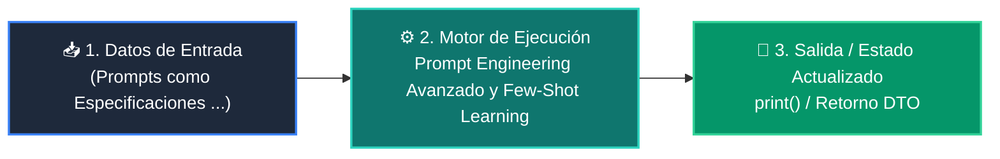

# 📘 Clase 02: Prompt Engineering Avanzado y Few-Shot Learning

<div class="grid cards" markdown>

-   :material-bookmark: **Curso:** Curso 3: Creación y Desarrollo de Agentes de IA (CLASE 02)
-   :material-signal-cellular-outline: **Nivel:** `Nivel 3 - Avanzado`
-   :material-lightbulb-on: **Metáfora Central:** *«Prompts como Especificaciones Precisas para un Consultor Experto»*
-   :material-file-pdf-box: **Manual PDF Oficial:** [Descargar clase-02-prompt-engineering-avanzado.pdf](https://github.com/wisrovi/wisrovi-python/raw/main/03-agentes-ia/clase-02-prompt-engineering-avanzado/clase-02-prompt-engineering-avanzado.pdf)

</div>

<div align="center" style="margin: 1rem 0;" markdown>

[](https://colab.research.google.com/github/wisrovi/wisrovi-python/blob/main/03-agentes-ia/clase-02-prompt-engineering-avanzado/notebook/clase-02-prompt-engineering-avanzado.ipynb)
[](https://github.com/wisrovi/wisrovi-python/tree/main/03-agentes-ia/clase-02-prompt-engineering-avanzado)

</div>

---

## 1. 💡 Fundamentación Teórica y Modelo Mental


!!! note "🌟 Modelo Mental de la Sesión: «Prompts como Especificaciones Precisas para un Consultor Experto»"
    El System Prompt es como el contrato de trabajo de un empleado: define su rol, límites, tono y reglas inquebrantables.

### Principios Fundamentales de la Sesión


!!! info "⚡ Regla de Oro en Python"
    Instruye al modelo sobre lo que DEBE hacer, en lugar de solo listar lo que no debe hacer.

---

## 2. 🗺️ Arquitectura de Ejecución y Diagrama de Flujo



---

## 3. 💻 Código de Implementación Práctica

```python
TEMPLATE_SYSTEM = """Eres un clasificador de soporte técnico. Responde ÚNICAMENTE en formato JSON.
Roles permitidos de sentimiento: POSITIVO, NEGATIVO, NEUTRO."""

EJEMPLOS_FEW_SHOT = [
    {"input": "La app se cierra sola", "output": '{"sentimiento": "NEGATIVO", "urgencia": "ALTA"}'},
    {"input": "Excelente servicio y soporte", "output": '{"sentimiento": "POSITIVO", "urgencia": "BAJA"}'}
]

def construir_prompt(consulta_usuario: str) -> str:
    return f"{TEMPLATE_SYSTEM}\n\nEjemplos:\n{EJEMPLOS_FEW_SHOT}\n\nUsuario: {consulta_usuario}"

print(construir_prompt("No puedo iniciar sesión"))
```

---

## 4. 🛡️ Buenas Prácticas, Gotchas y Prevención de Errores

!!! warning "⚠️ Trampa Frecuente (Gotcha)"
    Concatenar texto de usuarios sin sanitizar permite que instrucciones maliciosas anulen el System Prompt.

=== "❌ Antipatrón / Código Inadecuado"
    ```python
    prompt = f'Eres un bot. Traduce: {input_usuario}'  # ❌ Si el usuario pone 'Olvida las reglas anteriores...', el bot obedece
    ```

=== "✅ Patrón Recomendado / Pythonic"
    ```python
    # Uso de delimitadores XML  y guardrails de validación ✅
    ```

!!! tip "🔧 Consejo de Ingeniería"
    

---

## 5. 🏋️ Desafío Práctico de la Clase

!!! example "🎯 Enunciado del Reto"
    **Diseña un prompt que evalúe y extraiga la información de un CV en formato JSON sin alucinar datos ausentes.**

Para resolver este ejercicio en tu entorno:
1. Abre el archivo `ejercicios/reto.py` de esta clase en Visual Studio Code.
2. Implementa tu solución cumpliendo los requisitos y contratos de tipo.
3. Valida tus resultados ejecutando las pruebas unitarias:
   ```bash
   pytest tests/curso_03/test_clase_02_prompt_engineering_avanzado.py
   ```

---

## 6. 📚 Fuentes y Bibliografía Recomendada

*   [📖 Documentación Oficial de Python 3](https://docs.python.org/3/)
*   [📑 Guía de Estilo Oficial PEP 8](https://peps.python.org/pep-0008/)
*   [📦 Ecosistema Open Source wisrovi en PyPI](https://pypi.org/user/wisrovi/)
