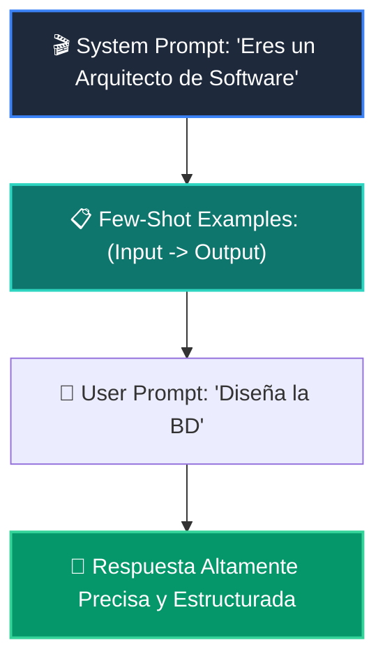

# 📘 Clase 02: Prompt Engineering Avanzado y Few-Shot Learning

<div class="grid cards" markdown>

-   :material-bookmark: **Curso:** Curso 3: Creación y Desarrollo de Agentes de IA (CLASE 02)
-   :material-signal-cellular-outline: **Nivel:** `Nivel 3 - Avanzado`
-   :material-lightbulb-on: **Metáfora Central:** *«El Director de Cine y el Guión Técnico (Instrucción + Ejemplos)»*
-   :material-laptop: **Wisrovi Studio (Local):** [🚀 Abrir Reto](http://127.0.0.1:8501/?course=3&class=2) &bull; [👨‍🏫 Modo Tutor](http://127.0.0.1:8501/tutor?course=3&class=2)
-   :material-file-pdf-box: **Manual PDF Oficial:** [Descargar clase-02-prompt-engineering-avanzado.pdf](https://github.com/wisrovi/wisrovi-python/raw/main/03-agentes-ia/clase-02-prompt-engineering-avanzado/clase-02-prompt-engineering-avanzado.pdf)

</div>

<div align="center" style="margin: 1rem 0;" markdown>

[](https://colab.research.google.com/github/wisrovi/wisrovi-python/blob/main/03-agentes-ia/clase-02-prompt-engineering-avanzado/notebook/clase-02-prompt-engineering-avanzado.ipynb)
[-0284c7?logo=python&logoColor=white)](http://127.0.0.1:8501/?course=3&class=2)
[](https://github.com/wisrovi/wisrovi-python/tree/main/03-agentes-ia/clase-02-prompt-engineering-avanzado)

</div>

---

## 1. 💡 Fundamentación Teórica y Modelo Mental

Técnicas deterministas para maximizar la fidelidad y precisión del LLM:
1. **System Prompt**: Define el rol, restricciones y tono de respuesta.
2. **Few-Shot Learning**: Proporcionar ejemplos demostrativos (Input -> Output) antes de la consulta.
3. **Delimitadores Semánticos**: Uso de Markdown (```, ###) para separar instrucciones de datos de usuario.

!!! note "🌟 Modelo Mental de la Sesión: «El Director de Cine y el Guión Técnico (Instrucción + Ejemplos)»"
    En esta sesión anclamos el aprendizaje en la metáfora del mundo real para visualizar cómo fluyen las estructuras de datos y el flujo de ejecución en la memoria.

---

## 2. 🗺️ Arquitectura de Ejecución y Diagrama de Flujo



---

## 3. 💻 Código de Implementación Práctica

=== "🚀 Demostración en Vivo"
    ```python
    def formatear_prompt(rol: str, tarea: str, entrada: str) -> str:
    return f"""### SYSTEM
Eres un {rol}.

### INSTRUCCIÓN
{tarea}

### INPUT
{entrada}

### RESPUESTA:"""

print(formatear_prompt("Traductor Técnico", "Traduce a inglés", "Base de datos vectoriales"))
    ```

=== "🔬 Arenero de Exploración de Memoria (RAM)"
    ```python
    ejemplos = [("positivo", "Me encantó"), ("negativo", "Pésimo servicio")]
for label, txt in ejemplos:
    print(f"Ejemplo: '{txt}' -> {label}")
    ```

---

## 4. 🛡️ Buenas Prácticas PEP 8: Antipatrones vs Código Pythonic

!!! warning "⚠️ Cuidado con los Antipatrones"
    

=== "❌ Antipatrón / Código Inadecuado"
    ```python
    prompt = f'Eres un bot. Traduce: {input_usuario}'  # ❌ Si el usuario pone 'Olvida las reglas anteriores...', el bot obedece
    ```

=== "✅ Patrón Recomendado / Pythonic"
    ```python
    # Uso de delimitadores XML  y guardrails de validación ✅
    ```

---

## 5. 🏋️ Desafío Práctico de la Clase

!!! example "🎯 Enunciado del Reto"
    **Crea una función `construir_prompt_few_shot(rol: str, tarea: str, ejemplos: list[tuple[str, str]], input_usuario: str) -> str` que arme un prompt concatenando el rol, la tarea, los pares de ejemplos 'Entrada: X -> Salida: Y' y la entrada final del usuario.**

!!! tip "⚡ Resolución Híbrida en 1 Clic (Local + Web)"
    Si tienes ejecutando `wisrovi ui` en tu terminal local, puedes [🚀 Abrir este Reto directamente en tu Studio Local (127.0.0.1:8501)](http://127.0.0.1:8501/?course=3&class=2) para escribir tu código con auto-formateo AST, inspeccionar variables en el Heap/Stack y evaluarlo con pruebas en tiempo real.

=== "💻 Plantilla de Inicio (Starter Code)"
    ```python
    def construir_prompt_few_shot(rol: str, tarea: str, ejemplos: list[tuple[str, str]], input_usuario: str) -> str:
    # ✍️ Estructura el prompt con System, Examples y User Input
    lineas = [
        f"ROL: {rol}",
        f"TAREA: {tarea}",
        "EJEMPLOS:"
    ]
    for inp, out in ejemplos:
        lineas.append(f"Entrada: {inp} -> Salida: {out}")
    lineas.append(f"ENTRADA USUARIO: {input_usuario}")
    lineas.append("RESPUESTA:")
    return "\n".join(lineas)

    ```

??? info "💡 Pista Socrática 1"
    💡 Pista 1: Incluye la cabecera `ROL: {rol}` y `TAREA: {tarea}`.

??? info "💡 Pista Socrática 2"
    💡 Pista 2: Itera sobre `ejemplos` formateando cada tupla como `Entrada: {inp} -> Salida: {out}`.

??? info "💡 Pista Socrática 3"
    💡 Pista 3: Une todas las líneas con `\n`.


Para resolver este ejercicio en tu entorno:
1. Abre el archivo `ejercicios/reto.py` de esta clase en Visual Studio Code o utiliza `wisrovi ui` / `wisrovi tutor`.
2. Implementa tu solución cumpliendo los requisitos y contratos de tipado.
3. Valida tus resultados ejecutando las pruebas unitarias:
   ```bash
   pytest tests/curso_03/test_clase_02_prompt_engineering_avanzado.py
   ```

---


## 6. 📚 Fuentes y Bibliografía Recomendada

*   [📖 Documentación Oficial de Python 3](https://docs.python.org/3/)
*   [📑 Guía de Estilo Oficial PEP 8](https://peps.python.org/pep-0008/)
*   [📦 Ecosistema Open Source wisrovi en PyPI](https://pypi.org/user/wisrovi/)
