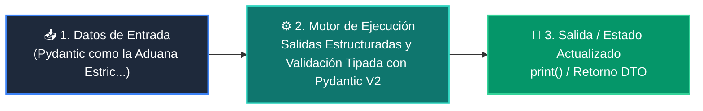

# 📘 Clase 03: Salidas Estructuradas y Validación Tipada con Pydantic V2

<div class="grid cards" markdown>

-   :material-bookmark: **Curso:** Curso 3: Creación y Desarrollo de Agentes de IA (CLASE 03)
-   :material-signal-cellular-outline: **Nivel:** `Nivel 3 - Avanzado`
-   :material-lightbulb-on: **Metáfora Central:** *«Pydantic como la Aduana Estricta de Datos para Respuestas de IA»*
-   :material-file-pdf-box: **Manual PDF Oficial:** [Descargar clase-03-salidas-estructuradas-pydantic.pdf](https://github.com/wisrovi/wisrovi-python/raw/main/03-agentes-ia/clase-03-salidas-estructuradas-pydantic/clase-03-salidas-estructuradas-pydantic.pdf)

</div>

<div align="center" style="margin: 1rem 0;" markdown>

[](https://colab.research.google.com/github/wisrovi/wisrovi-python/blob/main/03-agentes-ia/clase-03-salidas-estructuradas-pydantic/notebook/clase-03-salidas-estructuradas-pydantic.ipynb)
[](https://github.com/wisrovi/wisrovi-python/tree/main/03-agentes-ia/clase-03-salidas-estructuradas-pydantic)

</div>

---

## 1. 💡 Fundamentación Teórica y Modelo Mental


!!! note "🌟 Modelo Mental de la Sesión: «Pydantic como la Aduana Estricta de Datos para Respuestas de IA»"
    Pydantic es el inspector de aduana que revisa que cada paquete traiga exactamente los sellos, tipos y formatos requeridos.

### Principios Fundamentales de la Sesión


!!! info "⚡ Regla de Oro en Python"
    Nunca consumas texto libre de un LLM en lógica transaccional; valida siempre con Pydantic.

---

## 2. 🗺️ Arquitectura de Ejecución y Diagrama de Flujo



---

## 3. 💻 Código de Implementación Práctica

```python
from pydantic import BaseModel, Field, EmailStr

class LeadCliente(BaseModel):
    nombre: str = Field(description="Nombre completo del prospecto")
    email: str = Field(description="Correo electrónico válido")
    presupuesto_estimado: float = Field(ge=0.0, description="Monto en USD")
    interes_ia: bool = True

# Simulación de respuesta JSON generada por LLM
json_llm = '{"nombre": "Laura Méndez", "email": "laura@empresa.com", "presupuesto_estimado": 15000.0}'
lead = LeadCliente.model_validate_json(json_llm)

print("Lead Validado:", lead.nombre)
print("Presupuesto:", lead.presupuesto_estimado)
```

---

## 4. 🛡️ Buenas Prácticas, Gotchas y Prevención de Errores

!!! warning "⚠️ Trampa Frecuente (Gotcha)"
    Parsear la salida del LLM con json.loads() simple sin validar tipos permite que campos nulos rompan la aplicación.

=== "❌ Antipatrón / Código Inadecuado"
    ```python
    data = json.loads(respuesta_llm)
total = data['precio'] * 2  # ❌ Falla si 'precio' vino como None o string
    ```

=== "✅ Patrón Recomendado / Pythonic"
    ```python
    data = FacturaModel.model_validate_json(respuesta_llm)
total = data.precio * 2    # ✅ Garantizado float tipado
    ```

!!! tip "🔧 Consejo de Ingeniería"
    

---

## 5. 🏋️ Desafío Práctico de la Clase

!!! example "🎯 Enunciado del Reto"
    **Crea un modelo Pydantic para validar órdenes de compra con lista de productos, impuestos y total.**

Para resolver este ejercicio en tu entorno:
1. Abre el archivo `ejercicios/reto.py` de esta clase en Visual Studio Code.
2. Implementa tu solución cumpliendo los requisitos y contratos de tipo.
3. Valida tus resultados ejecutando las pruebas unitarias:
   ```bash
   pytest tests/curso_03/test_clase_03_salidas_estructuradas_pydantic.py
   ```

---

## 6. 📚 Fuentes y Bibliografía Recomendada

*   [📖 Documentación Oficial de Python 3](https://docs.python.org/3/)
*   [📑 Guía de Estilo Oficial PEP 8](https://peps.python.org/pep-0008/)
*   [📦 Ecosistema Open Source wisrovi en PyPI](https://pypi.org/user/wisrovi/)
