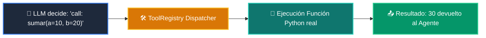

# 📘 Clase 04: Tool Calling y Function Calling en Python

<div class="grid cards" markdown>

-   :material-bookmark: **Curso:** Curso 3: Creación y Desarrollo de Agentes de IA (CLASE 04)
-   :material-signal-cellular-outline: **Nivel:** `Nivel 3 - Avanzado`
-   :material-lightbulb-on: **Metáfora Central:** *«El Cinturón de Herramientas de Batman (Acciones en el Mundo Real)»*
-   :material-laptop: **Wisrovi Studio (Local):** [🚀 Abrir Reto](http://127.0.0.1:8501/?course=3&class=4) &bull; [👨‍🏫 Modo Tutor](http://127.0.0.1:8501/tutor?course=3&class=4)
-   :material-file-pdf-box: **Manual PDF Oficial:** [Descargar clase-04-tool-calling-funciones.pdf](https://github.com/wisrovi/wisrovi-python/raw/main/03-agentes-ia/clase-04-tool-calling-funciones/clase-04-tool-calling-funciones.pdf)

</div>

<div align="center" style="margin: 1rem 0;" markdown>

[](https://colab.research.google.com/github/wisrovi/wisrovi-python/blob/main/03-agentes-ia/clase-04-tool-calling-funciones/notebook/clase-04-tool-calling-funciones.ipynb)
[-0284c7?logo=python&logoColor=white)](http://127.0.0.1:8501/?course=3&class=4)
[](https://github.com/wisrovi/wisrovi-python/tree/main/03-agentes-ia/clase-04-tool-calling-funciones)

</div>

---

## 1. 💡 Fundamentación Teórica y Modelo Mental

Permitir al Agente de IA invocar funciones de código externo para interactuar con APIs y bases de datos:
1. **Esquema de Herramienta (Tool Schema)**: Nombre, descripción y parámetros tipados en JSON Schema.
2. **Despacho Dinámico**: Enrutar la petición del modelo a la función Python real mediante `registry.execute(tool_name, **params)`.
3. **Manejo de Errores en Tools**: Retornar mensajes de error descriptivos al LLM para autocorrección.

!!! note "🌟 Modelo Mental de la Sesión: «El Cinturón de Herramientas de Batman (Acciones en el Mundo Real)»"
    En esta sesión anclamos el aprendizaje en la metáfora del mundo real para visualizar cómo fluyen las estructuras de datos y el flujo de ejecución en la memoria.

---

## 2. 🗺️ Arquitectura de Ejecución y Diagrama de Flujo



---

## 3. 💻 Código de Implementación Práctica

=== "🚀 Demostración en Vivo"
    ```python
    class ToolRegistryDemo:
        def __init__(self):
            self.tools = {}

        def register(self, name, fn):
            self.tools[name] = fn

        def run(self, name, **kwargs):
            return self.tools[name](**kwargs)

    reg = ToolRegistryDemo()
    reg.register("multiplicar", lambda x, y: x * y)
    print("Resultado Tool Call:", reg.run("multiplicar", x=6, y=7))
    ```

=== "🔬 Arenero de Exploración de Memoria (RAM)"
    ```python
    def consultar_clima(ciudad: str):
        return f"Soleado en {ciudad}, 24°C"

    herramientas = {"get_weather": consultar_clima}
    print(herramientas["get_weather"]("Madrid"))
    ```

---

## 4. 🛡️ Buenas Prácticas PEP 8: Antipatrones vs Código Pythonic

!!! warning "⚠️ Cuidado con los Antipatrones"
    

=== "❌ Antipatrón / Código Inadecuado"
    ```python
    eval(f'{nombre_funcion}({argumentos_crudos})')  # ❌ Vulnerabilidad RCE crítica
    ```

=== "✅ Patrón Recomendado / Pythonic"
    ```python
    HERRAMIENTAS[nombre](**argumentos)  # ✅ Mapeo explícito a funciones seguras
    ```

---

## 5. 🏋️ Desafío Práctico de la Clase

!!! example "🎯 Enunciado del Reto"
    Crea una clase `ToolRegistry` con los métodos: `register(self, name: str, fn: Callable)`, `execute(self, name: str, **kwargs: Any) -> Any` (debe lanzar `KeyError` si la herramienta no se encuentra registrada) y `list_tools(self) -> List[str]`.

!!! tip "⚡ Resolución Híbrida en 1 Clic (Local + Web)"
    Si tienes ejecutando `wisrovi ui` en tu terminal local, puedes [🚀 Abrir este Reto directamente en tu Studio Local (127.0.0.1:8501)](http://127.0.0.1:8501/?course=3&class=4) para escribir tu código con auto-formateo AST, inspeccionar variables en el Heap/Stack y evaluarlo con pruebas en tiempo real.

=== "💻 Plantilla de Inicio (Starter Code)"
    ```python
    from typing import Callable, Any, Dict, List

    class ToolRegistry:
        def __init__(self):
            self._tools: Dict[str, Callable] = {}

        def register(self, name: str, fn: Callable):
            self._tools[name] = fn

        def execute(self, name: str, **kwargs) -> Any:
            if name not in self._tools:
                raise KeyError(f"Herramienta '{name}' no registrada")
            return self._tools[name](**kwargs)

        def list_tools(self) -> List[str]:
            return list(self._tools.keys())
    ```

??? info "💡 Pista Socrática 1"
    💡 Pista 1: Guarda las funciones en un diccionario interno `self._tools = {}`.

??? info "💡 Pista Socrática 2"
    💡 Pista 2: En `execute`, verifica `if name not in self._tools: raise KeyError(...)`.

??? info "💡 Pista Socrática 3"
    💡 Pista 3: Invoca la función pasando los argumentos con `func = self._tools[name]; return func(**kwargs)`.


Para resolver este ejercicio en tu entorno:
1. Abre el archivo `ejercicios/reto.py` de esta clase en Visual Studio Code o utiliza `wisrovi ui` / `wisrovi tutor`.
2. Implementa tu solución cumpliendo los requisitos y contratos de tipado.
3. Valida tus resultados ejecutando las pruebas unitarias:
   ```bash
   pytest tests/curso_03/test_clase_04_tool_calling_funciones.py
   ```

---


## 6. 📚 Fuentes y Bibliografía Recomendada

*   [📖 Documentación Oficial de Python 3](https://docs.python.org/3/)
*   [📑 Guía de Estilo Oficial PEP 8](https://peps.python.org/pep-0008/)
*   [📦 Ecosistema Open Source wisrovi en PyPI](https://pypi.org/user/wisrovi/)
