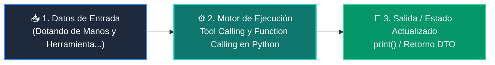

# 📘 Clase 04: Tool Calling y Function Calling en Python

<div class="grid cards" markdown>

-   :material-bookmark: **Curso:** Curso 3: Creación y Desarrollo de Agentes de IA (CLASE 04)
-   :material-signal-cellular-outline: **Nivel:** `Nivel 3 - Avanzado`
-   :material-lightbulb-on: **Metáfora Central:** *«Dotando de Manos y Herramientas al Cerebro del LLM»*
-   :material-file-pdf-box: **Manual PDF Oficial:** [Descargar clase-04-tool-calling-funciones.pdf](https://github.com/wisrovi/wisrovi-python/raw/main/03-agentes-ia/clase-04-tool-calling-funciones/clase-04-tool-calling-funciones.pdf)

</div>

<div align="center" style="margin: 1rem 0;" markdown>

[](https://colab.research.google.com/github/wisrovi/wisrovi-python/blob/main/03-agentes-ia/clase-04-tool-calling-funciones/notebook/clase-04-tool-calling-funciones.ipynb)
[](https://github.com/wisrovi/wisrovi-python/tree/main/03-agentes-ia/clase-04-tool-calling-funciones)

</div>

---

## 1. 💡 Fundamentación Teórica y Modelo Mental


!!! note "🌟 Modelo Mental de la Sesión: «Dotando de Manos y Herramientas al Cerebro del LLM»"
    El LLM es un cerebro brillante pero ciego y sin manos; las herramientas son sus brazos mecánicos para interactuar con el mundo.

### Principios Fundamentales de la Sesión


!!! info "⚡ Regla de Oro en Python"
    Escribe docstrings extremadamente claros en tus funciones: el LLM los usa como manual de instrucciones.

---

## 2. 🗺️ Arquitectura de Ejecución y Diagrama de Flujo



---

## 3. 💻 Código de Implementación Práctica

```python
import math

def calcular_distancia(x1: float, y1: float, x2: float, y2: float) -> float:
    """Calcula la distancia euclidiana entre dos puntos (x1, y1) y (x2, y2)."""
    return math.sqrt((x2 - x1)**2 + (y2 - y1)**2)

HERRAMIENTAS = {
    "calcular_distancia": calcular_distancia
}

def despachar_herramienta(nombre: str, argumentos: dict):
    if nombre in HERRAMIENTAS:
        return HERRAMIENTAS[nombre](**argumentos)
    raise ValueError(f"Herramienta '{nombre}' no encontrada.")

res = despachar_herramienta("calcular_distancia", {"x1": 0.0, "y1": 0.0, "x2": 3.0, "y2": 4.0})
print("Resultado de la herramienta:", res)  # 5.0
```

---

## 4. 🛡️ Buenas Prácticas, Gotchas y Prevención de Errores

!!! warning "⚠️ Trampa Frecuente (Gotcha)"
    Usar eval() o exec() para ejecutar herramientas abre una vulnerabilidad crítica de inyección de código.

=== "❌ Antipatrón / Código Inadecuado"
    ```python
    eval(f'{nombre_funcion}({argumentos_crudos})')  # ❌ Vulnerabilidad RCE crítica
    ```

=== "✅ Patrón Recomendado / Pythonic"
    ```python
    HERRAMIENTAS[nombre](**argumentos)  # ✅ Mapeo explícito a funciones seguras
    ```

!!! tip "🔧 Consejo de Ingeniería"
    

---

## 5. 🏋️ Desafío Práctico de la Clase

!!! example "🎯 Enunciado del Reto"
    **Crea una herramienta que consulte el clima simulado de una ciudad y conéctala a un despachador.**

Para resolver este ejercicio en tu entorno:
1. Abre el archivo `ejercicios/reto.py` de esta clase en Visual Studio Code.
2. Implementa tu solución cumpliendo los requisitos y contratos de tipo.
3. Valida tus resultados ejecutando las pruebas unitarias:
   ```bash
   pytest tests/curso_03/test_clase_04_tool_calling_funciones.py
   ```

---

## 6. 📚 Fuentes y Bibliografía Recomendada

*   [📖 Documentación Oficial de Python 3](https://docs.python.org/3/)
*   [📑 Guía de Estilo Oficial PEP 8](https://peps.python.org/pep-0008/)
*   [📦 Ecosistema Open Source wisrovi en PyPI](https://pypi.org/user/wisrovi/)
