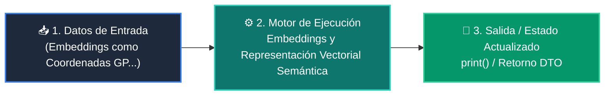

# 📘 Clase 05: Embeddings y Representación Vectorial Semántica

<div class="grid cards" markdown>

-   :material-bookmark: **Curso:** Curso 3: Creación y Desarrollo de Agentes de IA (CLASE 05)
-   :material-signal-cellular-outline: **Nivel:** `Nivel 3 - Avanzado`
-   :material-lightbulb-on: **Metáfora Central:** *«Embeddings como Coordenadas GPS del Significado de las Palabras»*
-   :material-file-pdf-box: **Manual PDF Oficial:** [Descargar clase-05-embeddings-y-bases-vectoriales.pdf](https://github.com/wisrovi/wisrovi-python/raw/main/03-agentes-ia/clase-05-embeddings-y-bases-vectoriales/clase-05-embeddings-y-bases-vectoriales.pdf)

</div>

<div align="center" style="margin: 1rem 0;" markdown>

[](https://colab.research.google.com/github/wisrovi/wisrovi-python/blob/main/03-agentes-ia/clase-05-embeddings-y-bases-vectoriales/notebook/clase-05-embeddings-y-bases-vectoriales.ipynb)
[](https://github.com/wisrovi/wisrovi-python/tree/main/03-agentes-ia/clase-05-embeddings-y-bases-vectoriales)

</div>

---

## 1. 💡 Fundamentación Teórica y Modelo Mental


!!! note "🌟 Modelo Mental de la Sesión: «Embeddings como Coordenadas GPS del Significado de las Palabras»"
    Un embedding es como la latitud y longitud de un concepto: 'Rey' y 'Reina' están muy cerca en el mapa semántico.

### Principios Fundamentales de la Sesión


!!! info "⚡ Regla de Oro en Python"
    Los embeddings permiten búsquedas por SIGNIFICADO, no solo por coincidencia exacta de palabras clave.

---

## 2. 🗺️ Arquitectura de Ejecución y Diagrama de Flujo



---

## 3. 💻 Código de Implementación Práctica

```python
import math

def similitud_coseno(v1: list[float], v2: list[float]) -> float:
    dot_product = sum(a * b for a, b in zip(v1, v2))
    norm_v1 = math.sqrt(sum(a * a for a in v1))
    norm_v2 = math.sqrt(sum(b * b for b in v2))
    if norm_v1 == 0 or norm_v2 == 0: return 0.0
    return dot_product / (norm_v1 * norm_v2)

# Vectores conceptuales simulados
vec_python = [0.9, 0.8, 0.1]
vec_codigo = [0.85, 0.75, 0.15]
vec_cocina = [0.05, 0.1, 0.95]

print("Similitud Python vs Código:", round(similitud_coseno(vec_python, vec_codigo), 4))
print("Similitud Python vs Cocina:", round(similitud_coseno(vec_python, vec_cocina), 4))
```

---

## 4. 🛡️ Buenas Prácticas, Gotchas y Prevención de Errores

!!! warning "⚠️ Trampa Frecuente (Gotcha)"
    Comparar embeddings generados por dos modelos distintos produce resultados erróneos.

=== "❌ Antipatrón / Código Inadecuado"
    ```python
    similitud(emb_openai_1536, emb_bge_768)  # ❌ Incompatibilidad de dimensiones
    ```

=== "✅ Patrón Recomendado / Pythonic"
    ```python
    # Usa SIEMPRE el mismo modelo de embedding para indexar y consultar ✅
    ```

!!! tip "🔧 Consejo de Ingeniería"
    

---

## 5. 🏋️ Desafío Práctico de la Clase

!!! example "🎯 Enunciado del Reto"
    **Crea un buscador semántico que ordene una lista de 5 frases según su parecido con una consulta.**

Para resolver este ejercicio en tu entorno:
1. Abre el archivo `ejercicios/reto.py` de esta clase en Visual Studio Code.
2. Implementa tu solución cumpliendo los requisitos y contratos de tipo.
3. Valida tus resultados ejecutando las pruebas unitarias:
   ```bash
   pytest tests/curso_03/test_clase_05_embeddings_y_bases_vectoriales.py
   ```

---

## 6. 📚 Fuentes y Bibliografía Recomendada

*   [📖 Documentación Oficial de Python 3](https://docs.python.org/3/)
*   [📑 Guía de Estilo Oficial PEP 8](https://peps.python.org/pep-0008/)
*   [📦 Ecosistema Open Source wisrovi en PyPI](https://pypi.org/user/wisrovi/)
