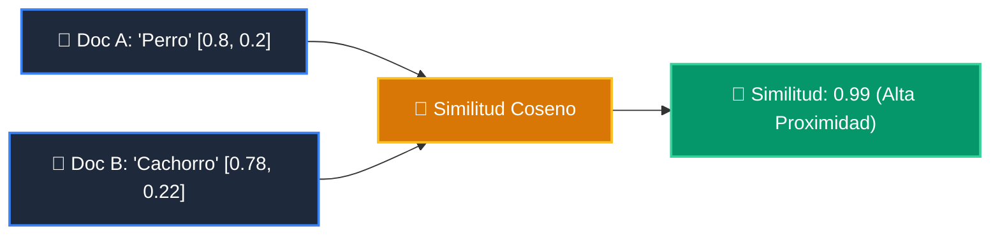

# 📘 Clase 05: Embeddings y Representación Vectorial Semántica

<div class="grid cards" markdown>

-   :material-bookmark: **Curso:** Curso 3: Creación y Desarrollo de Agentes de IA (CLASE 05)
-   :material-signal-cellular-outline: **Nivel:** `Nivel 3 - Avanzado`
-   :material-lightbulb-on: **Metáfora Central:** *«El Mapa de Constelaciones Semánticas (Vectores en el Hiperespacio)»*
-   :material-laptop: **Wisrovi Studio (Local):** [🚀 Abrir Reto](http://127.0.0.1:8501/?course=3&class=5) &bull; [👨‍🏫 Modo Tutor](http://127.0.0.1:8501/tutor?course=3&class=5)
-   :material-file-pdf-box: **Manual PDF Oficial:** [Descargar clase-05-embeddings-y-bases-vectoriales.pdf](https://github.com/wisrovi/wisrovi-python/raw/main/03-agentes-ia/clase-05-embeddings-y-bases-vectoriales/clase-05-embeddings-y-bases-vectoriales.pdf)

</div>

<div align="center" style="margin: 1rem 0;" markdown>

[](https://colab.research.google.com/github/wisrovi/wisrovi-python/blob/main/03-agentes-ia/clase-05-embeddings-y-bases-vectoriales/notebook/clase-05-embeddings-y-bases-vectoriales.ipynb)
[-0284c7?logo=python&logoColor=white)](http://127.0.0.1:8501/?course=3&class=5)
[](https://github.com/wisrovi/wisrovi-python/tree/main/03-agentes-ia/clase-05-embeddings-y-bases-vectoriales)

</div>

---

## 1. 💡 Fundamentación Teórica y Modelo Mental

Transformación de conceptos textuales en vectores numéricos densos de alta dimensión:
1. **Espacio Vectorial**: Textos con significados similares tienen menor distancia angular en el espacio.
2. **Similitud del Coseno**: $\text{Similitud}(A, B) = \frac{A \cdot B}{\|A\| \|B\|} = \frac{\sum A_i B_i}{\sqrt{\sum A_i^2} \sqrt{\sum B_i^2}}$.
3. **Bases de Datos Vectoriales**: Indexación ANN (Approximate Nearest Neighbors) para búsqueda semántica masiva.

!!! note "🌟 Modelo Mental de la Sesión: «El Mapa de Constelaciones Semánticas (Vectores en el Hiperespacio)»"
    En esta sesión anclamos el aprendizaje en la metáfora del mundo real para visualizar cómo fluyen las estructuras de datos y el flujo de ejecución en la memoria.

---

## 2. 🗺️ Arquitectura de Ejecución y Diagrama de Flujo



---

## 3. 💻 Código de Implementación Práctica

=== "🚀 Demostración en Vivo"
    ```python
    import math

def cos_sim(v1, v2):
    dot = sum(a * b for a, b in zip(v1, v2))
    norm1 = math.sqrt(sum(a * a for a in v1))
    norm2 = math.sqrt(sum(b * b for b in v2))
    return dot / (norm1 * norm2)

print("Similitud ortogonal:", cos_sim([1, 0], [0, 1]))
print("Similitud paralela:", cos_sim([1, 2], [2, 4]))
    ```

=== "🔬 Arenero de Exploración de Memoria (RAM)"
    ```python
    vA = [0.5, 0.5, 0.5]
vB = [0.5, 0.5, 0.5]
print("Mismo vector -> Similitud:", sum(a*b for a,b in zip(vA, vB)))
    ```

---

## 4. 🛡️ Buenas Prácticas PEP 8: Antipatrones vs Código Pythonic

!!! warning "⚠️ Cuidado con los Antipatrones"
    

=== "❌ Antipatrón / Código Inadecuado"
    ```python
    similitud(emb_openai_1536, emb_bge_768)  # ❌ Incompatibilidad de dimensiones
    ```

=== "✅ Patrón Recomendado / Pythonic"
    ```python
    # Usa SIEMPRE el mismo modelo de embedding para indexar y consultar ✅
    ```

---

## 5. 🏋️ Desafío Práctico de la Clase

!!! example "🎯 Enunciado del Reto"
    **Crea una función `similitud_coseno(v1: list[float], v2: list[float]) -> float` que calcule y retorne la similitud del coseno entre dos vectores numéricos de igual dimensión.**

!!! tip "⚡ Resolución Híbrida en 1 Clic (Local + Web)"
    Si tienes ejecutando `wisrovi ui` en tu terminal local, puedes [🚀 Abrir este Reto directamente en tu Studio Local (127.0.0.1:8501)](http://127.0.0.1:8501/?course=3&class=5) para escribir tu código con auto-formateo AST, inspeccionar variables en el Heap/Stack y evaluarlo con pruebas en tiempo real.

=== "💻 Plantilla de Inicio (Starter Code)"
    ```python
    import math

def similitud_coseno(v1: list[float], v2: list[float]) -> float:
    # ✍️ Calcula (v1 . v2) / (||v1|| * ||v2||)
    if len(v1) != len(v2) or not v1:
        return 0.0
    dot = sum(a * b for a, b in zip(v1, v2))
    norm1 = math.sqrt(sum(a * a for a in v1))
    norm2 = math.sqrt(sum(b * b for b in v2))
    if norm1 == 0 or norm2 == 0:
        return 0.0
    return float(dot / (norm1 * norm2))

    ```

??? info "💡 Pista Socrática 1"
    💡 Pista 1: Calcula el producto escalar `dot = sum(a * b for a, b in zip(v1, v2))`.

??? info "💡 Pista Socrática 2"
    💡 Pista 2: Calcula las normas euclidianas con `math.sqrt(sum(x * x for x in v))`.

??? info "💡 Pista Socrática 3"
    💡 Pista 3: Retorna `dot / (norm1 * norm2)` controlando división por cero.


Para resolver este ejercicio en tu entorno:
1. Abre el archivo `ejercicios/reto.py` de esta clase en Visual Studio Code o utiliza `wisrovi ui` / `wisrovi tutor`.
2. Implementa tu solución cumpliendo los requisitos y contratos de tipado.
3. Valida tus resultados ejecutando las pruebas unitarias:
   ```bash
   pytest tests/curso_03/test_clase_05_embeddings_y_bases_vectoriales.py
   ```

---


## 6. 📚 Fuentes y Bibliografía Recomendada

*   [📖 Documentación Oficial de Python 3](https://docs.python.org/3/)
*   [📑 Guía de Estilo Oficial PEP 8](https://peps.python.org/pep-0008/)
*   [📦 Ecosistema Open Source wisrovi en PyPI](https://pypi.org/user/wisrovi/)
