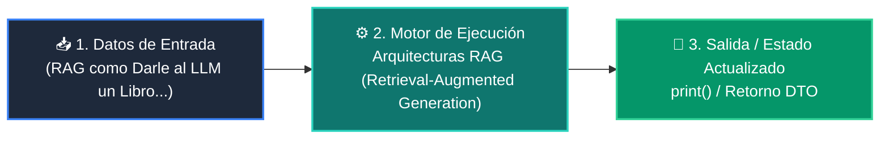

# 📘 Clase 06: Arquitecturas RAG (Retrieval-Augmented Generation)

<div class="grid cards" markdown>

-   :material-bookmark: **Curso:** Curso 3: Creación y Desarrollo de Agentes de IA (CLASE 06)
-   :material-signal-cellular-outline: **Nivel:** `Nivel 3 - Avanzado`
-   :material-lightbulb-on: **Metáfora Central:** *«RAG como Darle al LLM un Libro Abierto con la Información Exacta»*
-   :material-file-pdf-box: **Manual PDF Oficial:** [Descargar clase-06-arquitecturas-rag.pdf](https://github.com/wisrovi/wisrovi-python/raw/main/03-agentes-ia/clase-06-arquitecturas-rag/clase-06-arquitecturas-rag.pdf)

</div>

<div align="center" style="margin: 1rem 0;" markdown>

[](https://colab.research.google.com/github/wisrovi/wisrovi-python/blob/main/03-agentes-ia/clase-06-arquitecturas-rag/notebook/clase-06-arquitecturas-rag.ipynb)
[](https://github.com/wisrovi/wisrovi-python/tree/main/03-agentes-ia/clase-06-arquitecturas-rag)

</div>

---

## 1. 💡 Fundamentación Teórica y Modelo Mental


!!! note "🌟 Modelo Mental de la Sesión: «RAG como Darle al LLM un Libro Abierto con la Información Exacta»"
    En lugar de pedirle al alumno que responda de memoria, le permites consultar el capítulo exacto del libro antes de contestar.

### Principios Fundamentales de la Sesión


!!! info "⚡ Regla de Oro en Python"
    Instruye al modelo a responder ÚNICAMENTE basándose en el contexto provisto para eliminar alucinaciones.

---

## 2. 🗺️ Arquitectura de Ejecución y Diagrama de Flujo



---

## 3. 💻 Código de Implementación Práctica

```python
class MiniRAG:
    def __init__(self):
        self.docs = []

    def indexar(self, texto: str):
        # Simulación de chunking básico
        self.docs.append(texto)

    def recuperar(self, query: str) -> str:
        # Recupera el documento con mayor coincidencia léxica
        palabras = set(query.lower().split())
        mejor_doc = max(self.docs, key=lambda d: len(palabras.intersection(set(d.lower().split()))))
        return mejor_doc

    def generar_prompt(self, query: str) -> str:
        ctx = self.recuperar(query)
        return f"Contexto:\n{ctx}\n\nPregunta: {query}\nRespuesta basada estrictamente en el contexto:"

rag = MiniRAG()
rag.indexar("El horario de atención es de Lunes a Viernes de 9:00 a 18:00.")
print(rag.generar_prompt("¿A qué hora abren?"))
```

---

## 4. 🛡️ Buenas Prácticas, Gotchas y Prevención de Errores

!!! warning "⚠️ Trampa Frecuente (Gotcha)"
    Inyectar demasiados chunks (ej. 20 chunks) satura el contexto y hace que el LLM ignore la información central.

=== "❌ Antipatrón / Código Inadecuado"
    ```python
    prompt = f'Contexto:\n{20_chunks_desordenados}'  # ❌ Degradación de atención
    ```

=== "✅ Patrón Recomendado / Pythonic"
    ```python
    # Selecciona Top 3 a 5 chunks relevantes y reordénalos con un Re-ranker ✅
    ```

!!! tip "🔧 Consejo de Ingeniería"
    

---

## 5. 🏋️ Desafío Práctico de la Clase

!!! example "🎯 Enunciado del Reto"
    **Crea una función de chunking con solapamiento configurable que no corte palabras por la mitad.**

Para resolver este ejercicio en tu entorno:
1. Abre el archivo `ejercicios/reto.py` de esta clase en Visual Studio Code.
2. Implementa tu solución cumpliendo los requisitos y contratos de tipo.
3. Valida tus resultados ejecutando las pruebas unitarias:
   ```bash
   pytest tests/curso_03/test_clase_06_arquitecturas_rag.py
   ```

---

## 6. 📚 Fuentes y Bibliografía Recomendada

*   [📖 Documentación Oficial de Python 3](https://docs.python.org/3/)
*   [📑 Guía de Estilo Oficial PEP 8](https://peps.python.org/pep-0008/)
*   [📦 Ecosistema Open Source wisrovi en PyPI](https://pypi.org/user/wisrovi/)
