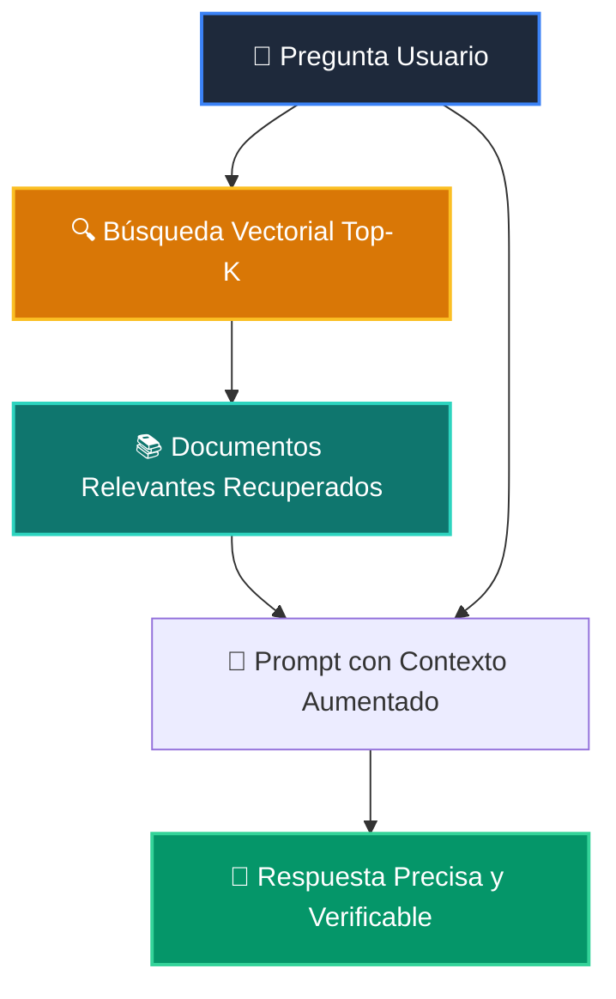

# 📘 Clase 06: Arquitecturas RAG (Retrieval-Augmented Generation)

<div class="grid cards" markdown>

-   :material-bookmark: **Curso:** Curso 3: Creación y Desarrollo de Agentes de IA (CLASE 06)
-   :material-signal-cellular-outline: **Nivel:** `Nivel 3 - Avanzado`
-   :material-lightbulb-on: **Metáfora Central:** *«El Estudiante con el Libro Abierto en el Examen (Búsqueda + Contexto)»*
-   :material-laptop: **Wisrovi Studio (Local):** [🚀 Abrir Reto](http://127.0.0.1:8501/?course=3&class=6) &bull; [👨‍🏫 Modo Tutor](http://127.0.0.1:8501/tutor?course=3&class=6)
-   :material-file-pdf-box: **Manual PDF Oficial:** [Descargar clase-06-arquitecturas-rag.pdf](https://github.com/wisrovi/wisrovi-python/raw/main/03-agentes-ia/clase-06-arquitecturas-rag/clase-06-arquitecturas-rag.pdf)

</div>

<div align="center" style="margin: 1rem 0;" markdown>

[](https://colab.research.google.com/github/wisrovi/wisrovi-python/blob/main/03-agentes-ia/clase-06-arquitecturas-rag/notebook/clase-06-arquitecturas-rag.ipynb)
[-0284c7?logo=python&logoColor=white)](http://127.0.0.1:8501/?course=3&class=6)
[](https://github.com/wisrovi/wisrovi-python/tree/main/03-agentes-ia/clase-06-arquitecturas-rag)

</div>

---

## 1. 💡 Fundamentación Teórica y Modelo Mental

Aumentar el conocimiento del LLM inyectando fragmentos recuperados en tiempo real:
1. **Pipeline RAG**: Ingestión -> Chunking -> Vectorización -> Búsqueda Top-K -> Inyección en Prompt.
2. **Reducción de Alucinaciones**: El LLM cita textualmente la información del contexto provisto.
3. **Métricas de Relevancia**: Score de similitud para filtrar documentos irrelevantes.

!!! note "🌟 Modelo Mental de la Sesión: «El Estudiante con el Libro Abierto en el Examen (Búsqueda + Contexto)»"
    En esta sesión anclamos el aprendizaje en la metáfora del mundo real para visualizar cómo fluyen las estructuras de datos y el flujo de ejecución en la memoria.

---

## 2. 🗺️ Arquitectura de Ejecución y Diagrama de Flujo



---

## 3. 💻 Código de Implementación Práctica

=== "🚀 Demostración en Vivo"
    ```python
    def simple_rag_mock(query: str, corpus: list[str]) -> list[str]:
    # Filtrar documentos que contengan palabras clave de la consulta
    palabras = set(query.lower().split())
    return [doc for doc in corpus if any(p in doc.lower() for p in palabras)]

docs = ["Python 3.12 incluye mejoras de rendimiento", "Docker permite empaquetar aplicaciones"]
print("Recuperado:", simple_rag_mock("rendimiento en Python", docs))
    ```

=== "🔬 Arenero de Exploración de Memoria (RAM)"
    ```python
    contexto = "\n".join(["- Doc 1: FastAPI", "- Doc 2: Uvicorn"])
prompt_rag = f"Contexto:\n{contexto}\n\nPregunta: ¿Qué es FastAPI?"
print(prompt_rag)
    ```

---

## 4. 🛡️ Buenas Prácticas PEP 8: Antipatrones vs Código Pythonic

!!! warning "⚠️ Cuidado con los Antipatrones"
    

=== "❌ Antipatrón / Código Inadecuado"
    ```python
    prompt = f'Contexto:\n{20_chunks_desordenados}'  # ❌ Degradación de atención
    ```

=== "✅ Patrón Recomendado / Pythonic"
    ```python
    # Selecciona Top 3 a 5 chunks relevantes y reordénalos con un Re-ranker ✅
    ```

---

## 5. 🏋️ Desafío Práctico de la Clase

!!! example "🎯 Enunciado del Reto"
    **Crea una clase `SimpleRAGIndex` con métodos: `agregar_documento(self, doc_id: str, texto: str, vector: list[float])` y `buscar_similares(self, vector_query: list[float], top_k: int = 2) -> list[str]` que retorne los IDs de los documentos con mayor similitud coseno.**

!!! tip "⚡ Resolución Híbrida en 1 Clic (Local + Web)"
    Si tienes ejecutando `wisrovi ui` en tu terminal local, puedes [🚀 Abrir este Reto directamente en tu Studio Local (127.0.0.1:8501)](http://127.0.0.1:8501/?course=3&class=6) para escribir tu código con auto-formateo AST, inspeccionar variables en el Heap/Stack y evaluarlo con pruebas en tiempo real.

=== "💻 Plantilla de Inicio (Starter Code)"
    ```python
    import math
from typing import List, Dict, Tuple

class SimpleRAGIndex:
    def __init__(self):
        self._docs: Dict[str, Tuple[str, List[float]]] = {}

    def agregar_documento(self, doc_id: str, texto: str, vector: List[float]):
        self._docs[doc_id] = (texto, vector)

    def _similitud(self, v1: List[float], v2: List[float]) -> float:
        dot = sum(a * b for a, b in zip(v1, v2))
        norm1 = math.sqrt(sum(a * a for a in v1)) or 1e-9
        norm2 = math.sqrt(sum(b * b for b in v2)) or 1e-9
        return dot / (norm1 * norm2)

    def buscar_similares(self, vector_query: List[float], top_k: int = 2) -> List[str]:
        # ✍️ Ordena por similitud descendente y retorna top_k IDs
        scores = []
        for doc_id, (_, vec) in self._docs.items():
            s = self._similitud(vector_query, vec)
            scores.append((doc_id, s))
        scores.sort(key=lambda x: x[1], reverse=True)
        return [doc_id for doc_id, _ in scores[:top_k]]

    ```

??? info "💡 Pista Socrática 1"
    💡 Pista 1: Almacena los documentos como `self._docs[doc_id] = (texto, vector)`.

??? info "💡 Pista Socrática 2"
    💡 Pista 2: Para cada documento calcula la similitud contra `vector_query`.

??? info "💡 Pista Socrática 3"
    💡 Pista 3: Ordena por puntaje descendente `scores.sort(key=lambda x: x[1], reverse=True)` y retorna los `doc_id` del top_k.


Para resolver este ejercicio en tu entorno:
1. Abre el archivo `ejercicios/reto.py` de esta clase en Visual Studio Code o utiliza `wisrovi ui` / `wisrovi tutor`.
2. Implementa tu solución cumpliendo los requisitos y contratos de tipado.
3. Valida tus resultados ejecutando las pruebas unitarias:
   ```bash
   pytest tests/curso_03/test_clase_06_arquitecturas_rag.py
   ```

---


## 6. 📚 Fuentes y Bibliografía Recomendada

*   [📖 Documentación Oficial de Python 3](https://docs.python.org/3/)
*   [📑 Guía de Estilo Oficial PEP 8](https://peps.python.org/pep-0008/)
*   [📦 Ecosistema Open Source wisrovi en PyPI](https://pypi.org/user/wisrovi/)
