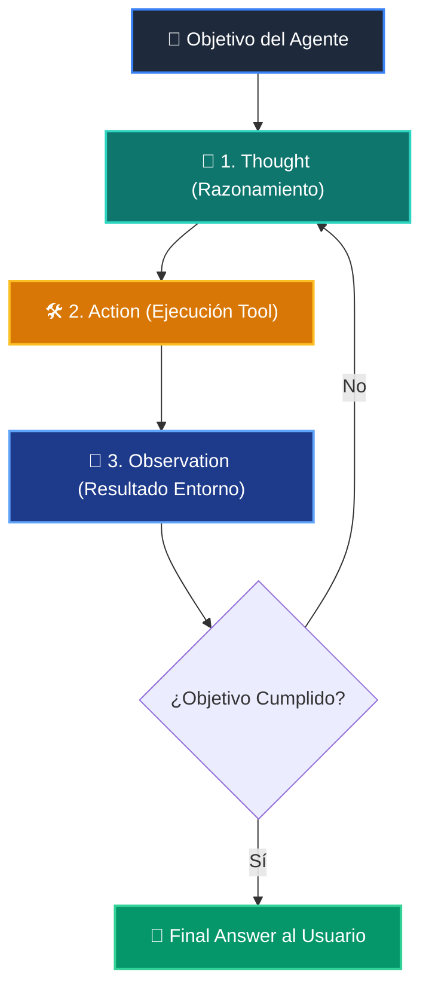

# 📘 Clase 07: Agentes Autónomos y el Ciclo Cognitivo ReAct

<div class="grid cards" markdown>

-   :material-bookmark: **Curso:** Curso 3: Creación y Desarrollo de Agentes de IA (CLASE 07)
-   :material-signal-cellular-outline: **Nivel:** `Nivel 3 - Avanzado`
-   :material-lightbulb-on: **Metáfora Central:** *«El Detective Privado (Pensar, Actuar, Observar)»*
-   :material-laptop: **Wisrovi Studio (Local):** [🚀 Abrir Reto](http://127.0.0.1:8501/?course=3&class=7) &bull; [👨‍🏫 Modo Tutor](http://127.0.0.1:8501/tutor?course=3&class=7)
-   :material-file-pdf-box: **Manual PDF Oficial:** [Descargar clase-07-agentes-autonomos-react.pdf](https://github.com/wisrovi/wisrovi-python/raw/main/03-agentes-ia/clase-07-agentes-autonomos-react/clase-07-agentes-autonomos-react.pdf)

</div>

<div align="center" style="margin: 1rem 0;" markdown>

[](https://colab.research.google.com/github/wisrovi/wisrovi-python/blob/main/03-agentes-ia/clase-07-agentes-autonomos-react/notebook/clase-07-agentes-autonomos-react.ipynb)
[-0284c7?logo=python&logoColor=white)](http://127.0.0.1:8501/?course=3&class=7)
[](https://github.com/wisrovi/wisrovi-python/tree/main/03-agentes-ia/clase-07-agentes-autonomos-react)

</div>

---

## 1. 💡 Fundamentación Teórica y Modelo Mental

El paradigma ReAct (Reasoning + Acting) para agentes con autonomía de resolución:
1. **Thought (Pensamiento)**: El agente reflexiona sobre el estado actual y planifica el siguiente paso.
2. **Action (Acción)**: El agente selecciona una herramienta y ejecuta una operación con parámetros.
3. **Observation (Observación)**: El agente recibe el resultado del entorno y decide si continuar o concluir.

!!! note "🌟 Modelo Mental de la Sesión: «El Detective Privado (Pensar, Actuar, Observar)»"
    En esta sesión anclamos el aprendizaje en la metáfora del mundo real para visualizar cómo fluyen las estructuras de datos y el flujo de ejecución en la memoria.

---

## 2. 🗺️ Arquitectura de Ejecución y Diagrama de Flujo



---

## 3. 💻 Código de Implementación Práctica

=== "🚀 Demostración en Vivo"
    ```python
    class SimpleReActDemo:
    def __init__(self): self.pasos = []
    def paso(self, pensamiento, accion, observacion):
        p = {"thought": pensamiento, "action": accion, "observation": observacion}
        self.pasos.append(p)
        return p

agente = SimpleReActDemo()
agente.paso("Necesito el clima de Madrid", "get_weather('Madrid')", "Soleado 22C")
print("Traza del Agente:", agente.pasos)
    ```

=== "🔬 Arenero de Exploración de Memoria (RAM)"
    ```python
    traza = [{"thought": "Calcular 2+2", "action": "calc", "obs": "4"}]
print("Pasos ejecutados:", len(traza))
    ```

---

## 4. 🛡️ Buenas Prácticas PEP 8: Antipatrones vs Código Pythonic

!!! warning "⚠️ Cuidado con los Antipatrones"
    

=== "❌ Antipatrón / Código Inadecuado"
    ```python
    while not finished: agent.step()  # ❌ Puede consumir tokens infinitos
    ```

=== "✅ Patrón Recomendado / Pythonic"
    ```python
    for step in range(max_steps):     # ✅ Límite estricto de seguridad
    ```

---

## 5. 🏋️ Desafío Práctico de la Clase

!!! example "🎯 Enunciado del Reto"
    **Crea una clase `ReActAgent` con métodos `registrar_paso(self, thought: str, action: str, observation: str)` y `obtener_traza(self) -> list[dict]` que almacene y retorne el historial completo de pasos.**

!!! tip "⚡ Resolución Híbrida en 1 Clic (Local + Web)"
    Si tienes ejecutando `wisrovi ui` en tu terminal local, puedes [🚀 Abrir este Reto directamente en tu Studio Local (127.0.0.1:8501)](http://127.0.0.1:8501/?course=3&class=7) para escribir tu código con auto-formateo AST, inspeccionar variables en el Heap/Stack y evaluarlo con pruebas en tiempo real.

=== "💻 Plantilla de Inicio (Starter Code)"
    ```python
    class ReActAgent:
    def __init__(self):
        self._traza = []

    def registrar_paso(self, thought: str, action: str, observation: str):
        # ✍️ Registra el diccionario con thought, action y observation
        self._traza.append({
            "thought": thought,
            "action": action,
            "observation": observation
        })

    def obtener_traza(self) -> list[dict]:
        return self._traza

    ```

??? info "💡 Pista Socrática 1"
    💡 Pista 1: Inicializa una lista `self._traza = []` en `__init__`.

??? info "💡 Pista Socrática 2"
    💡 Pista 2: En `registrar_paso`, añade un dict con las tres claves `thought`, `action`, `observation`.

??? info "💡 Pista Socrática 3"
    💡 Pista 3: Retorna `self._traza` en `obtener_traza()`.


Para resolver este ejercicio en tu entorno:
1. Abre el archivo `ejercicios/reto.py` de esta clase en Visual Studio Code o utiliza `wisrovi ui` / `wisrovi tutor`.
2. Implementa tu solución cumpliendo los requisitos y contratos de tipado.
3. Valida tus resultados ejecutando las pruebas unitarias:
   ```bash
   pytest tests/curso_03/test_clase_07_agentes_autonomos_react.py
   ```

---


## 6. 📚 Fuentes y Bibliografía Recomendada

*   [📖 Documentación Oficial de Python 3](https://docs.python.org/3/)
*   [📑 Guía de Estilo Oficial PEP 8](https://peps.python.org/pep-0008/)
*   [📦 Ecosistema Open Source wisrovi en PyPI](https://pypi.org/user/wisrovi/)
