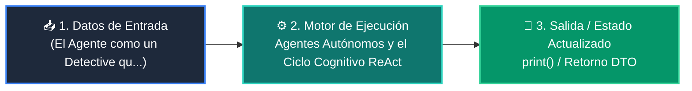

# 📘 Clase 07: Agentes Autónomos y el Ciclo Cognitivo ReAct

<div class="grid cards" markdown>

-   :material-bookmark: **Curso:** Curso 3: Creación y Desarrollo de Agentes de IA (CLASE 07)
-   :material-signal-cellular-outline: **Nivel:** `Nivel 3 - Avanzado`
-   :material-lightbulb-on: **Metáfora Central:** *«El Agente como un Detective que Piensa, Actúa y Observa hasta Resolver el Caso»*
-   :material-file-pdf-box: **Manual PDF Oficial:** [Descargar clase-07-agentes-autonomos-react.pdf](https://github.com/wisrovi/wisrovi-python/raw/main/03-agentes-ia/clase-07-agentes-autonomos-react/clase-07-agentes-autonomos-react.pdf)

</div>

<div align="center" style="margin: 1rem 0;" markdown>

[](https://colab.research.google.com/github/wisrovi/wisrovi-python/blob/main/03-agentes-ia/clase-07-agentes-autonomos-react/notebook/clase-07-agentes-autonomos-react.ipynb)
[](https://github.com/wisrovi/wisrovi-python/tree/main/03-agentes-ia/clase-07-agentes-autonomos-react)

</div>

---

## 1. 💡 Fundamentación Teórica y Modelo Mental


!!! note "🌟 Modelo Mental de la Sesión: «El Agente como un Detective que Piensa, Actúa y Observa hasta Resolver el Caso»"
    Un agente es como un detective: piensa qué pista necesita (Thought), busca el dato con una herramienta (Action), analiza el resultado (Observation) y repite.

### Principios Fundamentales de la Sesión


!!! info "⚡ Regla de Oro en Python"
    Establece siempre un 'max_iterations = 5' para evitar que el agente quede atrapado en bucles infinitos.

---

## 2. 🗺️ Arquitectura de Ejecución y Diagrama de Flujo



---

## 3. 💻 Código de Implementación Práctica

```python
class ReActAgent:
    def __init__(self, tools: dict, max_steps: int = 3):
        self.tools = tools
        self.max_steps = max_steps
        self.memory = []

    def run(self, goal: str):
        print(f"🎯 Meta: {goal}")
        for step in range(1, self.max_steps + 1):
            print(f"--- Paso {step} ---")
            # 1. Thought
            thought = f"Necesito consultar la cotización del euro."
            print(f"💭 Thought: {thought}")
            
            # 2. Action
            obs = self.tools["get_rate"]("EUR_USD")
            print(f"🎬 Action: get_rate(EUR_USD) -> Obs: {obs}")
            
            # 3. Final Answer
            return f"Respuesta Final: 1 EUR equivale a {obs} USD."

tools = {"get_rate": lambda pair: 1.08}
agente = ReActAgent(tools)
print(agente.run("¿Cuánto vale el euro frente al dólar?"))
```

---

## 4. 🛡️ Buenas Prácticas, Gotchas y Prevención de Errores

!!! warning "⚠️ Trampa Frecuente (Gotcha)"
    Si una herramienta falla o devuelve error, el agente puede reintentar la misma acción en un ciclo sin fin.

=== "❌ Antipatrón / Código Inadecuado"
    ```python
    while not finished: agent.step()  # ❌ Puede consumir tokens infinitos
    ```

=== "✅ Patrón Recomendado / Pythonic"
    ```python
    for step in range(max_steps):     # ✅ Límite estricto de seguridad
    ```

!!! tip "🔧 Consejo de Ingeniería"
    

---

## 5. 🏋️ Desafío Práctico de la Clase

!!! example "🎯 Enunciado del Reto"
    **Añade una herramienta de calculadora matemática al agente y haz que resuelva una ecuación paso a paso.**

Para resolver este ejercicio en tu entorno:
1. Abre el archivo `ejercicios/reto.py` de esta clase en Visual Studio Code.
2. Implementa tu solución cumpliendo los requisitos y contratos de tipo.
3. Valida tus resultados ejecutando las pruebas unitarias:
   ```bash
   pytest tests/curso_03/test_clase_07_agentes_autonomos_react.py
   ```

---

## 6. 📚 Fuentes y Bibliografía Recomendada

*   [📖 Documentación Oficial de Python 3](https://docs.python.org/3/)
*   [📑 Guía de Estilo Oficial PEP 8](https://peps.python.org/pep-0008/)
*   [📦 Ecosistema Open Source wisrovi en PyPI](https://pypi.org/user/wisrovi/)
