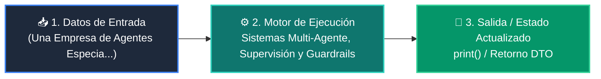

# 📘 Clase 08: Sistemas Multi-Agente, Supervisión y Guardrails

<div class="grid cards" markdown>

-   :material-bookmark: **Curso:** Curso 3: Creación y Desarrollo de Agentes de IA (CLASE 08)
-   :material-signal-cellular-outline: **Nivel:** `Nivel 3 - Avanzado`
-   :material-lightbulb-on: **Metáfora Central:** *«Una Empresa de Agentes Especializados Coordinados por un Director»*
-   :material-file-pdf-box: **Manual PDF Oficial:** [Descargar clase-08-sistemas-multi-agente.pdf](https://github.com/wisrovi/wisrovi-python/raw/main/03-agentes-ia/clase-08-sistemas-multi-agente/clase-08-sistemas-multi-agente.pdf)

</div>

<div align="center" style="margin: 1rem 0;" markdown>

[](https://colab.research.google.com/github/wisrovi/wisrovi-python/blob/main/03-agentes-ia/clase-08-sistemas-multi-agente/notebook/clase-08-sistemas-multi-agente.ipynb)
[](https://github.com/wisrovi/wisrovi-python/tree/main/03-agentes-ia/clase-08-sistemas-multi-agente)

</div>

---

## 1. 💡 Fundamentación Teórica y Modelo Mental


!!! note "🌟 Modelo Mental de la Sesión: «Una Empresa de Agentes Especializados Coordinados por un Director»"
    Es como una agencia de noticias: el reportero investiga los hechos, el redactor escribe la noticia y el editor jefe revisa la calidad.

### Principios Fundamentales de la Sesión


!!! info "⚡ Regla de Oro en Python"
    Asigna a cada agente un System Prompt ultra específico y un conjunto reducido de herramientas.

---

## 2. 🗺️ Arquitectura de Ejecución y Diagrama de Flujo



---

## 3. 💻 Código de Implementación Práctica

```python
class MultiAgentSystem:
    def __init__(self):
        pass

    def agente_investigador(self, tema: str) -> dict:
        return {"datos": f"Hallazgos clave sobre {tema}: Crecimiento del 40% en adopción."}

    def agente_redactor(self, investigacion: dict) -> str:
        return f"Reporte Ejecutivo: {investigacion['datos']}"

    def supervisor(self, tema: str) -> str:
        print("👑 Supervisor: Coordinando equipo...")
        datos = self.agente_investigador(tema)
        informe = self.agente_redactor(datos)
        return f"✅ Publicación Aprobada:\n{informe}"

sistema = MultiAgentSystem()
print(sistema.supervisor("Agentes Autónomos en 2026"))
```

---

## 4. 🛡️ Buenas Prácticas, Gotchas y Prevención de Errores

!!! warning "⚠️ Trampa Frecuente (Gotcha)"
    Pasar texto libre desordenado entre agentes provoca pérdida de contexto en cadenas largas.

=== "❌ Antipatrón / Código Inadecuado"
    ```python
    msg_agente_2 = call_llm(f'El otro dijo: {texto_libre_caotico}')  # ❌ Degradación
    ```

=== "✅ Patrón Recomendado / Pythonic"
    ```python
    # Usa esquemas Pydantic para el paso de mensajes entre agentes ✅
    ```

!!! tip "🔧 Consejo de Ingeniería"
    

---

## 5. 🏋️ Desafío Práctico de la Clase

!!! example "🎯 Enunciado del Reto"
    **Diseña un sistema con un Agente Programador y un Agente Revisor de Código que valide pruebas unitarias.**

Para resolver este ejercicio en tu entorno:
1. Abre el archivo `ejercicios/reto.py` de esta clase en Visual Studio Code.
2. Implementa tu solución cumpliendo los requisitos y contratos de tipo.
3. Valida tus resultados ejecutando las pruebas unitarias:
   ```bash
   pytest tests/curso_03/test_clase_08_sistemas_multi_agente.py
   ```

---

## 6. 📚 Fuentes y Bibliografía Recomendada

*   [📖 Documentación Oficial de Python 3](https://docs.python.org/3/)
*   [📑 Guía de Estilo Oficial PEP 8](https://peps.python.org/pep-0008/)
*   [📦 Ecosistema Open Source wisrovi en PyPI](https://pypi.org/user/wisrovi/)
